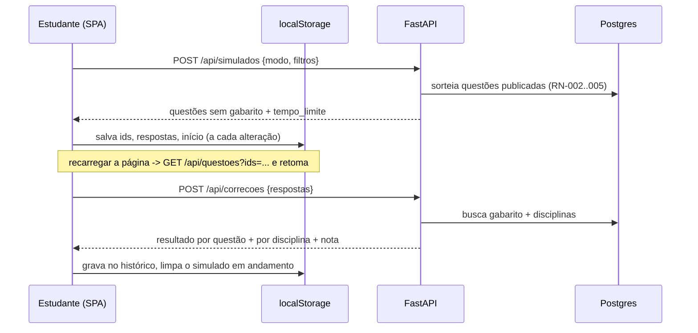
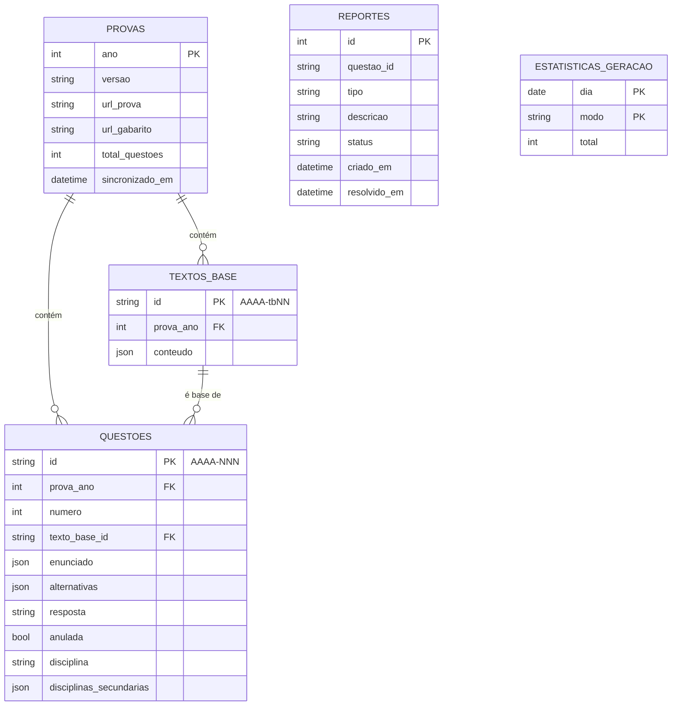
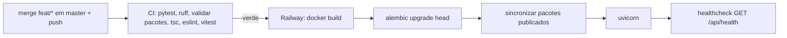

# Arquitetura — Simulado Fuvest

**Versão:** 1.0
**Data:** 2026-09-29
**PRD Ref:** 01-PRD v1.0
**CR Ref:** —

---

## 1. Stack Tecnológica

| Camada | Tecnologia | Versão | Justificativa |
|--------|------------|--------|---------------|
| Frontend | React + TypeScript | React 19.3, TS 6.0 | Mesma stack do Meu Controle; TS fixo em 6.0 por compatibilidade com typescript-eslint (ADR-007) |
| Build/Dev | Vite + @vitejs/plugin-react | 8.3 / 6.1 | Build rápido; proxy `/api` e `/figuras` para o backend em dev |
| Estilização | Tailwind CSS | 4.3 | Mesma stack; mobile-first (RNF-002) |
| State/Fetch | TanStack Query | 5.104 | Cache das chamadas à API (catálogo, questões) |
| Routing | react-router-dom | 7.18 | Rotas do SPA |
| Estado local | Context + reducer + `localStorage` | — | Simulado em andamento e histórico só no navegador (RN-012, ADR-004) |
| Backend | Python + FastAPI + uvicorn | Python 3.12, FastAPI 0.142, uvicorn 0.54 | Mesma stack; Python é o ecossistema natural para ler PDF |
| ORM | SQLAlchemy (síncrono) | 2.1 | Mesma stack; colunas JSON portáveis entre SQLite e Postgres |
| Banco de Dados | PostgreSQL (prod) + SQLite (dev/testes) | — | Postgres da Railway; SQLite local e in-memory nos testes |
| Migrations | Alembic | 1.20 | Schema só via migration, nunca `create_all()` |
| Validação | Pydantic | 2.13 | Schemas da API **e** do pacote de revisão (`prova.yaml`) |
| Rate limit | slowapi | 0.1 | Limite por IP em `POST /api/reportes` e `POST /api/simulados` (RNF-004) |
| Pacote de revisão | PyYAML | 6.0 | Formato editável à mão pelo curador (RF-004) |
| Leitura de PDF | pdfplumber (+ pypdfium2) | 0.11 / 5.13 | Texto com coordenadas, imagens embutidas e renderização de regiões; licenças MIT/Apache (ADR-003) |
| Imagens | Pillow | 12.3 | Conversão das figuras para WebP otimizado (RNF-001) |
| Driver Postgres | psycopg | 3.3 | Driver moderno do SQLAlchemy 2 |
| Testes | pytest + httpx (BE), Vitest + jsdom (FE) | 9.1 / 5.0 | Mesma stack |
| Lint | ruff (BE), ESLint + typescript-eslint (FE) | 0.16 / 10.11 + 8.71 | Erros de lint bloqueiam commit e CI |
| CI/CD | GitHub Actions | — | pytest + ruff + validação dos pacotes + tsc + eslint + vitest |
| Deploy | Railway (container Docker) | Node 24 / Python 3.12 | Serviço único + Postgres add-on (ADR-001) |

---

## 2. Arquitetura Geral

Monorepo com dois subsistemas que compartilham o mesmo modelo de dados:

1. **Ingestão (offline, máquina do curador):** CLI em Python que baixa os PDFs do acervo, extrai gabarito e questões com parsers determinísticos por família de layout e grava um **pacote de revisão** (`data/provas/AAAA/prova.yaml` + figuras). O curador revisa e classifica, depois commita o pacote. O repositório é a fonte da verdade das questões (ADR-002).
2. **Aplicação web (Railway):** um container com FastAPI, que serve a API, as figuras e o build do SPA React. No start, o container aplica as migrations e **sincroniza** os pacotes publicados do repositório no Postgres, que funciona como índice de consulta. O servidor não guarda nenhum estado do estudante: gerar e corrigir são operações sem estado (ADR-004), e o simulado em andamento e o histórico vivem no `localStorage`.

```mermaid
graph TD
    subgraph Curador["Máquina do curador (offline)"]
        Acervo[fuvest.br acervo PDFs] -->|baixar| Cache[data/_cache PDFs - gitignored]
        Cache -->|extrair: parser por família| Pacote[data/provas/AAAA/prova.yaml + figuras/]
        Pacote -->|revisar, classificar, validar| Pacote
        Pacote -->|git commit + push| Repo[(Repositório GitHub)]
    end

    subgraph Railway["Railway (produção)"]
        Repo -->|CI verde + auto-deploy| Build[Docker build: SPA + backend + data/provas]
        Build --> Start[alembic upgrade head -> sincronizar pacotes -> uvicorn]
        Start --> API[FastAPI :8000]
        API --> PG[(PostgreSQL)]
        API --> Figs[/figuras/AAAA/arquivo.webp]
        API --> SPA[SPA estático]
    end

    Browser[Navegador do estudante] -->|HTTPS| API
    Browser --> LS[(localStorage: simulado em andamento + histórico)]
```

**Fluxo de um simulado:**



---

## 3. Estrutura de Pastas

```
Simulado Fuvest/
├── .github/workflows/ci.yml
├── .claude/                        # hooks de qualidade + settings (versionado)
├── Dockerfile                      # multi-stage: build do SPA (Node 24) + backend (Python 3.12)
├── data/
│   ├── provas/                     # FONTE DA VERDADE das questões (versionado)
│   │   └── 2025/
│   │       ├── prova.yaml          # pacote de revisão (schema em app/pacote/schema.py)
│   │       └── figuras/            # q037-1.webp, q052-b.webp, tb03-1.webp
│   └── _cache/                     # PDFs originais baixados (gitignored)
├── backend/
│   ├── alembic.ini
│   ├── alembic/versions/
│   ├── pyproject.toml              # config do ruff e do pytest
│   ├── requirements.txt            # produção
│   ├── requirements-ingestao.txt   # pdfplumber, pypdfium2, Pillow (só curador/CI)
│   ├── requirements-dev.txt        # -r dos dois + pytest, httpx, ruff, pip-audit
│   ├── app/
│   │   ├── main.py                 # app, middlewares, rota de figuras, fallback do SPA
│   │   ├── config.py               # env vars (DATABASE_URL, DATA_DIR, ENVIRONMENT, ALLOWED_ORIGINS)
│   │   ├── database.py             # engine/sessão; postgres:// -> postgresql+psycopg://
│   │   ├── models.py               # SQLAlchemy
│   │   ├── schemas.py              # Pydantic da API
│   │   ├── disciplinas.py          # enum das 8 disciplinas + rótulos
│   │   ├── rate_limit.py           # slowapi
│   │   ├── security_headers.py     # middleware de headers HTTP
│   │   ├── routers/                # catalogo, simulados, questoes, correcoes, reportes, health
│   │   ├── services/               # catalogo, geracao, correcao, estatisticas
│   │   └── pacote/                 # compartilhado entre produção e ingestão (sem libs de PDF)
│   │       ├── schema.py           # modelo Pydantic do prova.yaml
│   │       ├── leitura.py          # carregar/salvar YAML
│   │       ├── validacao.py        # regras RN-007 + relatório de pendências
│   │       └── sincronizar.py      # repo -> banco (idempotente); `python -m app.pacote.sincronizar`
│   ├── ingestao/                   # CLI do curador: `python -m ingestao <comando>`
│   │   ├── __main__.py / cli.py    # baixar, extrair, preview, recortar, validar, importar, reportes
│   │   ├── baixar.py
│   │   ├── pdf_util.py             # colunas, ordem de leitura, limpeza de texto, render de região
│   │   ├── figuras.py              # imagens embutidas + recorte de região -> WebP
│   │   ├── gabarito/               # parsers de gabarito por família (registry por ano)
│   │   └── layouts/                # parsers de prova por família (registry por ano)
│   └── tests/
│       ├── conftest.py             # SQLite in-memory + pacote de fixture sincronizado
│       ├── fixtures/pdfs/          # poucas páginas recortadas dos PDFs oficiais
│       ├── fixtures/provas/        # pacotes YAML mínimos para testes
│       └── test_*.py
└── frontend/
    ├── package.json, vite.config.ts, tsconfig.json, tsconfig.app.json, eslint.config.js, index.html
    └── src/
        ├── main.tsx, App.tsx (rotas), queryClient.ts, index.css, types.ts
        ├── services/api.ts         # cliente fetch da API
        ├── storage/                # simuladoStorage.ts, historicoStorage.ts (versionados, try/catch)
        ├── contexts/SimuladoContext.tsx  # reducer do simulado em andamento + persistência
        ├── hooks/                  # useCatalogo, useCronometro, useGerarSimulado, useCorrecao...
        ├── components/             # QuestaoView, Blocos, Figura, Alternativas, GradeQuestoes, Cronometro, ReportarModal...
        ├── pages/                  # Home, ConfigurarSimulado, Resolucao, Resultado, Treino, Historico
        └── utils/                  # tempo.ts, format.ts
```

---

## 4. Modelagem de Dados

O banco guarda só o que é **derivado do repositório** (provas, textos-base, questões), mais duas tabelas escritas em runtime (reportes e estatística anônima). Não há tabela de usuário nem de resultados (RN-012).



### Detalhamento das Entidades

#### provas
| Campo | Tipo | Restrições | Descrição |
|-------|------|------------|-----------|
| ano | int | PK | Ano do vestibular (ex.: 2025) |
| versao | varchar(10) | NOT NULL | Versão ingerida: `V1`…`V4` ou `unica` (RN-001) |
| url_prova | text | NOT NULL | URL oficial do PDF da prova (RN-013) |
| url_gabarito | text | NOT NULL | URL oficial do PDF do gabarito |
| total_questoes | int | NOT NULL | Sempre 90 no MVP |
| sincronizado_em | timestamptz | NOT NULL | Última sincronização a partir do repositório |

#### textos_base
| Campo | Tipo | Restrições | Descrição |
|-------|------|------------|-----------|
| id | varchar(12) | PK | `AAAA-tbNN` (ex.: `2025-tb03`) — estável entre sincronizações |
| prova_ano | int | FK → provas.ano, ON DELETE CASCADE | |
| conteudo | JSON | NOT NULL | Lista de blocos (ver "Blocos de conteúdo") |

#### questoes
| Campo | Tipo | Restrições | Descrição |
|-------|------|------------|-----------|
| id | varchar(8) | PK | `AAAA-NNN` (ex.: `2025-037`) — ID natural e estável (ADR-006) |
| prova_ano | int | FK → provas.ano, ON DELETE CASCADE, index | |
| numero | int | NOT NULL, 1–90, UNIQUE(prova_ano, numero) | Número original na versão ingerida |
| texto_base_id | varchar(12) | FK → textos_base.id, NULL | Texto-base compartilhado (RN-005) |
| enunciado | JSON | NOT NULL | Lista de blocos |
| alternativas | JSON | NOT NULL | `{"A": {texto?, figura?}, …, "E": {…}}` |
| resposta | char(1) | NULL | `A`–`E`; NULL somente se anulada |
| anulada | bool | NOT NULL, default false | RN-002 |
| disciplina | varchar(12) | NOT NULL, index | Disciplina principal (slug do enum) |
| disciplinas_secundarias | JSON | NOT NULL, default `[]` | Slugs adicionais (interdisciplinares) |

#### reportes
| Campo | Tipo | Restrições | Descrição |
|-------|------|------------|-----------|
| id | int | PK, autoincremento | |
| questao_id | varchar(8) | NOT NULL, index — **sem FK** | Sobrevive à ressincronização/remoção da questão |
| tipo | varchar(20) | NOT NULL | `enunciado`, `figura`, `gabarito`, `outro` |
| descricao | varchar(500) | NULL | Texto livre |
| status | varchar(10) | NOT NULL, default `pendente` | `pendente` / `resolvido` |
| criado_em | timestamptz | NOT NULL, default now | |
| resolvido_em | timestamptz | NULL | |

#### estatisticas_geracao
| Campo | Tipo | Restrições | Descrição |
|-------|------|------------|-----------|
| dia | date | PK (composta) | Dia da geração (UTC) |
| modo | varchar(12) | PK (composta) | `completa`, `personalizado`, `ano`, `treino` |
| total | int | NOT NULL | Contador (métrica anônima do PRD §2) |

### Blocos de conteúdo

Enunciados, textos-base e alternativas são **listas de blocos**, iguais no YAML e no JSON do banco:

```yaml
- texto: "Parágrafo em texto puro. Quebras de linha são preservadas."
- figura: q037-1.webp        # arquivo em data/provas/AAAA/figuras/
```

Texto é sempre texto puro: o frontend renderiza escapado e com `white-space: pre-line`, sem Markdown nem HTML, o que evita XSS por construção. Fórmulas que não saem legíveis como texto viram figura recortada. Índices simples podem usar caracteres Unicode (H₂O, x²).

### Disciplinas (enum)

`biologia`, `fisica`, `geografia`, `historia`, `ingles`, `matematica`, `portugues`, `quimica` — as 8 disciplinas oficiais da 1ª fase (Guia de Provas FUVEST 2025).

---

## 5. Padrões e Convenções

### Nomenclatura
| Item | Padrão | Exemplo |
|------|--------|---------|
| Arquivos Python | snake_case | `geracao.py` |
| Arquivos TS/TSX | camelCase | `simuladoStorage.ts` |
| Componentes React | PascalCase | `GradeQuestoes.tsx` |
| Classes Python | PascalCase | `PacoteProva` |
| Funções Python / TS | snake_case / camelCase | `sortear_questoes()` / `formatarTempo()` |
| Constantes | UPPER_SNAKE | `TEMPO_PROVA_S` |
| Tabelas BD | snake_case, plural | `questoes`, `textos_base` |
| Rotas API | kebab-case sob `/api/` | `/api/simulados` |
| Termos de domínio | português | `questao`, `gabarito`, `anulada`, `disciplina` |

### Git
- **Commits:** Conventional Commits, referenciando a tarefa (`feat: implement T-012 - ...`)
- **Branches:** `feat/mvp` durante o Fluxo A; depois `feat/CR-XXX-slug`, `fix/CR-XXX-slug`, `hotfix/descricao`
- Merge em `master` com `--no-ff`

### API
- Todas as rotas sob `/api/` (exceto `/figuras/...` e o SPA)
- Sem autenticação: não há dados de usuário no servidor (RNF-005)
- Geração e correção **sem estado** no servidor (ADR-004); a única escrita pública é `POST /api/reportes`
- Erros de validação → 422 (padrão FastAPI); recurso inexistente → 404; limite excedido → 429
- O gabarito **nunca** vai na resposta de geração/consulta de questões; só em `POST /api/correcoes`
- Contratos detalhados em `03-SPEC.md`

### Frontend
- Estado do servidor com TanStack Query; estado do simulado com reducer em Context, persistido no `localStorage` a cada ação
- Todo acesso ao `localStorage` passa por `storage/*` com chave versionada (`simulado-fuvest:v1:*`) e `try/catch`: o site funciona mesmo com o storage bloqueado (sem persistência)
- Tempo sempre derivado de timestamps (`Date.now()`), nunca de contadores de `setInterval` (RN-009)

### Estilo de Código
- **Backend:** `ruff check` com as regras padrão + `I` (imports), configurado no `pyproject.toml`
- **Frontend:** ESLint (typescript-eslint + react-hooks), TypeScript `strict: true`
- Sem formatter obrigatório no MVP

---

## 6. Integrações Externas

| Serviço | Propósito | Autenticação | Documentação |
|---------|-----------|--------------|--------------|
| Acervo FUVEST (fuvest.br) | Download dos PDFs de prova e gabarito, **só pela CLI de ingestão** (nunca em runtime) | Nenhuma (público) | https://www.fuvest.br/acervo/ |
| Railway | Hospedagem do container + PostgreSQL | Conta Railway | https://docs.railway.com |

---

## 7. Estratégia de Testes

| Tipo | Ferramenta | Cobertura Mínima | Escopo |
|------|------------|------------------|--------|
| Unitário BE | pytest | > 80% em `services/` e `pacote/` | Sorteio (RN-002 a RN-005), distribuição (RN-003), correção (RN-008), validação do pacote (RN-007), sincronização idempotente |
| Parsers | pytest + fixtures de PDF | Toda família de layout | Gabarito e extração de questões sobre páginas reais recortadas (`tests/fixtures/pdfs/`); regressão ao adicionar família nova |
| Integração BE | pytest + TestClient (SQLite in-memory) | Todos os endpoints | Status codes, contratos, rate limit, ausência do gabarito nas respostas de geração |
| Unitário FE | Vitest + jsdom | Lógica crítica | Reducer do simulado, storage (incluindo storage indisponível), cálculo de tempo/pausa/expiração, formatação |
| E2E | Playwright MCP (manual, por tarefa) | Fluxos críticos | Gerar → resolver → recarregar → finalizar → resultado; treino; histórico; reporte |
| Dados | CLI `validar --todas` no CI | 100% dos pacotes | Nenhum pacote inválido chega à `master` (RNF-006) |

---

## 8. ADRs (Architecture Decision Records)

### ADR-001: Monorepo com serviço único na Railway
- **Status:** Aceita
- **Data:** 2026-09-29
- **Contexto:** O site é público, sem login e com pouco tráfego previsto; o curador já opera o Meu Controle com esse modelo.
- **Decisão:** Um container Docker multi-stage: o FastAPI serve a API, as figuras e o build do SPA (fallback `index.html`). PostgreSQL como add-on da Railway.
- **Alternativas Consideradas:**
  - Frontend e backend em serviços separados: descartada, porque dobra o custo e exige CORS em produção sem ganho.
  - Site 100% estático com as questões em JSON: descartada, porque os reportes (RF-021) e a métrica de geração precisam de escrita no servidor, e a stack já foi decidida.
- **Consequências:**
  - Positivas: deploy e operação idênticos ao Meu Controle; sem CORS em produção.
  - Negativas: um deploy atualiza front e back juntos (aceitável).

### ADR-002: Repositório como fonte da verdade das questões
- **Status:** Aceita
- **Data:** 2026-09-29
- **Contexto:** A ingestão roda na máquina do curador. Escrever direto no banco de produção a partir da máquina local já causou incidente no Meu Controle (CR-049). As questões mudam pouco (1 prova por ano + correções).
- **Decisão:** O pacote revisado (`data/provas/AAAA/prova.yaml` + `figuras/`) é versionado no git. No start, o container roda `python -m app.pacote.sincronizar`, que deixa o banco igual aos pacotes com `status: publicada` e válidos (upsert do que existe, remoção do que saiu). As figuras são servidas direto do diretório de dados da imagem.
- **Alternativas Consideradas:**
  - CLI local importando direto no Postgres de produção: descartada pelo risco do CR-049 e por não ter histórico nem revisão das mudanças.
  - Figuras no banco (bytea) ou em volume: descartada, porque o volume não é nativo na Railway (ADR do Meu Controle) e o bytea incha o banco sem benefício.
- **Consequências:**
  - Positivas: toda mudança de questão passa por commit, diff, CI e rollback via git; banco descartável; ambiente local idêntico.
  - Negativas: o repositório cresce com as figuras (~3 MB por prova em WebP), aceitável para dezenas de provas; publicar ou corrigir questão exige deploy.

### ADR-003: Parser determinístico por família de layout com pdfplumber
- **Status:** Aceita
- **Data:** 2026-09-29
- **Contexto:** O PRD exclui IA na ingestão. Os PDFs variam por ano: 2025 tem duas colunas, figuras embutidas e 4 versões; 2015 traz artefatos de fonte (`(cid:3)`).
- **Decisão:** Parsers de gabarito e de prova organizados em `ingestao/gabarito/` e `ingestao/layouts/`, com um registry que mapeia cada ano a uma família. Base comum em `pdf_util.py` (divisão em colunas, ordem de leitura, limpeza de artefatos, render de região via pypdfium2). O que o parser não extrai com segurança vira `pendencias` no YAML, e o curador completa com os comandos `preview` e `recortar`. A primeira família implementada é a do layout de 2025.
- **Alternativas Consideradas:**
  - PyMuPDF: descartada pela licença AGPL.
  - Um parser genérico para todos os anos: descartado, porque cada layout exige heurísticas próprias.
  - IA/visão: fora do escopo do PRD (roadmap Fase 4).
- **Consequências:**
  - Positivas: sem custo por prova; resultado reprodutível e testável com fixtures.
  - Negativas: cada família nova custa desenvolvimento; figuras vetoriais e fórmulas dependem de recorte manual.

### ADR-004: Servidor sem estado do estudante
- **Status:** Aceita
- **Data:** 2026-09-29
- **Contexto:** Público e sem login (PRD); o simulado precisa sobreviver a um recarregamento (US-005).
- **Decisão:** `POST /api/simulados` devolve as questões sem gabarito e não grava nada além do contador anônimo. O SPA persiste IDs, respostas e timestamps no `localStorage` e, ao retomar, busca o conteúdo com `GET /api/questoes?ids=`. `POST /api/correcoes` recebe as respostas e devolve o resultado completo sem gravar nada. O histórico fica no `localStorage`.
- **Alternativas Consideradas:**
  - Sessão de simulado no servidor com token anônimo: descartada, porque acrescenta tabela, limpeza e superfície de ataque sem necessidade.
  - Enviar o gabarito ao cliente e corrigir no navegador: descartada, porque exporia as respostas na aba de rede durante a prova e duplicaria a regra de nota (RN-002/RN-008).
- **Consequências:**
  - Positivas: sem dados pessoais (RNF-005); API simples e horizontalmente trivial.
  - Negativas: histórico perdido ao trocar de navegador (aceito no PRD, RF-020).

### ADR-005: Correção e treino pelo mesmo endpoint
- **Status:** Aceita
- **Data:** 2026-09-29
- **Contexto:** O Treino precisa de feedback imediato por questão; os simulados, de correção em lote.
- **Decisão:** `POST /api/correcoes` aceita de 1 a 90 respostas. O Treino chama com 1 item a cada resposta; os demais modos chamam uma vez ao finalizar.
- **Consequências:**
  - Positivas: uma única implementação da regra de correção.
  - Negativas: uma chamada por questão no Treino (latência baixa, aceitável).

### ADR-006: IDs naturais e estáveis para questões e textos-base
- **Status:** Aceita
- **Data:** 2026-09-29
- **Contexto:** A sincronização recria o conteúdo a cada deploy; o `localStorage` (simulado em andamento, histórico) e os reportes referenciam questões.
- **Decisão:** `questoes.id = "AAAA-NNN"` e `textos_base.id = "AAAA-tbNN"`, derivados de ano e número original. `reportes.questao_id` não tem FK.
- **Consequências:**
  - Positivas: referências nunca quebram em ressincronizações; IDs legíveis nos reportes.
  - Negativas: renumerar uma prova já publicada invalidaria as referências. A regra é nunca renumerar (a versão ingerida é fixa, RN-001).

### ADR-007: TypeScript 6.0 em vez de 7
- **Status:** Aceita
- **Data:** 2026-09-29
- **Contexto:** A última versão do typescript-eslint (8.71) declara `typescript >=4.8.4 <6.1.0` como peer dependency; o TypeScript 7 (nativo) ainda não é suportado.
- **Decisão:** Fixar `typescript ~6.0.3` até o typescript-eslint suportar o 7.
- **Consequências:** Lint e type-check funcionando no hook e no CI; revisar a trava a cada auditoria de dependências.

### ADR-008: Ferramentas do curador só locais e explícitas sobre o banco
- **Status:** Aceita
- **Data:** 2026-09-29
- **Contexto:** Lição do CR-049 do Meu Controle: um `.env` apontando para produção fez comandos locais escreverem no banco real.
- **Decisão:** Não há área administrativa web. Os comandos da CLI que tocam o banco usam SQLite local por padrão. O único que acessa produção (`reportes`, RF-007) exige `--database-url` explícito, nunca lido do `.env`, e mostra o host antes de executar.
- **Consequências:** Nenhum comando local escreve em produção por acidente; consultar reportes exige a URL pública do Postgres da Railway.

---

## 9. Deploy e Infraestrutura

### 9.1 Plataforma de Produção

| Item | Valor |
|------|-------|
| Hosting | Railway (container Docker, serviço único) — projeto `simulado-fuvest`, serviço `simulado-fuvest` ligado ao repositório `RafaelPeixoto01/simulado-fuvest` |
| Banco de dados | PostgreSQL (add-on Railway); `DATABASE_URL` por referência `${{Postgres.DATABASE_URL}}` |
| Provisionamento | Via CLI (`railway init`/`add`/`domain`), mesmo padrão do Meu Controle — comandos em T-027 e no `05-DEPLOY-GUIDE.md` |
| Config-as-code | `railway.json`: builder `DOCKERFILE`, `healthcheckPath: /api/health`, `restartPolicyType: ON_FAILURE` (10 tentativas) |
| Build trigger | Push em `master` (auto-deploy da Railway) |
| Gate de deploy | Toggle "Wait for CI" na Railway (só existe no dashboard). Sem branch protection no GitHub, como no Meu Controle: o fluxo faz merge local e push direto em `master`, e o gate é o CI antes do deploy |
| Container base | `node:24-alpine` (build do SPA) + `python:3.12-slim` (runtime) |
| Dados | `data/provas/` copiado para a imagem (`DATA_DIR=/app/data/provas`) |
| Start | `alembic upgrade head && python -m app.pacote.sincronizar && python -m uvicorn app.main:app --host 0.0.0.0 --port 8000 --proxy-headers --forwarded-allow-ips=*` |

`--proxy-headers` é necessário para o rate limit por IP enxergar o IP real atrás do proxy da Railway (mesma lição do Meu Controle).

### 9.2 Pipeline de Deploy



### 9.3 Variáveis de Ambiente

| Variável | Obrigatória | Default | Descrição |
|----------|-------------|---------|-----------|
| `DATABASE_URL` | Prod | `sqlite:///./local.db` | Postgres da Railway (prefixo `postgres://` convertido) |
| `DATA_DIR` | Não | `../data/provas` (relativo a `backend/`) | Diretório dos pacotes e figuras |
| `ENVIRONMENT` | Não | `development` | `production` desliga docs OpenAPI e CORS de dev |
| `ALLOWED_ORIGINS` | Não | `http://localhost:5173` | CORS, só em desenvolvimento |

Não há segredos no MVP (sem autenticação nem integrações pagas).

### 9.4 Verificação e Rollback

> Procedimentos detalhados em `/docs/05-DEPLOY-GUIDE.md` (criado na tarefa de deploy).

Rollback de código ou de dados é o mesmo procedimento: `git revert` do commit (inclusive de um pacote) + push, e a sincronização do próximo start deixa o banco igual ao repositório.

### 9.5 Health Check

- **Endpoint:** `GET /api/health` → `{"status": "ok", "provas": <n>}`
- **Uso:** healthcheck da Railway + verificação pós-deploy

---

## 10. Gestão de Dependências

### 10.1 Política de Pinning

| Ecossistema | Estratégia | Formato | Justificativa |
|-------------|------------|---------|---------------|
| Backend (pip) | Major.Minor fixo, patch livre | `==X.Y.*` | Permite bug fixes, bloqueia breaking changes |
| Frontend (npm) | Caret ranges + `package-lock.json` | `^X.Y.Z` | Padrão npm; o lock garante builds reprodutíveis |

**Pins críticos (não alterar sem testar):**

| Dependência | Pin | Motivo |
|-------------|-----|--------|
| typescript | `~6.0.3` | typescript-eslint 8.71 exige `<6.1.0` (ADR-007) |
| vite / @vitejs/plugin-react | `^8` / `^6` | plugin-react 6 exige vite 8 |
| pdfplumber | `==0.11.*` | Mudanças na API de coordenadas quebram os parsers; atualizar só com as fixtures verdes |

### 10.2 Processo de Auditoria

Executar antes de cada CR que mexa em dependências, ou mensalmente:

```bash
# Backend (pip-audit roda no CI — falha localmente por certificado, ver CLAUDE.md)
cd backend && pip list --outdated

# Frontend
cd frontend && npm audit && npm outdated
```

---

*Documento criado em 2026-09-29.*
