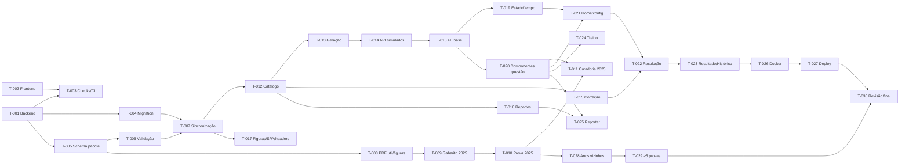

# Plano de Implementação — Simulado Fuvest

**Versão:** 1.0
**Data:** 2026-09-29
**PRD Ref:** 01-PRD v5.0
**Arquitetura Ref:** 02-ARCHITECTURE v1.10
**Spec Ref:** 03-SPEC v1.10 (specs 01–08)
**CR Ref:** CR-001, CR-002, CR-003, CR-004, CR-005, CR-006, CR-007, CR-008, CR-009, CR-010

---

## Visão Geral

| Grupo | Descrição | Tarefas | Status |
|-------|-----------|---------|--------|
| 1 | Setup e Infraestrutura | T-001 a T-004 | Concluído |
| 2 | Pacote e Ingestão | T-005 a T-011 | Concluído (exceto T-011, curador) |
| 3 | API | T-012 a T-017 | Concluído |
| 4 | Frontend | T-018 a T-025 | Concluído |
| 5 | Deploy | T-026 a T-027 | Concluído (pendente: toggle "Wait for CI", curador) |
| 6 | Conteúdo e Lançamento | T-028 a T-030 | Em andamento (T-028 concluída) |
| CR-001 | Resolução: navegação, folha de respostas e pausa (pós-MVP, [CR](changes/CR-001-resolucao-navegacao.md)) | CR-T-01 a CR-T-10 | Concluído |
| CR-002 | Contraste e tokens (pós-MVP, [CR](changes/CR-002-contraste-tokens.md)) | CR-T-01 a CR-T-05 | Concluído |
| CR-003 | Resultado, figura e início (pós-MVP, [CR](changes/CR-003-resultado-figura-inicio.md)) | CR-T-01 a CR-T-09 | Concluído |
| CR-004 | Assuntos e desempenho — Fase 3A do roadmap ([CR](changes/CR-004-assuntos-desempenho.md), [spec 06](specs/06-assuntos-desempenho.md)) | CR-T-01 a CR-T-10 | Concluído |
| CR-005 | Contas com Google e histórico sincronizado — Fase 3B do roadmap ([CR](changes/CR-005-contas-google.md), [spec 07](specs/07-contas-sincronizacao.md)) | CR-T-01 a CR-T-09 | Concluído |
| CR-006 | Login obrigatório para usar o site ([CR](changes/CR-006-login-obrigatorio.md), [spec 07 §8](specs/07-contas-sincronizacao.md)) | CR-T-01 a CR-T-05 | Concluído |
| CR-007 | Apresentação, menu do celular e barra opaca ([CR](changes/CR-007-apresentacao-menu-barra.md), [spec 07 §9](specs/07-contas-sincronizacao.md), [spec 03](specs/03-resolucao.md)) | CR-T-01 a CR-T-06 | Concluído |
| CR-008 | Identidade visual "Papel & Caneta" ([CR](changes/CR-008-identidade-papel-caneta.md), [spec 03 §3](specs/03-resolucao.md)) | CR-T-01 a CR-T-06 | Concluído |
| CR-009 | Rolagem ao trocar de página e extras do início ([CR](changes/CR-009-rolagem-inicio-extras.md), [spec 03](specs/03-resolucao.md)) | CR-T-01 a CR-T-06 | Concluído |
| CR-010 | Notas de corte por carreira e carreira-alvo, Fase 4 do roadmap ([CR](changes/CR-010-notas-de-corte.md), [spec 08](specs/08-notas-de-corte.md)) | CR-T-01 a CR-T-09 | Em Implementação |

> **Status:** Pendente / Em andamento / Concluído

**Branch:** todo o MVP é desenvolvido em `feat/mvp`, com commit ao fim de cada tarefa. O merge `--no-ff` em `master` acontece em T-027, depois da validação local completa dos Grupos 1–5. Depois do MVP, as mudanças de código seguem o Fluxo B (CR).

**Responsável:** as tarefas marcadas com **(curador)** dependem de trabalho manual do dono do produto (revisão e classificação das questões). GitHub e Railway são provisionados por CLI (`gh`, `railway`), como no Meu Controle. O único passo manual de infraestrutura é o toggle "Wait for CI" (T-027).

---

## Grupo 1: Setup e Infraestrutura

| ID | Tarefa | Arquivos | Ref | Depende de | Done When |
|----|--------|----------|-----|------------|-----------|
| T-001 | Scaffold do backend: FastAPI (`main`, `config`, `database`), `GET /api/health`, requirements (prod/ingestão/dev), `pyproject.toml` (ruff + pytest), `conftest.py` com SQLite in-memory, venv `backend/.venv` (sem `.env`, ver Arq. §9.3) | `backend/**` | ADR-001 | — | `python -m uvicorn app.main:app` sobe; `/api/health` 200; `pytest` e `ruff check` verdes |
| T-002 | Scaffold do frontend: Vite 8 + React 19 + TS 6.0 strict + Tailwind 4 + TanStack Query + react-router + ESLint + Vitest; proxy `/api` e `/figuras` → 8000 | `frontend/**` | ADR-007 | — | `npm run dev` abre a página; `tsc --noEmit -p tsconfig.app.json`, `npm run lint` e `npm test` verdes |
| T-003 | Ativar os checks de qualidade: hook com pytest, ruff, tsc, eslint e vitest (venv do projeto; letra do drive normalizada no `check-quality.js`); no CI, remover as guardas `hashFiles`, subir para Node 24, remover o `SECRET_KEY` e adicionar `ruff check`; atualizar os Comandos Essenciais e o Troubleshooting do `CLAUDE.md` | `.claude/hooks/check-config.json`, `.github/workflows/ci.yml`, `CLAUDE.md`, `.gitignore` (`data/_cache/`) | — | T-001, T-002 | Simulação do hook roda os 4 checks e passa; YAML do CI válido; CLAUDE.md sem a seção "Pendências do Scaffold" |
| T-004 | Models SQLAlchemy + migration `001_schema_inicial` (5 tabelas, índices) + Alembic configurado; testes rodam as migrations reais e comparam models × migration; CI valida as migrations num Postgres 17 (service container) e roda em push de qualquer branch | `backend/app/models.py`, `backend/alembic/**`, `.github/workflows/ci.yml` | Arq. §4 | T-001 | `alembic upgrade head` e `downgrade base` sem erro no SQLite (local) e no Postgres (CI) (BT-047) |

---

## Grupo 2: Pacote e Ingestão

| ID | Tarefa | Arquivos | Ref | Depende de | Done When |
|----|--------|----------|-----|------------|-----------|
| T-005 | Enum de disciplinas + schema do pacote + leitura/escrita YAML + gerador de pacotes sintéticos (2098/2099) | `app/disciplinas.py`, `app/pacote/schema.py`, `leitura.py`, `tests/fixtures/gerar_pacotes.py` | RF-004, RN-007 | T-001 | IT-001 verde; os pacotes sintéticos são gerados de forma determinística |
| T-006 | Validação V01–V10 + relatório + CLI `validar` + passo `python -m ingestao validar --todas` no CI | `app/pacote/validacao.py`, `ingestao/cli.py`, `.github/workflows/ci.yml` | RF-004, RN-007 | T-005 | IT-002, IT-003 verdes; `validar --todas` com exit code correto; passo no CI |
| T-007 | Sincronização repo → banco + `python -m app.pacote.sincronizar` + CLI `importar` | `app/pacote/sincronizar.py`, `ingestao/cli.py` | RF-006, RN-006, ADR-002 | T-004, T-006 | IT-004 a IT-007 e IT-012 verdes; pacotes sintéticos importados no SQLite local |
| T-008 | `baixar` + `pdf_util` (colunas, ordem de leitura, limpeza) + `figuras` (render → WebP) + `preview` + `recortar` | `ingestao/baixar.py`, `pdf_util.py`, `figuras.py`, `cli.py` | RF-001, RF-003 | T-005 | IT-010 e IT-013 verdes; `baixar` de 2025 grava os PDFs e o `fonte.json` |
| T-009 | Família 2025 — gabarito (registry + parser) com fixture do PDF oficial | `ingestao/gabarito/**`, `tests/fixtures/pdfs/` | RF-002, RN-001 | T-008 | IT-008 verde (90 respostas V1; Q1=E, Q46=D) |
| T-010 | Família 2025 — prova (registry + parser: questões, alternativas, textos-base, figuras, pendências) + CLI `extrair` | `ingestao/layouts/**`, `cli.py`, fixtures | RF-003, ADR-003 | T-008, T-009 | IT-009 e IT-011 verdes; `extrair --ano 2025` gera o pacote com relatório; métrica registrada no plano: % das 90 questões sem pendência estrutural. **Resultado (2026-09-29): 90/90 questões e 6/6 textos-base detectados; 61/90 (68%) sem pendência estrutural; 54 figuras (1,1 MB). Pendências nas 29 restantes: índices em fonte pequena (17), possíveis figuras vetoriais (16), sublinhados (9), fórmulas com símbolos não extraídos (9)** |
| T-011 | **(curador)** Curadoria da prova 2025: resolver as pendências, classificar as disciplinas, `validar`, conferir no site local (`importar --incluir-rascunhos`), `status: publicada` | `data/provas/2025/**` | RF-005, US-009 | T-010, T-020 | `validar --ano 2025` sem pendência bloqueante; **tempo de curadoria anotado** (meta ≤ 3 h, PRD §2) |

---

## Grupo 3: API

| ID | Tarefa | Arquivos | Ref | Depende de | Done When |
|----|--------|----------|-----|------------|-----------|
| T-012 | Serialização pública + serviço de catálogo (distribuição RN-003) + `GET /api/catalogo` | `services/serializacao.py`, `services/catalogo.py`, `routers/catalogo.py`, `schemas.py` | RF-008, RN-003 | T-007 | BT-001, BT-002 verdes |
| T-013 | Serviço de geração: 4 modos, semente, agrupamento RN-005, tempos RN-009 | `services/geracao.py` | RF-009–RF-012, RN-002–RN-005, RN-009 | T-012 | BT-010, BT-011 verdes + unitários de cada modo |
| T-014 | `POST /api/simulados` + `GET /api/questoes` + rate limit + contador de geração | `routers/simulados.py`, `routers/questoes.py`, `rate_limit.py`, `services/estatisticas.py` | RF-009–RF-012 | T-013 | BT-003 a BT-009 e BT-012 a BT-017 verdes |
| T-015 | Serviço de correção + `POST /api/correcoes` | `services/correcao.py`, `routers/correcoes.py` | RF-017, RF-018, RN-002, RN-008 | T-012 | BT-020 a BT-024 verdes |
| T-016 | Reportes: `POST /api/reportes` + CLI `reportes listar/resolver` | `routers/reportes.py`, `services/reportes.py`, `ingestao/cli.py` | RF-007, RF-021, ADR-008 | T-012 | BT-030 a BT-035 verdes |
| T-017 | Rota de figuras, fallback do SPA, headers de segurança, CORS/docs por ambiente | `main.py`, `security_headers.py` | Spec §3 | T-007 | BT-040 a BT-046 verdes; revisão OWASP registrada |

### Revisão de segurança do Grupo 3 (checklist OWASP do CLAUDE.md) — 2026-09-29

| Item | Resultado |
|------|-----------|
| Segredos hardcoded | Nenhum: o MVP não tem segredo (sem auth); config só por variáveis de ambiente, sem `.env` |
| Validação de entrada | Pydantic em todos os corpos (modos discriminados, faixas, padrões `AAAA-NNN`, listas únicas, descrição ≤ 500); `ids` da query validados antes da consulta |
| Tokens / ownership | N/A: não há usuário nem dado pessoal no servidor (ADR-004); reportes anônimos, sem IP gravado |
| SQL | Só ORM/`select()` parametrizado; nenhum SQL concatenado |
| CORS | Só em desenvolvimento, com origem explícita (`http://localhost:5173`), métodos GET/POST e header `Content-Type`; produção sem CORS (SPA na mesma origem) |
| Headers HTTP | CSP restritiva, `X-Frame-Options: DENY`, `nosniff`, `Referrer-Policy`; HSTS em produção (BT-045/046) |
| Exposição de dados | Gabarito nunca sai em geração/consulta (BT-017); `/docs` e OpenAPI desligados em produção |
| Path traversal | `/figuras`: regex de ano/arquivo antes de tocar o disco + só provas sincronizadas; fallback do SPA confere `is_relative_to(static)` |
| Abuso | Rate limit por IP: simulados 30/min, correções 120/min, reportes 10/h (IP real via `--proxy-headers`) |
| Dependências | `pip-audit` e `npm audit` no CI (informativos); localmente o `pip-audit` falha por certificado (CLAUDE.md) |

---

## Grupo 4: Frontend

| ID | Tarefa | Arquivos | Ref | Depende de | Done When |
|----|--------|----------|-----|------------|-----------|
| T-018 | Base: tipos, cliente da API (`ApiError`), layout com rodapé de não afiliação, rotas, estados loading/erro/vazio | `types.ts`, `services/api.ts`, `components/Layout.tsx`, `App.tsx` | RF-008, RN-013 | T-002, T-014 | App navega entre as rotas sem erros no console |
| T-019 | Storage + reducer + Context + utilitários de tempo + `useCronometro` + `AvisoStorage` | `storage/**`, `contexts/SimuladoContext.tsx`, `utils/tempo.ts`, `hooks/useCronometro.ts` | RF-015, RF-016, RN-009–RN-012 | T-018 | UT-001 a UT-006 verdes |
| T-020 | Componentes de questão: Blocos, Figura (zoom), Alternativas, QuestaoView | `components/**` | RF-013, RNF-003 | T-018 | UT-007, UT-008 verdes; questão sintética com figura e texto-base renderizada |
| T-021 | Home (catálogo + modos + retomar) + configuração do Personalizado + escolha do ano + início (RN-011, 409) | `pages/HomePage.tsx`, `ConfigurarPersonalizadoPage.tsx`, `EscolherAnoPage.tsx`, `hooks/useCatalogo.ts` | RF-008–RF-011 | T-019, T-020 | FT-003 validado (Playwright MCP) |
| T-022 | ResolucaoPage: grade, cronômetro (ocultar, pausar, aviso de 15 min), atalhos, finalizar (manual/tempo/ao carregar) | `pages/ResolucaoPage.tsx`, `components/GradeQuestoes.tsx`, `Cronometro.tsx`, `ConfirmDialog.tsx` | RF-013–RF-016, RN-010 | T-021, T-015 | FT-001 e FT-005 validados |
| T-023 | Resultado (resumo, disciplinas, revisão) + Histórico | `pages/ResultadoPage.tsx`, `HistoricoPage.tsx`, `storage/historicoStorage.ts`, componentes | RF-017–RF-020 | T-022 | UT-020, UT-021 verdes; FT-002 e FT-010 validados |
| T-024 | TreinoPage (lotes, feedback imediato, placar, recomeçar) | `pages/TreinoPage.tsx` | RF-012 | T-020, T-015 | FT-004 validado |
| T-025 | ReportarModal integrado ao QuestaoView | `components/ReportarModal.tsx` | RF-021 | T-020, T-016 | FT-020 validado |

### Validações em runtime do Grupo 4 (Playwright MCP, backend + Vite locais, base sintética 2098/2099)

| Data | Tarefa | Fluxo | Resultado |
|------|--------|-------|-----------|
| 2026-09-29 | T-018 | Navegar pelas 8 rotas | Todas renderizam; console sem erros após adicionar o favicon |
| 2026-09-29 | T-021 | FT-003: Personalizado (Inglês, 2098, 90 questões) | 409 → "Só existem 11 questões para esses filtros." → "Gerar com 11 questões" → `/simulado` com 11 questões, limite 2200 s, pausável. O único registro no console é o log automático do navegador para a resposta 409 (esperado e tratado pelo app) |
| 2026-09-29 | T-022 | FT-001: Início → Prova completa (descartando o anterior, RN-011) → responder 3 → recarregar | Volta na questão 3 de 90 com a resposta marcada; folha mostra 1 B, 2 D, 3 A; cronômetro seguiu (04:59:50); console limpo |
| 2026-09-29 | T-022 | FT-005: celular 360 px | Sem rolagem horizontal (345 px); folha de respostas em gaveta fecha ao navegar; figura amplia e fecha com Esc. Ajustes feitos: folha com 2 colunas visíveis no desktop (lateral de 20rem) e barra fixa em uma linha no celular (descrição oculta, ícone para ocultar o tempo) |
| 2026-09-29 | T-023 | FT-010: Prova de 2099 → 5 respostas → Finalizar → resultado → filtro "Erradas" → histórico | **Achou um bug**: a finalização caía em `/` (o `DESCARTAR` urgente fazia a resolução redirecionar antes da navegação, que roda como transição). Corrigido movendo o descarte para a tela de resultado; teste reforçado para exigir a tela de resultado. Após a correção: "Você acertou 2 de 90" (as 2 anuladas de 2099, RN-002), folha corrigida com rótulos por linha, filtro "Erradas" com 5 questões, histórico com a entrada e simulado em andamento descartado |
| 2026-09-29 | T-024 | FT-004: Treino → responder 3 → feedback → próxima | Feedback imediato ("Resposta correta: A."), alternativas travadas, placar "0 acertos em 3 respondidas", texto compartilhado exibido com figura. Implementado com `useInfiniteQuery` (lotes como páginas; `excluir` = já vistas) |
| 2026-09-30 | T-025 | FT-020: reportar na resolução | Modal com a fonte da questão; "Obrigado! Vamos revisar esta questão." e fechamento em 2 s; cronômetro seguiu (05:00:00 → 04:59:58); reporte gravado e listado pela CLI (`reportes listar`) |
| 2026-09-30 | T-026 | Composição de produção local (build do SPA + `ENVIRONMENT=production` + start completo) e job `docker` no CI | SPA nas rotas profundas, assets/figuras/favicon com tipo certo, 404 JSON em `/api`, sem Swagger, CSP/HSTS ativos; no navegador, nenhuma violação de CSP e as duas fontes carregam. CI: imagem construída e smoke test verde |
| 2026-09-30 | T-027 | Provisionamento via CLI + merge em `master` + primeiro deploy | Projeto, Postgres e serviço criados (o app da Railway no GitHub precisou de acesso ao repositório, liberado pelo curador); deploy de `2ad8220` com sucesso; migration aplicada no Postgres; health `{"status":"ok","provas":0}`; início em https://simulado-fuvest-production.up.railway.app com "Ainda não há provas publicadas" (o rascunho 2025 é ignorado até a curadoria); headers de segurança e ausência de CORS/docs conferidos. **O simulado completo em produção fica para depois da T-011** |

---

## Grupo 5: Deploy

| ID | Tarefa | Arquivos | Ref | Depende de | Done When |
|----|--------|----------|-----|------------|-----------|
| T-026 | Dockerfile multi-stage (Node 24 → Python 3.12) com `data/provas`, start = migrations + sincronização + uvicorn com proxy headers; `railway.json` (config-as-code: builder Dockerfile, healthcheck `/api/health`, restart on failure); `05-DEPLOY-GUIDE.md` no formato do Meu Controle | `Dockerfile`, `.dockerignore`, `railway.json`, `docs/05-DEPLOY-GUIDE.md` | ADR-001, Arq. §9 | Grupos 3 e 4 | `docker build` + `docker run` local com SQLite servem o SPA, a API e as figuras (se não houver Docker local, validar no primeiro deploy e registrar) |
| T-027 | Provisionar a Railway via CLI (mesmo padrão do Meu Controle) + merge `feat/mvp` → `master` + primeiro deploy (`/deploy-railway`) + smoke test em produção. Comandos: `railway init -n simulado-fuvest`; `railway add -d postgres`; `railway add -s simulado-fuvest -r RafaelPeixoto01/simulado-fuvest -v 'DATABASE_URL=${{Postgres.DATABASE_URL}}' -v ENVIRONMENT=production`; `railway domain`. **Único passo manual (curador):** ligar o toggle "Wait for CI" no dashboard (Settings → Source), que não é exposto por CLI, config-as-code nem API | Railway (fora do repo) | Arq. §9 | T-026 | CI verde em `master`; `/api/health` 200 no domínio da Railway; simulado completo exercitado em produção; "Wait for CI" ligado |

---

## Grupo 6: Conteúdo e Lançamento

| ID | Tarefa | Arquivos | Ref | Depende de | Done When |
|----|--------|----------|-----|------------|-----------|
| T-028 | Estender o registry da família 2025 aos anos vizinhos (2024, 2023, …) até onde ela extrair sem pendência estrutural; documentar onde uma família nova seria necessária | `ingestao/layouts/__init__.py`, `ingestao/gabarito/__init__.py`, fixtures | RF-003, ADR-003 | T-010 | Anos suportados listados no registry e na Arquitetura. **Resultado (2026-09-30):** a família cobre 2020, 2022, 2023, 2024 e 2025 (muda só a fonte do número da questão; gabarito com versões V/K/Q/X/Z). 2021 fica de fora: o PDF não tem texto extraível e exigiria OCR. Rascunhos extraídos: 2024 62/90, 2023 61/90, 2022 56/90, 2020 68/90 sem pendência estrutural (2025: 61/90). O gabarito retificado de 2024 aceita duas respostas na questão 48 (versão V): vira pendência para o curador |
| T-029 | **(curador)** Curadoria e publicação até **≥ 5 provas** (meta do PRD §2). Desde o CR-004, cada questão também recebe um assunto da taxonomia (V11); revisar com `ingestao assuntos --ano AAAA` | `data/provas/**` | PRD §2 | T-011, T-028 | `validar --todas` verde; 5+ provas no catálogo de produção |
| T-030 | Revisão final: acessibilidade (teclado, contraste, alt), mobile 360 px, performance (geração p95 < 2 s), `/code-review` do diff, sincronização de todos os docs (PRD, Arquitetura, Specs, Plano, CLAUDE.md) | docs + ajustes | RNF-001–RNF-003 | T-027, T-029 | Checklist Done When Universal completo; findings corrigidos ou justificados |

**Processo de conteúdo após o lançamento:** publicar uma prova nova (ou corrigir uma questão reportada) é mudança de **dados**, não de código. O fluxo é a branch `conteudo/prova-AAAA` (ou `conteudo/correcao-AAAA-NNN`) + commit do pacote + merge com o CI verde (`validar --todas`), sem CR. Mudanças em parser, API ou UI seguem o Fluxo B.

---

## Diagrama de Dependências

---

*Documento criado em 2026-09-29.*
