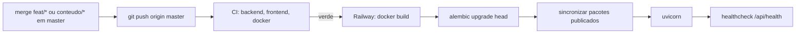

# Guia de Deploy e Release — Simulado Fuvest

**Versão:** 1.0
**Data:** 2026-09-30
**Arquitetura Ref:** 02-ARCHITECTURE v1.0 (ADR-001, ADR-002, ADR-008, §9)

---

## 1. Visão Geral da Infraestrutura

### 1.1 Plataforma

| Item | Valor |
|------|-------|
| Hosting | Railway, projeto `simulado-fuvest`, serviço `simulado-fuvest` (container Docker) |
| URL | https://simulado-fuvest-production.up.railway.app |
| Banco de dados | PostgreSQL (add-on Railway, serviço `Postgres`) |
| Repositório | https://github.com/RafaelPeixoto01/simulado-fuvest (branch `master`) |
| Build trigger | Push em `master` (auto-deploy da Railway) |
| Gate de deploy | "Wait for CI" ligado no serviço (toggle só no dashboard) |
| Config-as-code | `railway.json`: builder Dockerfile, healthcheck `/api/health` (120 s), restart on failure (10×) |
| Container | `node:24-alpine` (build do SPA) → `python:3.12-slim` |
| Porta | `PORT` injetada pela Railway (8080 em produção; padrão local 8000) |

### 1.2 Pipeline de Deploy



1. **Stage 1:** `npm ci` + `npm run build` do SPA.
2. **Stage 2:** instala só `requirements.txt` (as libs de PDF ficam fora), copia `backend/`, `data/provas/` e o build do SPA para `backend/static`.
3. **Start:** migrations → `python -m app.pacote.sincronizar` (o banco passa a espelhar os pacotes **publicados e válidos** do repositório) → uvicorn com `--proxy-headers` (IP real para o rate limit).
4. A Railway só troca o tráfego depois do `/api/health` responder 200.

---

## 2. Variáveis de Ambiente

Não existe arquivo `.env`: todo default é local e seguro (SQLite). Produção define:

| Variável | Obrigatória | Valor em produção | Observação |
|----------|-------------|-------------------|------------|
| `DATABASE_URL` | Sim | `${{Postgres.DATABASE_URL}}` (referência) | `postgres://` convertido para `postgresql+psycopg://` em `database.py` |
| `ENVIRONMENT` | Sim | `production` | Desliga `/docs`/OpenAPI e CORS, liga HSTS. Já vem no Dockerfile |
| `DATA_DIR` | Não | `/app/data/provas` (Dockerfile) | Pacotes e figuras |
| `STATIC_DIR` | Não | `/app/backend/static` (Dockerfile) | Build do SPA |
| `PORT` | Não | Injetada pela Railway | |

Não há segredos no MVP (sem autenticação nem integrações pagas).

---

## 3. Provisionamento (uma vez, via CLI)

Mesmo padrão do Meu Controle. Pré-requisitos: `railway` CLI logado (`railway whoami`), `master` com o app e CI verde.

```bash
railway init -n simulado-fuvest -w "My Projects"   # cria e linka o projeto a este diretório
railway add -d postgres                            # serviço Postgres
railway add -s simulado-fuvest -r RafaelPeixoto01/simulado-fuvest \
  -v 'DATABASE_URL=${{Postgres.DATABASE_URL}}' -v ENVIRONMENT=production
railway domain -s simulado-fuvest                  # domínio *.up.railway.app
```

**Único passo manual:** Railway Dashboard → serviço `simulado-fuvest` → Settings → Source → ligar **"Wait for CI"**. Sem ele o deploy sai no push, antes do CI terminar.

> Se a Railway não enxergar o repositório, o app da Railway no GitHub foi instalado só para repositórios selecionados: incluir `simulado-fuvest` em GitHub → Settings → Applications → Railway.

---

## 4. Checklist Pré-Deploy

### 4.1 Código (Fluxo B / CR)
- [ ] Branch do CR mergeada em `master` com `--no-ff`
- [ ] `pytest`, `ruff`, `tsc`, `eslint`, `vitest` verdes (o hook de commit já exige)
- [ ] CI verde no push (`gh run watch`): jobs backend, frontend e docker
- [ ] Nenhum `.env`, credencial ou `data/_cache/` no commit

### 4.2 Conteúdo (prova nova ou correção de questão)
- [ ] Branch `conteudo/prova-AAAA` (ou `conteudo/correcao-AAAA-NNN`)
- [ ] `python -m ingestao validar --ano AAAA` sem pendência bloqueante
- [ ] `status: publicada` no `prova.yaml`
- [ ] Conferido no site local: `python -m ingestao importar` + `npm run dev`
- [ ] Merge em `master` + push → CI (`validar --todas`) → deploy → a sincronização publica a prova

### 4.3 Migration
- [ ] `upgrade head` e `downgrade -1` testados no SQLite local **e** no Postgres do CI (passo "Migrations no Postgres")
- [ ] `downgrade()` implementado; se destrutiva, backup antes (seção 6)

> **Nunca aponte o banco local para produção.** Todos os comandos locais usam SQLite por padrão. O único comando que toca produção é `reportes`, e ele exige `--database-url` explícito (ADR-008).

---

## 5. Rollback

| Situação | Ação |
|----------|------|
| Código quebrou (sem migration) | Railway Dashboard → Deployments → "Redeploy" no deploy anterior; ou `git revert <hash>` + push |
| Prova publicada com erro | `git revert` do commit do pacote (ou corrigir o `prova.yaml`) + push: a próxima sincronização deixa o banco igual ao repositório |
| Migration precisa reverter | Backup (seção 6) → `railway ssh -s simulado-fuvest python -m alembic downgrade -1` (roda **dentro** do container, com a URL interna do banco) → reverter o código |
| Deploy não sobe (healthcheck falha) | A Railway mantém o deploy anterior no ar; ver `railway logs` |

O banco de questões é descartável: ele é reconstruído a cada start a partir de `data/provas`. Só `reportes` e `estatisticas_geracao` são dados próprios do banco.

---

## 6. Backup

Pela URL pública do Postgres (a interna, `*.railway.internal`, só é alcançável de dentro da Railway):

```bash
railway variables -s Postgres --kv | grep DATABASE_PUBLIC_URL   # tem a senha: não colar em lugar nenhum
pg_dump -Fc "<DATABASE_PUBLIC_URL>" > backup_$(date +%Y%m%d_%H%M%S).dump
pg_restore --clean --if-exists -d "<DATABASE_PUBLIC_URL>" backup_AAAAMMDD_HHMMSS.dump
```

Requer o cliente do PostgreSQL (`pg_dump`/`pg_restore`), **que não está instalado nesta máquina hoje**. Obrigatório antes de migration destrutiva. O que se perderia sem backup é pouco: só `reportes` e `estatisticas_geracao`, porque as questões são reconstruídas do git a cada start.

---

## 7. Verificação Pós-Deploy

- [ ] `GET /api/health` → `{"status":"ok","provas":N}` com o N esperado de provas publicadas
- [ ] Início carrega o catálogo (anos e questões por disciplina)
- [ ] Prova completa ou de um ano: gerar, responder, recarregar (respostas mantidas), finalizar, resultado
- [ ] Treino: resposta imediata
- [ ] Figuras carregam (`/figuras/AAAA/...`)
- [ ] `railway logs`: sem erros; a linha `Sincronizadas: [...]` lista as provas esperadas e nenhuma `Ignorada` publicada

---

## 8. Operação do Curador

### 8.1 Reportes de erro dos estudantes

```bash
railway variables -s Postgres --kv | grep DATABASE_PUBLIC_URL     # URL pública (tem a senha: não colar em lugar nenhum)
cd backend
.venv/Scripts/python -m ingestao reportes listar --database-url "<DATABASE_PUBLIC_URL>"
# corrigir o prova.yaml numa branch conteudo/..., merge, deploy; depois:
.venv/Scripts/python -m ingestao reportes resolver --database-url "<DATABASE_PUBLIC_URL>" 12 15
```

### 8.2 Diagnóstico

```bash
railway logs -s simulado-fuvest
railway ssh -s simulado-fuvest python -m alembic current     # dentro do container (WORKDIR /app/backend)
railway status
```

---

## 9. Integração Contínua

`.github/workflows/ci.yml` roda em push de **qualquer branch** e em PRs:

| Job | Passos |
|-----|--------|
| backend | ruff → pytest → `ingestao validar --todas` → migrations num Postgres 17 (upgrade/downgrade/upgrade) → pip-audit (informativo) |
| frontend | `npm ci` → tsc → eslint → vitest → npm audit (informativo) |
| docker | `docker build` da mesma imagem da Railway → container com SQLite → smoke test (health, SPA, 404 JSON em `/api`, sem Swagger, CSP) |

Acompanhar: `gh run watch`; falhas: `gh run view --log-failed`.

---

## Changelog

| Data | Autor | Descrição |
|------|-------|-----------|
| 2026-09-30 | Claude | Documento criado (v1.0) — T-026 |
