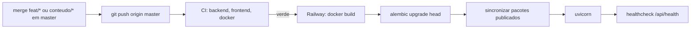

# Guia de Deploy e Release — Simulado Fuvest

**Versão:** 1.4
**Data:** 2026-10-01
**Arquitetura Ref:** 02-ARCHITECTURE v1.7 (ADR-001, ADR-002, ADR-008, ADR-009, ADR-010, ADR-012, §9)

---

## 1. Visão Geral da Infraestrutura

### 1.1 Plataforma

| Item | Valor |
|------|-------|
| Hosting | Railway, projeto `simulado-fuvest`, serviço `simulado-fuvest` (container Docker) |
| URL | https://simulado-fuvest-production.up.railway.app |
| Banco de dados | PostgreSQL (add-on Railway, serviço `Postgres`) |
| Repositório | https://github.com/RafaelPeixoto01/simulado-fuvest (branch `master`) |
| Build trigger | Push em `master` (auto-deploy da Railway) |
| Gate de deploy | "Wait for CI" ligado no serviço (toggle só no dashboard) |
| Config-as-code | `railway.json`: builder Dockerfile, healthcheck `/api/health` (120 s), restart on failure (10×) |
| Container | `node:24-alpine` (build do SPA) → `python:3.12-slim` |
| Porta | `PORT` injetada pela Railway (8080 em produção; padrão local 8000) |

### 1.2 Pipeline de Deploy



1. **Stage 1:** `npm ci` + `npm run build` do SPA.
2. **Stage 2:** instala só `requirements.txt` (as libs de PDF ficam fora), copia `backend/`, `data/provas/` e o build do SPA para `backend/static`.
3. **Start:** migrations → `python -m app.pacote.sincronizar` (o banco passa a espelhar os pacotes **publicados e válidos** do repositório) → uvicorn com `--proxy-headers` (IP real para o rate limit).
4. A Railway só troca o tráfego depois do `/api/health` responder 200.

---

## 2. Variáveis de Ambiente

Não existe arquivo `.env`: todo default é local e seguro (SQLite). Produção define:

| Variável | Obrigatória | Valor em produção | Observação |
|----------|-------------|-------------------|------------|
| `DATABASE_URL` | Sim | `${{Postgres.DATABASE_URL}}` (referência) | `postgres://` convertido para `postgresql+psycopg://` em `database.py` |
| `ENVIRONMENT` | Sim | `production` | Desliga `/docs`/OpenAPI e CORS, liga HSTS. Já vem no Dockerfile |
| `DATA_DIR` | Não | `/app/data/provas` (Dockerfile) | Pacotes e figuras |
| `STATIC_DIR` | Não | `/app/backend/static` (Dockerfile) | Build do SPA |
| `PORT` | Não | Injetada pela Railway | |
| `GOOGLE_CLIENT_ID` | Sim (CR-006) | ID do cliente OAuth (seção 3.1) | Sem ele (ou sem o segredo, ou com `PUBLIC_URL` sem https), o site fica **indisponível** em produção: 503 `site_indisponivel` na API de conteúdo (CR-006). Fora de produção, abre sem login |
| `GOOGLE_CLIENT_SECRET` | Para o login | Segredo do cliente OAuth | **Único segredo do projeto.** Definir só na Railway; nunca no repositório, em log ou no chat |
| `PUBLIC_URL` | Para o login | `https://simulado-fuvest-production.up.railway.app` | Sem barra final. Monta o `redirect_uri` e é o único `Origin` aceito nos `POST`/`DELETE` com cookie. Em produção, sem `https` o login fica desligado e o log mostra `PUBLIC_URL precisa ser https` |

Trocar o domínio exige atualizar `PUBLIC_URL` **e** o URI de redirecionamento do cliente OAuth (seção 3.1).

---

## 3. Provisionamento (uma vez, via CLI)

Mesmo padrão do Meu Controle. Pré-requisitos: `railway` CLI logado (`railway whoami`), `master` com o app e CI verde.

```bash
railway init -n simulado-fuvest -w "My Projects"   # cria e linka o projeto a este diretório
railway add -d postgres                            # serviço Postgres
railway add -s simulado-fuvest -r RafaelPeixoto01/simulado-fuvest \
  -v 'DATABASE_URL=${{Postgres.DATABASE_URL}}' -v ENVIRONMENT=production
railway domain -s simulado-fuvest                  # domínio *.up.railway.app
```

**Único passo manual:** Railway Dashboard → serviço `simulado-fuvest` → Settings → Source → ligar **"Wait for CI"**. Sem ele o deploy sai no push, antes do CI terminar.

> Se a Railway não enxergar o repositório, o app da Railway no GitHub foi instalado só para repositórios selecionados: incluir `simulado-fuvest` em GitHub → Settings → Applications → Railway.

### 3.1 Login com Google (uma vez, manual — CR-005)

O Google Cloud não tem CLI para criar cliente OAuth do tipo "Aplicativo da Web"; estes passos são feitos no console (https://console.cloud.google.com), com a conta do curador.

1. **Projeto:** criar um projeto "Simulado Fuvest" (ou usar um existente).
2. **Google Auth Platform → Branding (tela de consentimento):** nome do app "Simulado Fuvest"; e-mail de suporte; página inicial `https://simulado-fuvest-production.up.railway.app`; política de privacidade `https://simulado-fuvest-production.up.railway.app/privacidade`; domínio autorizado `simulado-fuvest-production.up.railway.app` (se o console recusar, `up.railway.app`).
3. **Público-alvo:** tipo **Externo**, depois **Publicar app** ("Em produção"). Em "Teste", só os usuários de teste entram. Com os escopos `openid`, `email` e `profile`, que não são sensíveis, não há verificação do Google.
4. **Acesso a dados:** nenhum escopo além de `openid`, `.../auth/userinfo.email` e `.../auth/userinfo.profile`.
5. **Clientes → Criar cliente → Aplicativo da Web**, nome "Simulado Fuvest". **URIs de redirecionamento autorizados:**
   - `https://simulado-fuvest-production.up.railway.app/api/auth/google/callback`
   - `http://localhost:5173/api/auth/google/callback` (opcional: login real no ambiente local)

   Nenhuma "origem JavaScript" é necessária (o site não usa o script do Google).
6. **Variáveis na Railway**, rodadas pelo curador no próprio terminal (o segredo não passa pelo chat):
   ```bash
   railway variables -s simulado-fuvest \
     --set GOOGLE_CLIENT_ID=<id>.apps.googleusercontent.com \
     --set GOOGLE_CLIENT_SECRET=<segredo> \
     --set PUBLIC_URL=https://simulado-fuvest-production.up.railway.app
   ```
   Definir variáveis dispara um redeploy. Sem o código do CR-005 no ar, elas são ignoradas.

**Situação (01/10/2026, CR-005):** cliente criado e app publicado; as três variáveis estão definidas. A tela de login do Google mostra o domínio no lugar de "Simulado Fuvest" porque a marca não foi verificada; isso não impede o login. Para mostrar o nome, pedir a verificação da marca em "Branding".

**Login local (opcional):** `GOOGLE_CLIENT_ID=... GOOGLE_CLIENT_SECRET=... DATABASE_URL="sqlite:///./local.db" .venv/Scripts/python -m uvicorn app.main:app --reload` + `npm run dev` (o `PUBLIC_URL` padrão já é `http://localhost:5173`). Sem as variáveis, o site local funciona sem login.

---

## 4. Checklist Pré-Deploy

### 4.1 Código (Fluxo B / CR)
- [ ] Branch do CR mergeada em `master` com `--no-ff`
- [ ] `pytest`, `ruff`, `tsc`, `eslint`, `vitest` verdes (o hook de commit já exige)
- [ ] CI verde no push (`gh run watch`): jobs backend, frontend e docker
- [ ] Nenhum `.env`, credencial ou `data/_cache/` no commit (o `GOOGLE_CLIENT_SECRET` só existe na Railway)

### 4.2 Conteúdo (prova nova ou correção de questão)
- [ ] Branch `conteudo/prova-AAAA` (ou `conteudo/correcao-AAAA-NNN`)
- [ ] Toda questão com disciplina **e assunto** da taxonomia `data/provas/assuntos.yaml` (V11, CR-004); revisar com `python -m ingestao assuntos --ano AAAA`
- [ ] `python -m ingestao validar --ano AAAA` sem pendência bloqueante
- [ ] `status: publicada` no `prova.yaml`
- [ ] Conferido no site local: `python -m ingestao importar` + `npm run dev`
- [ ] Merge em `master` + push → CI (`validar --todas`) → deploy → a sincronização publica a prova

### 4.3 Migration
- [ ] `upgrade head` e `downgrade -1` testados no SQLite local **e** no Postgres do CI (passo "Migrations no Postgres")
- [ ] `downgrade()` implementado; se destrutiva, backup antes (seção 6)

### 4.4 Taxonomia de assuntos (CR-004)
- [ ] Mudou `data/provas/assuntos.yaml`? `python -m ingestao validar --todas` verde: renomear ou remover um slug em uso exige reclassificar as questões no mesmo commit (V11)
- [ ] Taxonomia inválida em produção **não derruba o site**: a sincronização sai com erro antes de tocar o banco, o start falha e a Railway mantém o deploy anterior (ADR-009)

> **Nunca aponte o banco local para produção.** Todos os comandos locais usam SQLite por padrão. O único comando que toca produção é `reportes`, e ele exige `--database-url` explícito (ADR-008).

---

## 5. Rollback

| Situação | Ação |
|----------|------|
| Código quebrou (sem migration) | Railway Dashboard → Deployments → "Redeploy" no deploy anterior; ou `git revert <hash>` + push |
| Prova publicada com erro | `git revert` do commit do pacote (ou corrigir o `prova.yaml`) + push: a próxima sincronização deixa o banco igual ao repositório |
| Migration precisa reverter | Backup (seção 6) → `railway ssh -s simulado-fuvest python -m alembic downgrade -1` (roda **dentro** do container, com a URL interna do banco) → reverter o código |
| Deploy não sobe (healthcheck falha) | A Railway mantém o deploy anterior no ar; ver `railway logs` (inclui taxonomia inválida: `TaxonomiaInvalida` no log da sincronização) |
| Desligar o login (CR-005/CR-006) | Desde o CR-006, remover `GOOGLE_CLIENT_ID` **tira o site do ar** em produção ("temporariamente indisponível"); quem já entrou ainda pode sair e excluir a conta. Para voltar ao site público, reverter o CR-006. Trocar o segredo não desconecta ninguém |
| Desconectar todo mundo (ex.: suspeita de vazamento de sessões) | Apagar as linhas de `sessoes` com um comando Python no container (seção 8.3): `with app.state.engine.begin() as c: c.execute(text("DELETE FROM sessoes"))`. Os históricos ficam; cada estudante entra de novo |
| Reverter o CR-005 (contas) | `git revert -m 1` do merge: o código anterior ignora as tabelas novas. **Não** rodar `alembic downgrade` da `003` sem backup: ele apaga contas e históricos |
| Reverter o CR-004 (assuntos) | `git revert -m 1` do merge **inteiro**, que leva código e conteúdo juntos. Reverter só o código deixaria os pacotes com `assunto`, que o schema antigo (`extra="forbid"`) rejeita, e as provas sairiam do ar. A migration `002` pode ficar: o código antigo ignora a coluna |

O banco de questões é descartável: ele é reconstruído a cada start a partir de `data/provas`. Os dados próprios do banco são `reportes`, `estatisticas_geracao` e, desde o CR-005, **as contas**: `usuarios`, `sessoes` e `simulados_concluidos`, que não podem ser reconstruídas.

---

## 6. Backup

Pela URL pública do Postgres (a interna, `*.railway.internal`, só é alcançável de dentro da Railway):

```bash
railway variables -s Postgres --kv | grep DATABASE_PUBLIC_URL   # tem a senha: não colar em lugar nenhum
pg_dump -Fc "<DATABASE_PUBLIC_URL>" > backup_$(date +%Y%m%d_%H%M%S).dump
pg_restore --clean --if-exists -d "<DATABASE_PUBLIC_URL>" backup_AAAAMMDD_HHMMSS.dump
```

Requer o cliente do PostgreSQL (`pg_dump`/`pg_restore`), **que não está instalado nesta máquina hoje**. Obrigatório antes de migration destrutiva. Desde o CR-005, o banco guarda contas e históricos de estudantes, e perdê-los é perder dados de usuários: além do backup manual antes de migrations, ligar os backups do volume do Postgres na Railway (Postgres → Backups, conforme o plano). O arquivo de backup tem dado pessoal: guardar fora do repositório e apagar quando não for mais necessário.

---

## 7. Verificação Pós-Deploy

- [ ] `GET /api/health` → `{"status":"ok","provas":N}` com o N esperado de provas publicadas
- [ ] Com login, o início carrega o catálogo (anos e questões por disciplina), e o catálogo traz `assuntos` em cada disciplina (CR-004). Desde o CR-006, `GET /api/catalogo` sem cookie responde 401: confira no navegador logado (ou com o cookie de sessão)
- [ ] Prova completa ou de um ano: gerar, responder, recarregar (respostas mantidas), finalizar, resultado
- [ ] Resultado com "Ver por assunto" e `/desempenho` somando o histórico (CR-004)
- [ ] Treino: resposta imediata
- [ ] Conta (CR-005): `GET /api/sessao` → `login_disponivel: true`; "Entrar" → Google → volta logado com o primeiro nome no cabeçalho; o histórico aparece em outro navegador depois de entrar; "Sair" limpa o histórico do navegador
- [ ] Sem conta: nenhum cookie é criado ao navegar (DevTools → Application → Cookies)
- [ ] Login obrigatório (CR-006): `GET /api/sessao` → `acesso: "conta"`; sem cookie, `GET /api/catalogo` → 401; num navegador sem login, o início mostra a apresentação e `/historico` leva a ela
- [ ] Vitrine (CR-007): sem cookie, `GET /api/vitrine` → 200 com `total_questoes` igual ao do catálogo e os `anos` publicados; a apresentação mostra esses números
- [ ] Figuras carregam (`/figuras/AAAA/...`)
- [ ] `railway logs`: sem erros; a linha `Sincronizadas: [...]` lista as provas esperadas e nenhuma `Ignorada` publicada

---

## 8. Operação do Curador

### 8.1 Reportes de erro dos estudantes

```bash
railway variables -s Postgres --kv | grep DATABASE_PUBLIC_URL     # URL pública (tem a senha: não colar em lugar nenhum)
cd backend
.venv/Scripts/python -m ingestao reportes listar --database-url "<DATABASE_PUBLIC_URL>"
# corrigir o prova.yaml numa branch conteudo/..., merge, deploy; depois:
.venv/Scripts/python -m ingestao reportes resolver --database-url "<DATABASE_PUBLIC_URL>" 12 15
```

### 8.2 Diagnóstico

```bash
railway logs -s simulado-fuvest
railway ssh -s simulado-fuvest python -m alembic current     # dentro do container (WORKDIR /app/backend)
railway status
```

---

### 8.3 Comandos Python no container

O `railway ssh` repassa o comando a um `sh` remoto e perde as aspas: `python -c "...(...)"` falha com `Syntax error: "(" unexpected`. Mande o código em base64:

```bash
CODIGO='from sqlalchemy import text
from app.main import app
c = app.state.engine.connect()
print({t: c.execute(text("select count(*) from " + t)).scalar() for t in ("usuarios", "sessoes", "simulados_concluidos")})'
B64=$(printf '%s' "$CODIGO" | base64 -w0)
railway ssh -s simulado-fuvest "python -c 'exec(__import__(\"base64\").b64decode(\"$B64\"))'"
```

Consultas sobre as contas devem mostrar só contagens: e-mails, nomes e históricos são dados pessoais e não vão para o terminal nem para o chat.

## 9. Integração Contínua

`.github/workflows/ci.yml` roda em push de **qualquer branch** e em PRs:

| Job | Passos |
|-----|--------|
| backend | ruff → pytest → `ingestao validar --todas` → migrations num Postgres 17 (upgrade/downgrade/upgrade) → pip-audit (informativo) |
| frontend | `npm ci` → tsc → eslint → vitest → npm audit (informativo) |
| docker | `docker build` da mesma imagem da Railway → container com SQLite → smoke test (health, SPA, 404 JSON em `/api`, sem Swagger, CSP; `/api/catalogo` → 503, porque o container de produção do CI não tem login configurado — CR-006; `/api/vitrine` → 200, porque é pública — CR-007) |

Acompanhar: `gh run watch`; falhas: `gh run view --log-failed`.

---

## Changelog

| Data | Autor | Descrição |
|------|-------|-----------|
| 2026-09-30 | Claude | Documento criado (v1.0) — T-026 |
| 2026-09-30 | Claude | v1.1 — CR-004: assunto obrigatório na publicação, checklist da taxonomia, rollback conjunto código + conteúdo, verificação dos assuntos |
| 2026-10-01 | Claude | v1.2 — CR-005: variáveis do login (`GOOGLE_*`, `PUBLIC_URL`), cliente OAuth no Google Cloud (§3.1), backup com dados de usuário, rollback e verificação das contas |
| 2026-10-01 | Claude | v1.2 — CR-005 concluído: situação do cliente OAuth (§3.1) e comandos Python no container via base64 (§8.3) |
| 2026-10-01 | Claude | v1.3 — CR-006: login obrigatório; sem as variáveis do Google, o site fica indisponível em produção; smoke test e verificação pós-deploy |
| 2026-10-01 | Claude | v1.4 — CR-007: `GET /api/vitrine` pública na verificação pós-deploy e no smoke test |
