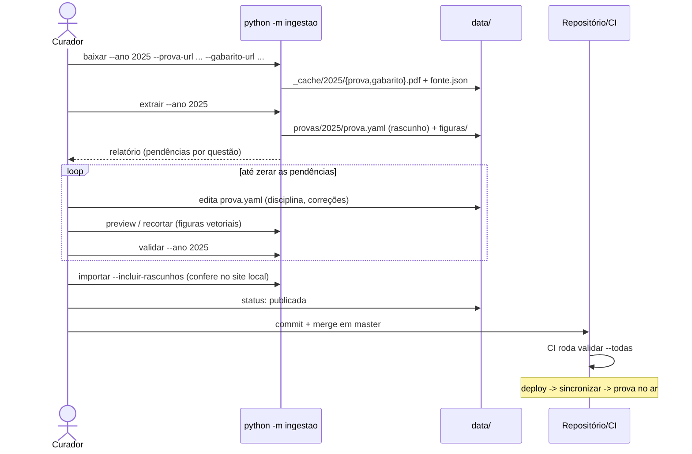

# Especificação Técnica — Ingestão de Provas

**Versão:** 1.4
**Data:** 2026-10-05
**PRD Ref:** 01-PRD v2.0 (RF-001 a RF-006, RF-023, US-009, US-012, RN-001, RN-006, RN-007, RN-014)
**Arquitetura Ref:** 02-ARCHITECTURE v1.4 (ADR-002, ADR-003, ADR-006, ADR-008, ADR-009)
**CR Ref:** CR-004 (assunto por questão, V11, taxonomia e comando `assuntos` — detalhe em `specs/06-assuntos-desempenho.md`), CR-010 (notas de corte: comando `cortes` e `validar` com os cortes — detalhe em `specs/08-notas-de-corte.md`), CR-011 (código da prova, simulados oficiais, total de questões por pacote e família 2027), CR-012 (família 2026: prova da FUVEST 2026 e simulado oficial de 2025)

---

## 1. Resumo das Mudanças

CLI do curador (`python -m ingestao <comando>`, executada a partir de `backend/`) que transforma os PDFs oficiais de uma prova em um **pacote de revisão** versionado (`data/provas/CODIGO/prova.yaml` + `figuras/`). Desde o CR-011, a prova é identificada pelo **código**: `AAAA` no vestibular e `AAAAsN` no simulado oficial da FUVEST (edição N, ex.: `2027s1`); ver ADR-015. Inclui também o módulo `app/pacote/`, usado tanto pela CLI quanto pela produção: schema do pacote, validação e sincronização repositório → banco.

### Escopo desta Iteração
- Schema do `prova.yaml` e leitura/escrita (`app/pacote/schema.py`, `leitura.py`)
- Validação com relatório de pendências (`app/pacote/validacao.py`)
- Sincronização idempotente com o banco (`app/pacote/sincronizar.py`)
- Comandos `baixar`, `extrair`, `preview`, `recortar`, `validar`, `importar`
- Primeira família de layout: **`familia_2025`** (prova + gabarito), com a extensão do registry aos anos vizinhos que ela conseguir extrair

---

## 2. Detalhamento Técnico

### 2.1 Arquivos

| Ação | Caminho | Descrição |
|------|---------|-----------|
| Criar | `backend/app/disciplinas.py` | Enum `Disciplina` (8 slugs) + rótulos em português |
| Criar | `backend/app/pacote/schema.py` | Modelos Pydantic do pacote |
| Criar | `backend/app/pacote/leitura.py` | `carregar_pacote(dir)`, `salvar_pacote(pacote, dir)`, `listar_pacotes(data_dir)` |
| Criar | `backend/app/pacote/validacao.py` | `validar_pacote(pacote, dir_figuras, taxonomia) -> list[Pendencia]` (a taxonomia entrou no CR-004) |
| Criar (CR-004) | `backend/app/pacote/assuntos.py` | Taxonomia de assuntos: schema, `carregar_taxonomia`, `taxonomia_em_uso` (`specs/06` §2.2) |
| Criar | `backend/app/pacote/sincronizar.py` | `sincronizar(session, data_dir, incluir_rascunhos=False) -> ResumoSincronizacao` + `__main__` |
| Criar | `backend/ingestao/__main__.py`, `cli.py` | argparse com os subcomandos |
| Criar | `backend/ingestao/baixar.py` | Download para `data/_cache/AAAA/` |
| Criar | `backend/ingestao/pdf_util.py` | Colunas, ordem de leitura, limpeza de texto, render de região |
| Criar | `backend/ingestao/figuras.py` | Render de região → WebP |
| Criar | `backend/ingestao/gabarito/__init__.py`, `familia_2025.py` | Registry + parser do gabarito |
| Criar | `backend/ingestao/layouts/__init__.py`, `base.py`, `familia_2025.py` | Registry + protocolo + parser da prova |
| Criar (CR-011) | `backend/ingestao/layouts/familia_2027.py`, `backend/ingestao/gabarito/familia_2027.py` | Família dos simulados oficiais de 2027: variante da 2025 (§2.4) |
| Criar (CR-012) | `backend/ingestao/layouts/familia_2026.py`, `backend/ingestao/gabarito/familia_2026.py` | Família da prova da FUVEST 2026 e do simulado oficial de 2025: layout da 2027 + gabarito de 90 (§2.4) |
| Criar | `backend/tests/fixtures/pdfs/*.pdf` | Páginas recortadas dos PDFs oficiais (≤ 1 MB no total) |
| Criar | `backend/tests/test_pacote_*.py`, `test_ingestao_*.py` | Testes |
| Modificar | `.gitignore` | Adicionar `data/_cache/` |

### 2.2 Interfaces / Types

**Pacote (`app/pacote/schema.py`)** — mesmo formato no YAML:

```python
Letra = Literal["A", "B", "C", "D", "E"]

class Bloco(BaseModel):            # exatamente um dos dois campos
    texto: str | None = None
    figura: str | None = None      # nome do arquivo em figuras/ (ex.: "q037-1.webp")

class Alternativa(BaseModel):      # pelo menos um dos dois campos
    texto: str | None = None
    figura: str | None = None

class TextoBase(BaseModel):
    id: str                        # "tb01".."tb99" (regex ^tb\d{2}$)
    questoes: list[int]            # números das questões que usam este texto
    conteudo: list[Bloco]

class Questao(BaseModel):
    numero: int                    # 1..90; até o total_questoes da prova (V01)
    disciplina: Disciplina | None = None
    assunto: str | None = None     # slug da taxonomia da disciplina principal (CR-004; V11)
    disciplinas_secundarias: list[Disciplina] = []
    texto_base: str | None = None  # id "tbNN"
    enunciado: list[Bloco]
    alternativas: dict[Letra, Alternativa]
    resposta: Letra | None = None
    anulada: bool = False
    pendencias: list[str] = []     # escritas pelo parser; o curador apaga ao resolver

class Fonte(BaseModel):
    url_prova: HttpUrl
    url_gabarito: HttpUrl
    familia_layout: str            # ex.: "familia_2025"

class PacoteProva(BaseModel):
    ano: int                       # 1977..2100; ano FUVEST de referência (o do vestibular ou o do formato do simulado)
    tipo: Literal["vestibular", "simulado"] = "vestibular"     # CR-011
    edicao: int | None = None      # 1..9; obrigatória no simulado oficial e proibida no vestibular
    versao: str                    # "V1".."V4" (2025) | "V","K","Q","X","Z" (2020, 2022-2024) | "S1".."S4" (simulados) | "unica"
    total_questoes: Literal[80, 90] = 90   # 90 até 2026, 80 desde a FUVEST 2027 (CR-011)
    status: Literal["rascunho", "publicada"] = "rascunho"
    fonte: Fonte
    textos_base: list[TextoBase] = []
    questoes: list[Questao]

    @property
    def codigo(self) -> str: ...   # "2025" ou "2027s1": o diretório do pacote e o prefixo dos ids
```

Os campos do CR-011 (`tipo`, `edicao`, `total_questoes`) só são gravados no YAML fora do padrão: os pacotes de vestibular de 90 questões ficam com as mesmas chaves de antes. Um simulado começa com `ano: 2027`, `tipo: simulado`, `edicao: 1`, `versao: S1`, `total_questoes: 80`.

**Exemplo de `prova.yaml`:**

```yaml
ano: 2025
versao: V1
status: rascunho
fonte:
  url_prova: https://www.fuvest.br/wp-content/uploads/fuvest2025_primeira_fase_prova_V1.pdf
  url_gabarito: https://www.fuvest.br/wp-content/uploads/fuvest2025_gabarito_primeira_fase.pdf
  familia_layout: familia_2025
textos_base:
  - id: tb01
    questoes: [10, 11]
    conteudo:
      - texto: "Texto para as questões 10 e 11..."
questoes:
  - numero: 2
    disciplina: null
    assunto: null
    disciplinas_secundarias: []
    texto_base: null
    enunciado:
      - texto: "Analise, na figura a seguir, os dados referentes a áreas de garimpo ilegal..."
      - figura: q002-1.webp
      - texto: "A partir dos dados apresentados ..., é correto afirmar:"
    alternativas:
      A: {texto: "Os territórios indígenas encontram-se nas áreas mais desmatadas..."}
      B: {texto: "..."}
      C: {texto: "..."}
      D: {texto: "..."}
      E: {texto: "..."}
    resposta: B
    anulada: false
    pendencias: []
```

**Pendência de validação (`app/pacote/validacao.py`):**

```python
@dataclass(frozen=True)
class Pendencia:
    codigo: str            # "V01".."V11"
    questao: int | None    # None = pendência da prova
    mensagem: str
    bloqueante: bool
```

**Protocolo de layout (`ingestao/layouts/base.py`):**

```python
class ResultadoExtracao(NamedTuple):
    questoes: list[Questao]        # disciplina=None; resposta preenchida depois pelo gabarito
    textos_base: list[TextoBase]
    figuras: dict[str, bytes]      # nome do arquivo -> WebP

class ParserLayout(Protocol):
    nome: str                                        # "familia_2025"
    def extrair(self, pdf_path: Path) -> ResultadoExtracao: ...

class ParserGabarito(Protocol):
    nome: str
    total: int                                       # questões da prova: 90 (famílias 2025 e 2026) ou 80 (família 2027)
    def extrair(self, pdf_path: Path, versao: str) -> dict[int, Letra | None | Literal["anulada"]]: ...
    # None = marcação não reconhecida (vira pendência)
```

Registries (`layouts/__init__.py`, `gabarito/__init__.py`): `FAMILIAS: dict[str, str]` (código da prova → nome da família, em `ingestao/familias.py`) e `obter_parser_layout(codigo)` / `obter_parser_gabarito(codigo)`, que levantam `FamiliaNaoRegistrada` se a prova não tiver família. Hoje: `2020`, `2022`–`2025` → `familia_2025`; `2026`, `2026s1` → `familia_2026` (CR-012); `2027s1`, `2027s2` → `familia_2027` (CR-011).

### 2.3 Comandos da CLI

| Comando | Argumentos | Efeito |
|---------|------------|--------|
| `baixar` | `--prova`, `--prova-url`, `--gabarito-url`, `[--versao V1]` | Baixa para `data/_cache/CODIGO/prova.pdf` e `gabarito.pdf` e grava `data/_cache/CODIGO/fonte.json` (código, URLs, versão). Timeout 60 s; falha se o HTTP não for 200 ou se o arquivo não começar com `%PDF` |
| `extrair` | `--prova`, `[--forcar]` | Roda gabarito + layout da família da prova e grava `data/provas/CODIGO/prova.yaml` (status `rascunho`, com `tipo`, `edicao` e o `total_questoes` da família) + `figuras/`. **Recusa** se `prova.yaml` já existir, a menos que receba `--forcar`, para proteger a revisão manual. Imprime o relatório de validação |
| `preview` | `--prova`, `--pagina`, `[--grade 50]` | Renderiza a página do PDF em cache em `data/_cache/CODIGO/preview-pNN.png`, com grade de coordenadas (em pontos PDF) a cada `--grade` pontos, para o curador achar a bbox de uma figura |
| `recortar` | `--prova`, `--pagina`, `--bbox x0,y0,x1,y1`, `--nome qNNN-k` | Renderiza a região e grava `figuras/qNNN-k.webp`. **Não edita o YAML**: imprime o bloco `- figura: qNNN-k.webp` para o curador colar, preservando a formatação do arquivo |
| `validar` | `--prova` ou `--todas` | Carrega a taxonomia (`data/provas/assuntos.yaml`; inválida ou ausente → exit 1) e imprime o relatório. Exit 1 se houver pendência bloqueante em pacote `publicada` ou YAML inválido em qualquer pacote. Pacote `rascunho` só gera avisos |
| `importar` | `[--incluir-rascunhos]` | Roda a sincronização no banco do `DATABASE_URL`. `--incluir-rascunhos` só é aceito com banco SQLite (recusa com erro caso contrário), para o curador ver no site local um rascunho já completo antes de publicá-lo. Taxonomia inválida → exit 1 sem tocar o banco |
| `assuntos` | `[--prova]` | Relatório da classificação por disciplina e assunto, para revisão (CR-004; formato em `specs/06` §2.5). Não toca o banco |
| `cortes` | `--ano --url [--forcar]` | Baixa o PDF "Notas de Corte" do ano e grava `data/provas/notas_corte/AAAA.yaml` em rascunho, com as pendências de nome (CR-010; `specs/08` §2.4). Não sobrescreve sem `--forcar`; não toca o banco. `validar` passa a relatar também os cortes (`== cortes AAAA — status`, regras C01–C05) |

**`--prova CODIGO` (CR-011):** os comandos de pacote recebem o código da prova (`2025`, `2027s1`); `--ano` continua aceito como sinônimo, para os comandos documentados até o CR-010. Só o `cortes` continua por ano (`--ano AAAA`).

**Pacotes sintéticos para desenvolvimento:** `backend/tests/fixtures/gerar_pacotes.py` gera, de forma determinística, pacotes válidos de anos fictícios (2098 e 2099) e, desde o CR-011, o simulado oficial sintético `2099s1` (80 questões; nos testes, só quando pedido com `simulados=`), com 90 questões nos vestibulares, textos-base, figuras placeholder, anuladas e todas as disciplinas, além de uma taxonomia sintética (`assuntos.yaml`, 3 assuntos por disciplina) e um assunto em cada questão (CR-004). Esses pacotes alimentam os testes e o site local (`importar --data-dir tests/fixtures/provas`) antes de existir uma prova real curada.

Todos os comandos aceitam `--data-dir` (default: `DATA_DIR` da config) para os testes.

### 2.4 Lógica de Negócio

**Extrair (`extrair --prova C`):**
1. Carregar `data/_cache/C/fonte.json`; se não existir → erro "Rode `baixar` antes".
2. `obter_parser_*(C)` para layout e gabarito; se não houver família → erro listando as provas registradas.
3. Gabarito → `dict[numero, marcação]`. Se não houver exatamente o `total` da família (90 ou 80) → erro fatal (nada é gravado). O pacote grava esse total em `total_questoes`; `ano` e `edicao` saem do código.
4. Layout → `ResultadoExtracao`.
5. Casar cada questão com o gabarito: letra → `resposta`; `"anulada"` → `anulada=True, resposta=None`; `None` → pendência "Marcação de gabarito não reconhecida".
6. Gravar figuras (`figuras/`) e `prova.yaml` com `status: rascunho`.
7. Imprimir o relatório de validação (todas as questões sairão com as pendências V05 e V11, sem disciplina e sem assunto, até a classificação). O YAML traz `assunto: null` em cada questão.

**Parser `familia_2025` — prova** (heurísticas refinadas com as fixtures durante a implementação):
1. Ignorar a capa e as páginas de instruções (sem marcadores de questão).
2. Por página: remover as faixas de cabeçalho e rodapé (margens fixas da família) e dividir em duas colunas pela metade da largura.
3. Ordem de leitura: coluna esquerda de cima para baixo, depois a direita; uma questão pode continuar na coluna ou na página seguinte.
4. Detectar os marcadores de início de questão (na família 2025, o número de dois dígitos isolado dentro da caixa, na borda da coluna) e segmentar o texto entre marcadores.
5. Dentro do corpo: linhas iniciadas por `(A)`…`(E)` iniciam as alternativas; o que vem antes é o enunciado.
6. Textos-base: um trecho iniciado por `Texto para as questões N e M` (e variações: `N a M`, `N, M e P`) vira um `TextoBase` com `id` sequencial `tbNN` e é vinculado às questões citadas.
7. Limpeza de texto (em `pdf_util`): remover artefatos `(cid:N)` (cid:3 → espaço), normalizar espaços, juntar hifenização de fim de linha quando a linha seguinte começa em minúscula e preservar quebras de parágrafo (espaçamento vertical > 1,5× a altura da linha).
8. Figuras: palavras cuja bbox cai dentro da bbox de uma figura (rótulos sobrepostos a mapas e gráficos, ex.: Q02 de 2025) **não** entram no texto, porque o recorte já as inclui. Cada imagem embutida (`page.images`) cuja bbox cai na região de uma questão é renderizada a 2× (144 dpi), limitada a 1200 px de largura, em WebP qualidade 80, com o nome `qNNN-k.webp` (ou `tbNN-k.webp`) e inserida como bloco `figura` na posição vertical correspondente. Imagem na região de uma alternativa vira `figura` da alternativa.
9. Pendências geradas pelo parser (texto em `pendencias`):
   - menos de 5 alternativas detectadas;
   - região com muitos traços vetoriais (curvas/retângulos) e sem imagem: "Possível figura vetorial na página P, y≈Y0–Y1";
   - texto com o caractere de substituição `�`;
   - enunciado vazio;
   - índice/expoente em fonte pequena (< 7,5pt): a palavra sai do texto (evita "PbSO" + linha solta "4") e o curador reescreve (ex.: PbSO₄);
   - glifos sem mapeamento `(cid:N)` (N ≠ 3), típicos de fórmulas em Cambria Math: recortar a fórmula como figura;
   - texto sublinhado (fio fino logo abaixo de uma palavra): o texto puro perde a ênfase, e questões como "conectivos sublinhados" (Q11 de 2025) dependem dela.
   Os alertas são agrupados por tipo e página (`rótulo na página P, y≈A, B: ação`). Pendências de um texto-base vão para a primeira questão que o usa.
10. Ordem de leitura por faixas: cada linha é partida em segmentos nos vãos horizontais (> 15pt) e cada segmento é classificado como coluna esquerda, direita ou largura total. As faixas de duas colunas são lidas esquerda→direita entre os elementos de largura total, o que cobre páginas mistas (p. 2 de 2025) e de coluna única (p. 12). Imagens entram na ordem pelo centro vertical (as de alternativas começam acima do rótulo `(A)`).

**Família `familia_2027` — simulados oficiais da FUVEST 2027 (CR-011):** o layout é o da 2025 (duas colunas, número entre chaves `{01}`, `(A)`…`(E)`, `#####` no fim de cada questão), e a família é uma **variante** dela (`Variante`: faixa de tamanho do marcador e glifos que valem espaço):
- o número da questão vem em Baloo 2 ExtraBold de 14,04 pt (a família 2025 aceita até 14 pt): faixa 12–14,5 pt;
- na 1ª edição, o espaço entre palavras sai como o glifo `(cid:172)`: ele vira espaço no texto (`limpar_texto` com os glifos da variante) e não gera a pendência de "símbolos não extraídos";
- gabarito com cabeçalho `PROVA S1 PROVA S2 PROVA S3 PROVA S4`, linhas `n L n+40 L` por versão, `*` = anulada e 80 respostas.

Com os PDFs reais (S1 das duas edições), a extração sai com 80 questões, 6 e 5 textos-base, 42 e 41 figuras e o gabarito casado (anuladas: a 51 da 1ª edição e a 20 da 2ª). As versões S1–S4 têm as mesmas questões (gabarito de correspondência), e ingere-se a S1 (RN-001).

**Família `familia_2026` — prova da FUVEST 2026 e simulado oficial de 19/10/2025 (CR-012):** esses PDFs estrearam o layout da família 2027 (número em Baloo 2 ExtraBold de 13,98 pt, espaço como `(cid:172)`), mas têm 90 questões. A família é o par **parser de prova da 2027** (`VARIANTE_2027`) + **gabarito da 2025** (`n L n+45 L`, `*` = anulada; `PROVA V1 …` na prova e `PROVA S1 …` no simulado), com o nome `familia_2026`; o total do pacote vem do gabarito (90). A família 2025 também acha as questões, mas toma o `(cid:172)` por símbolo não extraído, e o gabarito da 2027 recusa 90 respostas.

Com os PDFs reais (V1 da prova, S1 do simulado), a extração sai com 90 questões, 9 e 7 textos-base, 47 e 52 figuras, 55 e 41 questões sem pendência estrutural e o gabarito casado (anulada: a 3 da V1 da prova; nenhuma no simulado). O simulado entra como `2026s1` (`edicao: 1`, D1 do CR-012).

**Parser `familia_2025` — gabarito:** cabeçalho `PROVA V1 ...` (2025) ou `PROVA V PROVA K ...` (2020, 2022–2024, às vezes em minúsculas); as linhas têm o formato `n L n+45 L` repetido por versão (ex.: `1 E 46 D 1 A 46 C ...`). Extrair a coluna da versão pedida. Letras `A`–`E` → letra; o marcador de anulada documentado no próprio PDF → `"anulada"`; qualquer outro token, ou **duas respostas aceitas** num gabarito retificado (`48 D E`), → `None` (pendência para o curador).

**Extensão do registry:** depois que `familia_2025` passar nas fixtures de 2025, rodar `baixar` + `extrair` nos anos anteriores (2024, 2023, …) e registrar na família os anos que saírem sem pendência estrutural (V01/V03). O ano em que a família parar de funcionar marca onde uma família nova será necessária (fora do MVP se a meta de ≥ 5 provas já tiver sido atingida).

**Validar (`validar_pacote`)** — regras RN-007:

| Código | Regra | Bloqueante |
|--------|-------|------------|
| V01 | Exatamente `total_questoes` questões (90 ou 80 — CR-011), números de 1 ao total, sem repetição | Sim |
| V02 | Enunciado com pelo menos um bloco; blocos de texto não vazios | Sim |
| V03 | Alternativas A–E presentes, cada uma com texto não vazio ou figura | Sim |
| V04 | Não anulada ⇒ `resposta` A–E; anulada ⇒ `resposta` nula | Sim |
| V05 | `disciplina` definida | Sim |
| V06 | Toda figura referenciada existe em `figuras/` e o nome casa `^[a-z0-9-]+\.webp$` | Sim |
| V07 | `texto_base` referenciado existe; `textos_base[].questoes` bate com as questões que o referenciam | Sim |
| V08 | `pendencias` vazia em todas as questões | Sim |
| V09 | `disciplinas_secundarias` sem duplicatas e sem a principal | Sim |
| V10 | Arquivo em `figuras/` não referenciado (órfão) | Não (aviso) |
| V11 | `assunto` definido e presente na taxonomia da disciplina principal (RN-014, CR-004). Sem disciplina, só acusa a ausência do assunto | Sim |

**Sincronizar (`app/pacote/sincronizar.py`)** — idempotente, em uma única transação:
0. Carregar a taxonomia (`carregar_taxonomia(DATA_DIR)`). Inválida ou ausente → `TaxonomiaInvalida` **antes de tocar o banco**; `python -m app.pacote.sincronizar` sai com 1 e o start do container para (ADR-009, CR-004).
1. Listar `DATA_DIR/*/prova.yaml`; carregar e validar cada pacote (com a taxonomia). O diretório tem de ser o código da prova (`2025`, `2027s1`); senão o pacote é ignorado (CR-011).
2. Selecionar os pacotes **sem pendência bloqueante** com `status: publicada` (com `incluir_rascunhos`, também os `rascunho` sem pendência bloqueante, ou seja, completos mas ainda não publicados). YAML inválido ou pacote com pendência → ignorado, com log e o motivo (erro se `publicada`, informativo se `rascunho`).
3. Para cada pacote selecionado: upsert em `provas` (pelo código, com `ano`, `tipo`, `edicao` e `total_questoes`); apagar `textos_base` e `questoes` daquela prova e inserir de novo, com IDs `CODIGO-NNN` e `CODIGO-tbNN` (ADR-006, ADR-015) e o `assunto` de cada questão.
4. Apagar de `provas` os códigos que não estão entre os selecionados (cascade em questões e textos-base; `reportes` não são afetados).
5. Retornar e logar `ResumoSincronizacao(sincronizadas=[códigos], ignoradas={diretório: motivo}, removidas=[códigos])`.
6. `python -m app.pacote.sincronizar`: exit 0 mesmo com pacotes ignorados (o CI já barra pacote inválido); exit 1 em erro de banco ou taxonomia inválida.

### 2.5 Banco de Dados

Tabelas `provas`, `textos_base` e `questoes` conforme `02-ARCHITECTURE.md` §4, criadas na migration `001_schema_inicial` (junto com `reportes` e `estatisticas_geracao`) e recriadas pela `005_codigo_prova` (CR-011) com a chave da prova pelo código (`provas.codigo`, `prova_codigo`, ids de até 12 caracteres). Índices: `questoes(prova_ano)`, `questoes(disciplina)`, `UNIQUE(questoes.prova_ano, questoes.numero)`. A migration `002_assunto_questoes` (CR-004) acrescenta `questoes.assunto` (varchar 40, nullable) e o índice `ix_questoes_assunto`.

### 2.6 Validações da CLI

| Entrada | Regra | Mensagem de Erro |
|---------|-------|------------------|
| `--prova` (ou `--ano`) | Código `^\d{4}(s[1-9])?$`, ano 1977–2100 (CR-011) | "Código de prova inválido: use AAAA (vestibular) ou AAAAsN (simulado oficial, ex.: 2027s1)" |
| `cortes --ano` | Inteiro 1977–2100 | "Ano inválido" |
| `--bbox` | 4 números, x0 < x1, y0 < y1, dentro da página | "bbox inválida: use x0,y0,x1,y1 dentro de 0–LARGURA × 0–ALTURA" |
| `--nome` | `^(q\d{3}\|tb\d{2})-[a-z0-9]+$` | "Nome inválido: use qNNN-k ou tbNN-k" |
| `--pagina` | 1..número de páginas | "Página fora do intervalo 1–N" |
| URLs | `https://` | "URL deve usar https" |

---

## 3. Componentes de UI

Não se aplica (CLI).

---

## 4. Fluxos Críticos



---

## 5. Casos de Borda

| # | Cenário | Comportamento Esperado |
|---|---------|------------------------|
| 1 | `extrair` com `prova.yaml` já existente | Recusa sem `--forcar`; a revisão manual não é sobrescrita |
| 2 | Gabarito com 89 ou 91 números | Erro fatal; nada é gravado |
| 3 | Marcação de gabarito desconhecida | Questão sem resposta + pendência; V04/V08 bloqueiam a publicação |
| 4 | Questão que continua na coluna/página seguinte | Texto concatenado na ordem de leitura |
| 5 | Figura vetorial (gráfico desenhado) | Pendência com página e faixa vertical; o curador usa `preview` + `recortar` |
| 6 | Texto-base usado por questões não consecutivas | `questoes` lista todas; V07 valida a consistência |
| 7 | Pacote `publicada` com pendência chegando ao deploy | A sincronização ignora esse ano (log de erro); o site continua no ar sem ele. O CI deveria ter barrado |
| 8 | Pacote removido do repositório | A próxima sincronização remove a prova e as questões; reportes antigos permanecem |
| 9 | Ano sem família registrada | Erro listando os anos suportados |
| 10 | `importar --incluir-rascunhos` com `DATABASE_URL` de Postgres | Recusa (ADR-008) |
| 11 | `assuntos.yaml` ausente ou inválido | `validar`, `importar` e `assuntos` saem com 1; a sincronização do start aborta sem tocar o banco (CR-004) |
| 12 | Slug renomeado na taxonomia sem reclassificar as questões | V11 acusa cada questão com o slug antigo; o pacote publicado não passa no CI (CR-004) |
| 13 | Simulado gravado num diretório com o ano (`data/provas/2027`) | A sincronização ignora: o diretório tem de ser o código (`2027s1`) — CR-011 |
| 14 | Pacote de 80 questões com `total_questoes` ausente (90 por padrão) | V01 acusa as 10 que faltam |

---

## 6. Plano de Testes

| ID | Cenário | Alvo | Esperado |
|----|---------|------|----------|
| IT-001 | YAML válido carrega e salva sem perda (ida e volta) | `leitura` | Objetos iguais |
| IT-002 | Cada regra V01–V10 com um pacote de fixture que a viola | `validacao` | Pendência com o código correto e bloqueante conforme a tabela |
| IT-003 | Pacote válido `publicada` | `validacao` | Nenhuma pendência bloqueante |
| IT-004 | Sincronizar 2× o mesmo diretório | `sincronizar` | Mesmo estado no banco; nenhuma duplicata |
| IT-005 | Sincronizar com um pacote `rascunho` e um `publicada` | `sincronizar` | Só o publicado entra; com `incluir_rascunhos`, ambos |
| IT-006 | Remover um pacote e sincronizar | `sincronizar` | Prova removida; reportes da prova preservados |
| IT-007 | Pacote publicado inválido | `sincronizar` | Ignorado, com motivo no resumo; demais sincronizados |
| IT-008 | Gabarito 2025 (fixture: PDF oficial, 2 páginas) | `gabarito/familia_2025` | 90 respostas para V1; Q1 = E, Q46 = D |
| IT-009 | Prova 2025 (fixture: páginas com questão simples, questão com figura, texto-base) | `layouts/familia_2025` | Enunciado, 5 alternativas e figura extraídos |
| IT-010 | Limpeza de texto: `(cid:3)`, hifenização, parágrafos | `pdf_util` | Texto normalizado |
| IT-011 | `extrair` com `prova.yaml` existente, sem `--forcar` | CLI | Exit ≠ 0; arquivo intacto |
| IT-012 | `importar --incluir-rascunhos` com URL Postgres | CLI | Exit ≠ 0 com mensagem |
| IT-013 | `recortar` com bbox fora da página | CLI | Exit ≠ 0 com mensagem |
| IT-014 a IT-020 | Taxonomia, V11, `validar` com taxonomia, pacotes sintéticos, sincronização com assunto e com taxonomia inválida, comando `assuntos` | ver `specs/06` §6 | CR-004 |
| IT-028 | Pacote de simulado válido (tipo, edição, 80, `S1`) e inválidos (edição sem tipo, simulado sem edição, total 85, versão `S5`) | `schema` | Válido / `ValidationError` (CR-011) |
| IT-029 | V01 com 80: falta uma e sobra a 81; o mesmo pacote com total 90 | `validacao` | Mensagens de V01 (CR-011) |
| IT-030 | Sincronizar um vestibular e um simulado do mesmo ano; simulado no diretório do ano | `sincronizar` | Ids `2099s1-NNN`, prova com tipo e edição / ignorado (CR-011) |
| IT-031 | Pacote de vestibular sem os campos novos, regravado | `leitura` | Padrões; arquivo idêntico (CR-011) |
| IT-032 | Gabarito da família 2027 (fixture: S1 da 1ª edição) | `gabarito/familia_2027` | 80 respostas, a 51 anulada; a família 2025 recusa (CR-011) |
| IT-033 | Layout da família 2027 (fixtures: página 2 da 1ª edição e página 3 da 2ª) | `layouts/familia_2027` | Questões 1–3 e 4–5 com 5 alternativas e figuras; sem pendência pelo `(cid:172)` (CR-011) |
| IT-034 | `extrair --prova 2027s1`, `--ano` como sinônimo, código inválido | CLI | Pacote de simulado / mesmo efeito / erro (CR-011) |
| IT-035 | Gabarito da família 2026 (fixtures: página "Gabarito" da prova e do simulado) | `gabarito/familia_2026` | 90 respostas; a 3 anulada na V1 e a 48 na V3; simulado sem anulada, Q1 da S1 = Q71 da S2; a família 2027 recusa (CR-012) |
| IT-036 | Layout da família 2026 (fixtures: página 22 da prova V1 e página 28 do simulado S1) | `layouts/familia_2026` | Questões 48–49 sem pendência pelo `(cid:172)` (a família 2025 acusa símbolos) e 89–90 com figuras (CR-012) |
| IT-037 | `extrair --prova 2026s1` | CLI | Simulado de 90, `familia_2026`, gabarito S1 (CR-012) |

---

## 7. Checklist de Implementação

- [ ] Enum de disciplinas + schema do pacote + leitura/escrita
- [ ] Validação V01–V10 + relatório
- [ ] Sincronização + `__main__` + integração no start do container
- [ ] CLI: `baixar`, `extrair`, `preview`, `recortar`, `validar`, `importar`
- [ ] `pdf_util` + `figuras`
- [ ] Família 2025: gabarito + prova, com fixtures
- [ ] Extensão do registry aos anos vizinhos
- [ ] Testes IT-001 a IT-013
