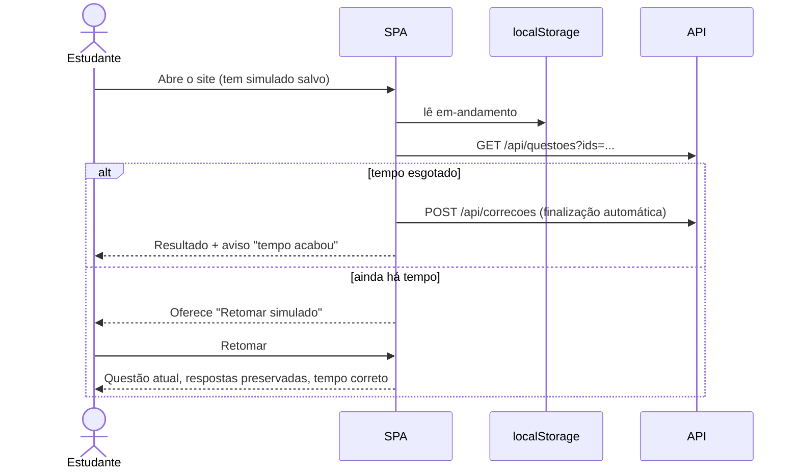

# Especificação Técnica — Início, Configuração e Resolução do Simulado (Frontend)

**Versão:** 1.11
**Data:** 2026-10-03
**PRD Ref:** 01-PRD v4.0 (RF-008 a RF-016, US-001 a US-005, RN-009 a RN-012)
**Arquitetura Ref:** 02-ARCHITECTURE v1.0 (ADR-004)
**CR Ref:** CR-001 (resolução: navegação, folha de respostas e pausa), CR-002 (contraste e tokens), CR-003 (início, figura ampliada), CR-004 (rota `/desempenho` e link no cabeçalho), CR-005 (rotas `/conta` e `/privacidade`, link da conta no cabeçalho e "Privacidade" no rodapé), CR-006 (rotas atrás do login, apresentação no início), CR-007 (menu do cabeçalho no celular, barra do topo da resolução opaca), CR-008 (identidade "Papel & Caneta" e início com conta), CR-009 (rolagem ao trocar de página, extras do início, círculo de um algarismo, marcas do painel), CR-010 (rota `/notas-de-corte`, link "Notas de corte" no cabeçalho e no menu, linha dos cortes em "Seu último simulado" — detalhe em `specs/08-notas-de-corte.md`), CR-011 (Prova completa com 80, simulados oficiais na Prova de um ano, origem da questão, ritmo de 225 s, contagem de provas e simulados no início), CR-013 (rotas `/gestao/*` e link "Gestão" só para o administrador — detalhe em `specs/09-gestao.md`)

---

## 1. Resumo das Mudanças

SPA React: tela inicial com catálogo, configuração dos modos, tela de resolução (questão, grade, cronômetro), modo Treino e persistência do simulado em andamento no `localStorage`.

### Escopo desta Iteração
- Rotas e layout base (cabeçalho, rodapé com aviso de não afiliação)
- Home/catálogo, configuração do Personalizado e da Prova de um ano
- Estado do simulado (reducer + Context + storage) e cronômetro por timestamps
- Tela de resolução e modo Treino
- Componentes de exibição de questão (blocos, figuras com zoom, alternativas)

---

## 2. Detalhamento Técnico

### 2.1 Arquivos

| Ação | Caminho | Descrição |
|------|---------|-----------|
| Criar | `frontend/src/App.tsx` | Rotas + layout |
| Criar | `frontend/src/types.ts` | Tipos espelhando os schemas da API |
| Criar | `frontend/src/services/api.ts` | `getCatalogo`, `gerarSimulado`, `getQuestoes`, `corrigir`, `reportar`; erro tipado `ApiError {status, codigo?, dados?}` |
| Criar | `frontend/src/storage/storage.ts` | `lerJSON`/`gravarJSON`/`remover` com `try/catch`; `storageDisponivel()` |
| Criar | `frontend/src/storage/simuladoStorage.ts` | Chave `simulado-fuvest:v1:em-andamento` |
| Criar | `frontend/src/contexts/SimuladoContext.tsx` | Reducer + persistência a cada ação |
| Criar | `frontend/src/utils/tempo.ts` | `restanteMs`, `decorridoMs`, `formatarTempo` |
| Criar | `frontend/src/hooks/useCatalogo.ts`, `useQuestoes.ts`, `useCronometro.ts` | TanStack Query + relógio |
| Criar | `frontend/src/components/` | `Layout`, `Blocos`, `Figura`, `Alternativas`, `QuestaoView`, `FolhaRespostas` (planejado como `GradeQuestoes`), `Cronometro`, `ConfirmDialog`, `AvisoStorage` |
| Criar | `frontend/src/pages/` | `HomePage`, `ConfigurarPersonalizadoPage`, `EscolherAnoPage`, `ResolucaoPage`, `TreinoPage` |
| Criar | `frontend/src/**/*.test.ts(x)` | Vitest |
| Criar (CR-001) | `frontend/src/components/resolucao/PainelFolha.tsx`, `TelaPausa.tsx` | Folha do celular como diálogo; tela de pausa |
| Criar (CR-001) | `frontend/src/components/Icone.tsx` | Ícones de traço comuns (`Icone`, `IconePausa`) |
| Criar (CR-002) | `frontend/src/hooks/useTituloPagina.ts` | Título da aba por página |
| Criar (CR-002) | `frontend/src/tokens.test.ts` | Contraste WCAG dos pares de tokens, lido do `index.css` |
| Criar (CR-009) | `frontend/src/components/RolarAoTopo.tsx` | Rolagem ao topo a cada mudança de caminho |
| Criar (CR-009) | `frontend/src/components/inicio/MiniFolha.tsx` | Miniatura decorativa da folha óptica no cartão da Prova completa |

### 2.2 Interfaces / Types

```typescript
type Modo = 'completa' | 'personalizado' | 'ano' | 'treino';
type Letra = 'A' | 'B' | 'C' | 'D' | 'E';

interface SimuladoEmAndamento {
  versao: 1;
  id: string;                     // crypto.randomUUID()
  modo: Exclude<Modo, 'treino'>;
  descricao: string;              // "Prova completa" | "Personalizado — Física, Química (20)" | "FUVEST 2023" | "Simulado FUVEST 2027 · 1ª edição" (rótulo da prova — CR-011)
  questaoIds: string[];
  respostas: Record<string, Letra>;
  marcadas: string[];             // "marcar para revisar"
  indiceAtual: number;
  iniciadoEm: number;             // epoch ms
  tempoLimiteS: number | null;
  pausavel: boolean;
  pausadoEm: number | null;       // != null => pausado agora
  pausadoTotalMs: number;
}

type AcaoSimulado =
  | { tipo: 'INICIAR'; simulado: SimuladoEmAndamento }
  | { tipo: 'RESPONDER'; questaoId: string; letra: Letra }   // mesma letra de novo => desmarca
  | { tipo: 'ALTERNAR_MARCADA'; questaoId: string }
  | { tipo: 'IR_PARA'; indice: number }                      // limitado a [0, n-1]
  | { tipo: 'PAUSAR'; agora: number }                        // ignorado se !pausavel ou já pausado
  | { tipo: 'RETOMAR'; agora: number }
  | { tipo: 'DESCARTAR' };
```

O conteúdo das questões **não** vai para o storage: fica no cache do TanStack Query (chave `['questoes', ids]`), semeado pela resposta de `POST /api/simulados` e buscado por `GET /api/questoes?ids=` quando o simulado é retomado.

### 2.3 Lógica de Negócio

**Tempo (RN-009)** — `utils/tempo.ts`, sempre por timestamps:
```
pausaAtualMs = pausadoEm ? agora - pausadoEm : 0
decorridoMs  = agora - iniciadoEm - pausadoTotalMs - pausaAtualMs
restanteMs   = max(0, tempoLimiteS*1000 - decorridoMs)     // null se sem cronômetro
```
`useCronometro` só força re-render a cada 1 s (`setInterval`); o valor vem sempre da fórmula. Fechar a aba não pausa: ao reabrir, a fórmula já considera o tempo decorrido.

**Pausa (Personalizado, CR-001 D3):** com `pausadoEm ≠ null`, a questão, a barra inferior e a folha dão lugar à `TelaPausa` ("Simulado pausado" + Retomar), o botão "Folha" do topo some e os atalhos ficam desligados. O cronômetro mostra "Pausado". Os avisos ("Corrigindo…", erro de correção) continuam visíveis. Um simulado salvo pausado reabre direto na `TelaPausa`.

**Eventos do cronômetro:**
- `restanteMs ≤ 15 min` (primeira vez) → banner "Faltam 15 minutos" (RF-015)
- `restanteMs = 0` → finalização automática (RN-010), sem diálogo de confirmação
- Ao carregar com o tempo já esgotado → finaliza imediatamente e avisa "O tempo acabou enquanto você estava fora; o simulado foi finalizado com as respostas marcadas"

**Iniciar simulado (RN-011):**
1. Se existe simulado em andamento → `ConfirmDialog` "Descartar o simulado em andamento?"; cancelar mantém o atual.
2. `POST /api/simulados` → semear o cache de questões → `INICIAR` com `iniciadoEm = Date.now()` → navegar para `/simulado`.
3. 409 `questoes_insuficientes` (Personalizado) → mensagem "Só existem N questões para esses filtros" + botão "Gerar com N" (N > 0) ou "Nenhuma questão encontrada" (N = 0).

**Persistência:** o Context grava o estado no storage após cada ação; `DESCARTAR` remove a chave. Na carga do app, lê a chave; se `versao` for desconhecida ou o JSON estiver corrompido, descarta. Sem storage disponível (bloqueado/privado): funciona em memória e mostra `AvisoStorage` ("Seu navegador bloqueou o armazenamento local: o simulado não será salvo se você recarregar a página").

**Finalizar (RF-016, CR-001 D1):** "Finalizar simulado" no rodapé da folha (cartão no desktop, painel no celular) ou "Finalizar" no lugar de "Próxima" na última questão → `ConfirmDialog` "Finalizar o simulado?" com "Você deixou N questões em branco" ou "Você respondeu todas as questões", seguido de "e marcou M para revisar" quando houver marcadas; botões "Continuar resolvendo" e "Finalizar e ver o resultado" → correção (fluxo em `specs/04-correcao-resultado.md`). Não há botão "Finalizar" na barra do topo. Se a correção falhar, o simulado **continua** em andamento e aparece "Não foi possível corrigir agora. Tentar novamente" (nenhuma resposta se perde).

**Treino (RF-012):** estado só da página (não persiste). Filtros (disciplinas, anos) → `POST /api/simulados {modo:'treino', excluir: vistas}` busca lotes de 20; quando faltarem 3 questões no lote, busca o próximo. Ao escolher uma alternativa → `POST /api/correcoes` com 1 item → mostra certo/errado + a alternativa correta, e as alternativas ficam travadas. "Próxima" avança. Placar "acertos / respondidas". Lote vazio → "Você já viu todas as questões deste filtro" + "Recomeçar" (limpa `excluir`).

### 2.4 Rotas

| Rota | Página | Observação |
|------|--------|------------|
| `/` | `HomePage` | Sem login (CR-006): página de apresentação (`specs/07` §8). Com login: com simulado em andamento, banner no topo (CR-003, P1.9): "Simulado em andamento", descrição, barra de progresso, "r de n respondidas · m para revisar", tempo ("Restam 4 h 52 min. O relógio continua correndo mesmo com a aba fechada." / "Pausado com 58 min restantes." / "O tempo acabou: ao continuar, o simulado é finalizado com as respostas marcadas."; sem cronômetro, nada), "Continuar simulado" e "Descartar"; atualiza a cada 30 s e mostra minutos (`formatarRestante`); os 4 modos ficam com botão secundário. Depois, catálogo e 4 modos; com conta, saudação, Prova completa em destaque e "Seu último simulado" (CR-008, §3 "Início com conta"). "Provas na base": "‹rótulo› · PDF oficial" ("FUVEST 2025", "Simulado FUVEST 2027 · 1ª edição" — CR-011) com ícone de link externo e "(abre em nova aba)" para leitor de tela (P2.6). Resumo da base: "N questões de M provas (‹ano›–‹ano›) e K simulados oficiais", contando provas e período só dos vestibulares; sem vestibulares, só "N questões de K simulados oficiais" (CR-011, P4) |
| `/novo/personalizado` | `ConfigurarPersonalizadoPage` | Disciplinas (checkbox, mín. 1), anos (dois selects com os anos de referência das provas do catálogo, sem repetição — `anosDasProvas`; os simulados de 2027 entram em 2027 — CR-011), quantidade (1–90, default 20), cronômetro (default ligado; mostra o tempo calculado: 225 s por questão, "o mesmo ritmo da prova (3 min 45 s por questão)" — RN-009, CR-011) |
| `/novo/ano` | `EscolherAnoPage` | Seção "Provas da FUVEST" (vestibulares) e, se houver, seção "Simulados oficiais da FUVEST" ("Aplicados pela própria FUVEST no formato novo da 1ª fase, com 80 questões."), cada uma com `h2`. Cada item: `h3` com o rótulo, "‹total› questões · PDF oficial" (RN-013) e o botão "Fazer esta prova"/"Fazer este simulado" (nomes acessíveis "Fazer a prova de ‹ano›" / "Fazer o ‹rótulo›"). Inicia `{modo: 'ano', prova: ‹código›}` com o rótulo como descrição (CR-011, D1) |
| `/simulado` | `ResolucaoPage` | Fora do `Layout` (modo foco, CR-001 D5): sem o cabeçalho e o rodapé do site. Sem simulado em andamento → redireciona para `/` |
| `/treino` | `TreinoPage` | Filtros + sessão |
| `/resultado/:id`, `/historico` | ver `specs/04-correcao-resultado.md` | |
| `/desempenho` | ver `specs/06-assuntos-desempenho.md` | Painel "Meu desempenho" (CR-004). O cabeçalho do `Layout` tem os links "Desempenho", "Histórico" e, desde o CR-010, "Notas de corte", nessa ordem; no celular, eles ficam no menu (CR-007, §3 "Cabeçalho do `Layout`") |
| `/notas-de-corte` | ver `specs/08-notas-de-corte.md` | Notas de corte por ano e carreira e escolha da carreira-alvo (CR-010); `?ano=AAAA` escolhe o ano |
| `/gestao`, `/gestao/aprendizado`, `/gestao/qualidade`, `/gestao/estudantes` | ver `specs/09-gestao.md` | Área de gestão (CR-013), dentro do `RequerConta` e do `RequerAdmin`: sem `usuario.admin`, "Página não encontrada"; `?periodo=` nas abas Uso e Aprendizado |
| `/conta`, `/privacidade` | ver `specs/07-contas-sincronizacao.md` | Conta e privacidade (CR-005). Com login disponível, o cabeçalho ganha um terceiro link ("Entrar" ou o primeiro nome) para `/conta`; o rodapé ganha "Privacidade". Sem login, só estas duas e a apresentação abrem: as demais rotas, inclusive `/simulado`, passam por `RequerConta` (CR-006, `specs/07` §8) |
| `*` | 404 simples | Link para `/` |

**Título da página (CR-002, WCAG 2.4.2):** cada página chama `useTituloPagina`: "Simulado Fuvest" no início e "‹página› · Simulado Fuvest" nas demais (Simulado personalizado, Prova de um ano, ‹descrição do simulado› na resolução, Treino por questão, Resultado, Histórico, Meu desempenho, Conta, Privacidade, Página não encontrada).

"Prova completa" inicia direto da Home (sem configuração), com 80 questões (`QUESTOES_PROVA_COMPLETA` em `utils/formatoProva.ts`, o formato da FUVEST 2027 — CR-011); fica desabilitada com a explicação "Disponível quando a base tiver 80 questões válidas" se `completa_disponivel=false`.

**Rolagem ao trocar de página (CR-009, R1):** o `RolarAoTopo`, renderizado no `App` antes das rotas, chama `window.scrollTo({top: 0})` num `useLayoutEffect` a cada mudança de `pathname`, inclusive ao voltar e avançar pelo navegador. Vale também para a resolução, que fica fora do `Layout`. Não rola na primeira renderização nem quando muda só a busca. Enquanto montado, põe `history.scrollRestoration = 'manual'`: no voltar, o navegador restaurava a posição antiga logo depois do `popstate`, por cima do topo. Recarregar continua começando no topo, como já começava (os dados chegam depois da carga). O foco não muda. A rolagem da resolução ao trocar de questão (P1.1, §3 "Estrutura da ResolucaoPage") é à parte.

---

## 3. Componentes de UI

### Identidade visual e tokens (CR-002, CR-008)

Direção "Papel & Caneta" (CR-008, ADR-013). As cores só mudam pelos tokens do `index.css`; os nomes são os do CR-002.

| Token | Valor | Uso |
|-------|-------|-----|
| `fundo` | #FBF7EF | Papel creme da página |
| `papel` | #ffffff | Cartões e superfícies |
| `tinta` | #14213D | Texto (14,95:1 no fundo) |
| `tinta-suave` | #55607A | Texto secundário (5,88:1 no fundo; 5,47:1 na seleção) |
| `linha` | #E6DFD0 | Divisórias e bordas de cartão |
| `caneta` / `caneta-escura` / `caneta-clara` | #14213D / #0B1428 / #F3EFE4 | Ação e seleção em tinta azul-marinho; hover do primário; fundo da alternativa marcada e da linha atual |
| `optico` | #D6336C | Só decorativo: anéis das bolinhas, marca, círculo de caneta (4,62:1 no branco; ≥ 3:1 como gráfico) |
| `optico-texto` / `optico-claro` | #A61E4D / #FCE8EF | Letras A–E, números das folhas e da questão (7,21:1 no branco) |
| `grafite` | #14213D | Miolo da marca |
| `borda-campo` | #8C8577 | Bordas de campo, botão secundário e botões neutros da barra (3,43:1 no fundo) |
| `acerto` / `acerto-claro` | #1F7A4D / #E7F3EC | 4,67:1 entre si |
| `erro` / `erro-claro` | #B42318 / #FCE9E7 | 5,62:1 entre si |
| `alerta` / `alerta-claro` | #8A5A00 / #FFF1D6 | Revisar e tempo (5,31:1 entre si) |
| `foco` | #A61E4D | Anel de foco (`:focus-visible`, 3 px, afastamento de 2 px): 6,74:1 no fundo e 7,21:1 no papel |

O `tokens.test.ts` calcula o contraste dos pares a partir do `index.css`. Para isso, o Vitest processa só esse arquivo (`css.include` no `vite.config.ts`).

- **Fontes:** Atkinson Hyperlegible Next (interface), Literata (texto das questões) e Fraunces 650 (`--font-titulo`), todas por `@fontsource-variable` no `main.tsx`. Fraunces vale para a marca, `h1` e `h2` (regra de base no `index.css`), títulos de cartão, número da questão, cronômetro e números de destaque (classe `font-titulo`). Nunca em texto corrido, botões ou rótulos.
- **Marca** (`Marca.tsx`): uma bolinha, anel `optico` e miolo `tinta`, 30 px no desktop e 26 px no celular, com "Simulado Fuvest" em `font-titulo`. O favicon (`public/favicon.svg`) é a mesma bolinha sobre `fundo`, com cantos de 7 px.
- **Botões** (`estilos.ts`): primário `caneta` com texto `fundo`, cantos de 6 px e hover `caneta-escura`; secundário `papel` com borda `borda-campo`. Os botões neutros da barra da resolução (inclusive "Folha" e "Pausar") e o "cancelar" dos diálogos também usam `borda-campo`.
- **Cartões** (`CARTAO`): `papel`, borda `linha`, cantos de 16 px, sem sombra. O aviso de simulado em andamento mantém o fundo `caneta-clara`, agora com borda `caneta` (no creme, o fundo sozinho não se destaca).
- **Marcas de sincronismo** (`MarcasSincronismo`, `aria-hidden`): barrinhas `tinta` de 12–14 × 4–5 px na borda esquerda, distribuídas na altura. Só no cartão da Prova completa do início e na borda da folha de respostas (cartão no desktop, painel no celular). No painel, ficam na altura visível da grade, abaixo do resumo e da legenda (CR-009, A2): até 14 e, quando a grade cabe inteira (simulado curto), no máximo 2 por linha.
- **Círculo de caneta** (`CirculoCaneta`, `aria-hidden`): traço à mão em `optico` em volta de uma palavra de título, no máximo um por tela: "reais" na apresentação e no início, o número de acertos no resultado. Fica centrado na palavra, com folga fixa (12 px em palavras, 8 px em números) e 4 px de margem na palavra circulada, para não cortar as vizinhas. Números de um algarismo (CR-009, A1) ganham folga de 16 px e margem de 12 px: com 8 px, o círculo ficava estreito em volta do número. A folga sai do conteúdo (`children` texto ou número), e não de quem chama. O texto do título não muda.

### Início com conta (CR-008)

Protótipos "A · Início" e "A · Início · celular"; o que eles mostram além da especificação fica fora (CR-008 §4.3). Desses extras, o CR-009 trouxe parte do E4 (sobretítulo, etiquetas e miniatura da folha), o E6 (linhas no celular) e o E7 (lateral de 340 px); o resto continua fora (CR-009 §4.3).

- **Saudação (I6.1):** "Olá, ‹primeiro nome›." acima do `h1`, em `font-titulo` itálico `optico-texto`, só com uma conta que tenha nome (`sessao.usuario.nome`). Sem conta ou sem nome, nada.
- **Prova completa em destaque (I6.3):** uma `section` em cartão maior (padding maior, `h2` em `text-2xl`/`text-3xl`), com as marcas de sincronismo à esquerda, a bolinha "A", a descrição e o botão de hoje ("Começar prova completa": primário, ou secundário com simulado em andamento; desabilitado com "Disponível quando a base tiver 80 questões válidas" — CR-011).
  - **Extras do E4 (CR-009):** na linha da bolinha "A", o sobretítulo "A mais próxima da prova real" (caixa alta pelo CSS, `optico-texto`, negrito, espaçamento de 0,1em). Entre a descrição e o botão, uma lista de etiquetas em pílula (borda `linha`, fundo `fundo`): "80 questões" (CR-011), "5 horas" e "‹n› disciplinas", com n = disciplinas com questões na `distribuicao_completa` do catálogo ("1 disciplina" no singular; sem distribuição, essa etiqueta some). A partir de 640 px, o cartão tem duas colunas: o texto e a `MiniFolha` (`components/inicio/`, `aria-hidden`), de 190 px, centrada na altura. Ela é uma caixa `fundo` com borda `linha` e cantos de 10 px, com o cabeçalho A–E e cinco linhas (01 a 05), cada uma com uma bolinha preenchida a caneta (B, D, A, C, E) e as outras com o anel `optico`. No celular, a miniatura não aparece.
- **Outros modos:** Prova de um ano, Personalizado e Treino, com as bolinhas B, C e D, `h2`, descrição e a ação de hoje ("Escolher o ano", "Montar simulado", "Treinar"). A descrição da Prova de um ano: "Refaça a prova original de um ano ou um simulado oficial da FUVEST, com 5 horas." (CR-011).
  - **A partir de 640 px:** três cartões menores em 3 colunas, com a bolinha em cima e a ação como botão secundário.
  - **Abaixo de 640 px (E6, CR-009):** linhas compactas, com a bolinha à esquerda, o título (19 px) e a descrição no meio e uma seta à direita. O link é o mesmo, mas o texto da ação vira `sr-only` (o nome acessível continua sendo a ação) e um `::after` absoluto cobre o cartão: tocar em qualquer ponto abre o modo. O anel de foco fica no `::after`, em volta do cartão.
- **Lateral (E7, CR-009):** 340 px a partir de 1280 px, com a borda `linha` e o recuo de hoje. Entre 1024 e 1279 px, continua com 256 px: com 340, os cartões dos modos ficavam com 188 px e "Montar simulado" quebrava.
- **"Seu último simulado" (I6.2)** (`components/inicio/UltimoSimulado.tsx`): no topo da lateral (no celular, depois dos modos e do link do histórico). Usa `useHistorico` e `ultimoSimulado` (o de maior `finalizadoEm`). Mostra o `h2` "Seu último simulado", "‹descrição› · dd/mm", os acertos em `font-titulo` ("58 de 90", "52 de 80"), "64,4% de aproveitamento", "Para estudar" com as duas disciplinas mais fracas (`disciplinasMaisFracas`: menor `percentual`, empate pelo slug, como no resultado; sem as que não tiveram questão contada nem as de 100%, e sem a parte se não sobrar nenhuma) com percentual e barra, e os links "Ver o resultado" (`/resultado/:id`) e "Meu desempenho" (`/desempenho`). Sem histórico, não aparece. Com só uma disciplina, mostra uma. CR-010: com carreira-alvo e um último simulado da Prova completa ou da Prova de um ano, abaixo do aproveitamento, a linha dos três cortes (`LinhaCortes`, `specs/08` §3); desde o CR-011, de qualquer tamanho, com a nota convertida para a escala da lista quando os tamanhos diferem.

### Cabeçalho do `Layout` (CR-007)

Protótipo: tela "Menu do cabeçalho · celular" do canvas "Protótipo Simulado Fuvest".

- **A partir de 640 px:** como antes. Marca + "Simulado Fuvest" à esquerda; à direita, os links em linha: "Desempenho", "Histórico" e "Notas de corte" (com acesso ao conteúdo; o terceiro desde o CR-010), "Gestão" (só com `usuario.admin`, CR-013) e a conta ("Entrar" ou o primeiro nome). Altura e estilo dos links (`itemNav`) inalterados.
- **Abaixo de 640 px:** o cabeçalho tem **56 px fixos**. Os links empilhados (CR-004) saem:
  - **Sem conta** (`acesso: 'conta'` sem usuário): não há menu, só "Entrar", como hoje (O2.4).
  - **Com conta, ou com links de conteúdo** (`livre`, ou `indisponivel` com alguém conectado): botão **"Menu"** (`MenuCelular`) com ícone de três traços e o texto "Menu", 44 px de altura, `aria-expanded` e `aria-controls="menu-principal"`. Aberto, o ícone vira um X e o botão fica com borda azul e fundo `caneta-clara` (O2.1).
- **Painel** (`<nav id="menu-principal" aria-label="Menu">`, logo abaixo do cabeçalho, largura toda, sombra), sobre o conteúdo escurecido (`tinta` a 35%, a partir do fim do cabeçalho). Itens em linhas de 52 px com ícone (O2.2):
  - "Início" (casa), "Desempenho" (barras), "Histórico" (relógio) e "Notas de corte" (alvo, CR-010). Os três últimos só com acesso ao conteúdo, como os links do desktop. Depois deles, "Gestão" (colunas), só com `usuario.admin` (CR-013).
  - A página atual fica destacada (fundo `caneta-clara`, texto `caneta-escura`, negrito) e leva `aria-current="page"`.
  - Separada por uma linha, a conta (só com alguém conectado): a inicial do primeiro nome num círculo, o primeiro nome e "Conta e sair", levando a `/conta`.
- **Fechar (O2.3):** Esc (o foco volta ao botão), toque ou clique fora do painel e do botão (o toque não chega ao que está por baixo), escolher um item (o foco volta ao botão), qualquer troca de rota ou o foco saindo do painel e do botão (Tab depois do último item). O botão também alterna. Tab segue do botão para os itens do painel.
- **Com o menu aberto**, a rolagem da página fica travada (`overflow: hidden` no `html`, como no `PainelFolha`): o cabeçalho não é fixo, e rolar levaria o painel embora.
- **Enquanto a sessão carrega**, o celular mostra só a marca (nem "Menu" nem "Entrar").
- **Marca no celular:** a bolinha de 26 px (30 px a partir de 640 px, CR-008), com 8 px até o botão, para o cabeçalho caber numa linha em 320 px.

### Componente: Blocos

| Prop | Tipo | Obrigatório | Default | Descrição |
|------|------|-------------|---------|-----------|
| blocos | `Bloco[]` | Sim | — | Texto e figuras em ordem |
| altFigura | `string` | Sim | — | Base do texto alternativo |

Texto renderizado como texto React (escapado) com `whitespace-pre-line`; **nunca** `dangerouslySetInnerHTML`.

### Componente: Figura

| Prop | Tipo | Obrigatório | Default | Descrição |
|------|------|-------------|---------|-----------|
| src | `string` | Sim | — | URL `/figuras/...` |
| alt | `string` | Sim | — | "Figura da questão N — FUVEST AAAA" (RNF-003) |

**Comportamento:** `loading="lazy"`, largura máxima da coluna; clique/Enter abre a `ModalFigura` (CR-003, P1.6, D7): diálogo em tela cheia sobre fundo escuro, com a imagem **ajustada à tela** e centralizada (`object-contain`; cresce até ocupar a área) e o grupo "Ajustar à tela | Tamanho real" (`aria-pressed`); "Tamanho real" mostra o tamanho natural com rolagem. Barra com o texto alternativo (desktop) e "Fechar" (44 px no celular); foco inicial em "Fechar figura"; Esc, "Fechar", o fundo escuro e as faixas em volta da parte pintada da figura fecham. Rodapé: "Use dois dedos para aproximar ainda mais." (celular) / "Esc fecha · a figura cresce até ocupar a tela" (desktop). Falha de carga → "Não foi possível carregar a figura" + link para o PDF oficial.

### Componente: Alternativas

| Prop | Tipo | Obrigatório | Default | Descrição |
|------|------|-------------|---------|-----------|
| alternativas | `Record<Letra, Alternativa>` | Sim | — | |
| selecionada | `Letra \| null` | Sim | — | |
| onSelecionar | `(l: Letra) => void` | Sim | — | |
| correcao | `{correta: Letra \| null; anulada: boolean} \| null` | Não | null | Treino/revisão: destaca a correta e a errada, desabilita |

**Comportamento:** `radiogroup` acessível; clicar na selecionada desmarca (quando sem `correcao`).

### Componente: QuestaoView

Monta: cabeçalho "Questão i de n" e a fonte "‹Disciplina›, ‹origem› (questão NN)" (RN-013), com a origem vinda da API: "FUVEST 2025" ou "Simulado FUVEST 2027 · 1ª edição" (CR-011; também no texto alternativo das figuras) → texto-base (se houver, em caixa destacada) → enunciado → alternativas. Mostra o botão "Reportar problema" (`specs/05-reportes.md`).

**Título (`TituloQuestao`, CR-008):** o número numa bolinha de anel `optico` (2,5 px) em `font-titulo` `optico-texto`, seguido de "de n" em `tinta-suave`; um "Questão" só para leitor de tela mantém o nome acessível "Questão i de n". Vale na resolução, na questão removida e na revisão do resultado.

### Estrutura da ResolucaoPage (CR-001)

- **Barra do topo** (fixa e opaca, `bg-fundo` sem transparência nem desfoque — CR-007, O3.1; 60 px no celular, 64 px no desktop): no desktop, a descrição do simulado à esquerda e o `Cronometro` à direita; no celular, o `Cronometro` e o botão "Folha r/n", que abre o `PainelFolha`.
- **Barra inferior** (fixa no rodapé da coluna da questão): Anterior | Revisar | Próxima. "Próxima" é o único botão azul e ocupa o resto da linha no celular; na última questão vira "Finalizar" (rótulo acessível "Finalizar o simulado"). "Revisar" usa `aria-pressed` e mostra "Marcada" em laranja quando marcada. Botões de 48 px no celular e 44 px no desktop; abaixo de 380 px, "Anterior" fica só com o ícone. No desktop, a linha de atalhos aparece sob a barra.
- **Trocar de questão** (botões, atalhos ← → ou folha): `window.scrollTo({top: 0})` e foco no título "Questão N de M" (`tabIndex=-1`, `focus({preventScroll: true})`), pelo `refTitulo` da `QuestaoView`.
- **Marcas de sincronismo (CR-008):** na borda esquerda do cartão da folha (desktop, por fora do cartão, fixas com ele) e do painel da folha (celular).
- **Desktop (≥ 1024 px):** coluna da questão e cartão da folha (408 px) fixo 24 px abaixo da barra, com título, `FolhaRespostas` no formato `bolhas` e "Finalizar simulado". A folha de 90 questões cabe inteira em 1440 × 900; a rolagem própria (`max-h`) só entra como reserva em telas baixas.

### Componente: FolhaRespostas

| Prop | Tipo | Obrigatório | Default | Descrição |
|------|------|-------------|---------|-----------|
| questaoIds | `string[]` | Sim | — | Ordem do simulado |
| respostas | `Record<string, Letra>` | Sim | — | |
| marcadas | `string[]` | Sim | — | "Para revisar" |
| atual | `number` | Sim | — | `aria-current="step"` |
| onIr | `(i) => void` | Sim | — | |
| formato | `'bolhas'` ou `'grade'` | Sim | — | Desktop / painel do celular (D2) |

Resumo "r respondida(s) · b em branco · m para revisar" e legenda (respondida, em branco, para revisar). Cada questão é um botão com o rótulo "Questão N: respondida X" ou "Questão N: em branco", seguido de ", marcada para revisar" quando for o caso.

- **`bolhas`**: 3 colunas acima de 40 questões, 2 acima de 15 e 1 até 15, preenchidas de cima para baixo; cabeçalho A–E em cada coluna; linhas de 20 px com o número, cinco bolinhas sem letra (a marcada preenchida a caneta) e o ponto laranja de revisar.
- **`grade`**: 5 colunas de botões de 48 px com o número e uma bolinha com a letra marcada; ponto laranja no canto = revisar; a questão atual rola para a vista ao abrir. As marcas de sincronismo do painel ficam aqui, fora da área que rola e paradas, na altura visível da grade e abaixo da legenda: até 14 e, com a grade inteira à vista, no máximo 2 por linha (CR-009, A2). O número das folhas (01, 02…) vem de `numeroDaFolha` (`utils/folha.ts`).

### Componente: PainelFolha

Painel inferior do celular (`role="dialog"`, `aria-modal`, título "Folha de respostas"). Ao abrir, põe o foco no botão "Fechar folha" e `overflow: hidden` no `<html>`. Tab e Shift+Tab circulam dentro do painel. Esc, o botão Fechar e o clique que começa e termina no fundo fecham. Ao fechar, o foco volta ao botão "Folha", ou ao título se a questão mudou. A grade rola dentro do painel (`overscroll-contain`), e o rodapé traz "Finalizar simulado". As marcas de sincronismo vêm da `FolhaRespostas` no formato `grade` (CR-009); o painel não tem marcas próprias.

### Componente: TelaPausa

Ocupa o lugar do conteúdo enquanto o simulado está pausado (D3): ícone, título "Simulado pausado", o texto "O cronômetro está parado e a questão fica oculta até você retomar." e o botão Retomar.

### Componente: Cronometro

Mostra `hh:mm:ss` restante (ou o decorrido, sem limite; o prefixo "Tempo:" some abaixo de 640 px), "Oculto" quando escondido e "Pausado" quando pausado. Botão "Ocultar/Mostrar" (continua contando) e "Pausar/Retomar" só quando `pausavel`; no celular, os dois são só ícone, com 44 px. Estado de aviso (≤ 15 min) em cor de alerta. O tempo usa `font-titulo` (CR-008).

### Atalhos (ResolucaoPage e TreinoPage)

`A`–`E` marcam a alternativa; `←`/`→` navegam; `M` alterna "revisar". Ignorados quando o foco está em campo de texto, há diálogo aberto ou o simulado está pausado.

**Estados comuns das páginas:** Loading (skeleton), Error ("Não foi possível carregar. Tentar novamente"), Empty (catálogo vazio: "Ainda não há provas publicadas").

---

## 4. Fluxos Críticos



---

## 5. Casos de Borda

| # | Cenário | Comportamento Esperado |
|---|---------|------------------------|
| 1 | Recarregar no meio da prova | Mesma questão, respostas e marcações; tempo continua descontado |
| 2 | Fechar a aba por 1 h na Prova completa | Ao voltar, o restante já desconta 1 h |
| 3 | Personalizado pausado e aba fechada | Ao voltar, continua pausado (direto na `TelaPausa`); a pausa não consome tempo |
| 4 | Storage bloqueado | Funciona em memória + aviso |
| 5 | JSON do storage corrompido ou de outra versão | Descartado sem quebrar o app |
| 6 | Questão do simulado salvo removida da base | `nao_encontradas` → aviso; a questão é tratada como em branco e mostrada como "removida da base" |
| 7 | Duas abas com o mesmo simulado | Não suportado; a última gravação vence (documentado) |
| 8 | Tempo zera com um diálogo aberto | Fecha o diálogo e finaliza |
| 9 | Correção falha na finalização automática | Mantém o simulado; banner de erro com "Tentar novamente" |
| 10 | Tempo zera com a folha aberta no celular | Fecha o painel (e destrava a página) e finaliza (CR-001) |
| 11 | Pausar durante a correção | Os avisos "Corrigindo…" e de erro continuam visíveis na `TelaPausa` (CR-001) |
| 12 | Arrastar da grade do painel até o fundo | Não fecha o painel (CR-001) |

---

## 6. Plano de Testes

| ID | Cenário | Alvo | Esperado |
|----|---------|------|----------|
| UT-001 | `restanteMs` com e sem pausa, pausa em curso, esgotado | `utils/tempo` | Valores exatos; nunca negativo |
| UT-002 | Reducer: responder, desmarcar com a mesma letra, marcar revisar, ir para fora do intervalo | `SimuladoContext` | Estado esperado |
| UT-003 | PAUSAR em simulado não pausável | reducer | Ignorado |
| UT-004 | Persistência: ação grava; DESCARTAR remove | `simuladoStorage` | Chave correta |
| UT-005 | Storage lançando exceção | `storage` | Sem crash; `storageDisponivel()=false` |
| UT-006 | JSON corrompido/versão desconhecida | `simuladoStorage` | Retorna null e limpa |
| UT-007 | Alternativas: clique, desmarcar, modo correção desabilitado | componente | Callbacks e estados corretos |
| UT-008 | Blocos com texto contendo `<script>` | componente | Renderizado como texto literal |
| UT-009 | `FolhaRespostas`: colunas (3/2/1), cabeçalho A–E, resumo, grade de 48 px com a letra marcada | componente | Estrutura e rótulos corretos (CR-001) |
| UT-010 | Trocar de questão: `scrollTo({top: 0})` e foco no título | `ResolucaoPage` | Título focado (CR-001) |
| UT-011 | `PainelFolha`: foco, Tab preso, Esc, clique e arrasto no fundo, trava da rolagem | `ResolucaoPage` | Comportamento de diálogo (CR-001) |
| UT-012 | Pausa: questão oculta, atalhos desligados, folha escondida, reabrir pausado | `ResolucaoPage` | `TelaPausa` (CR-001) |
| UT-045 | Menu do celular: botão com `aria-expanded`/`aria-controls`; painel com Início, Desempenho, Histórico e a conta; `aria-current` na página atual; fecha com Esc (foco no botão), toque fora, item e troca de rota; sem conta, só "Entrar" e nenhum menu | `Layout`, `MenuCelular` | Comportamento de O2.1–O2.4 (CR-007) |
| UT-046 | Barra do topo da resolução opaca | `ResolucaoPage` | `bg-fundo`, sem transparência nem `backdrop-blur` (CR-007) |
| UT-047 | Contraste dos tokens novos, incluindo `foco` sobre `fundo` e `papel` e `optico` ≥ 3:1 | `tokens.test.ts` | Pares da especificação (CR-008) |
| UT-048 | Título da questão na bolinha com o nome acessível "Questão i de n"; marca de uma bolinha | `QuestaoView`, `Layout` | Estrutura acessível (CR-008) |
| UT-049 | Início com conta: saudação (com nome; sem nome e sem conta, nada); Prova completa em destaque com A e marcas `aria-hidden`; B–D em cartões; regras do botão mantidas | `HomePage` | Textos e estrutura (CR-008) |
| UT-050 | "Seu último simulado": o mais recente, acertos, aproveitamento, as duas mais fracas, links; sem histórico, ausente; `ultimoSimulado` e `disciplinasMaisFracas` | `UltimoSimulado`, `utils/desempenho` | Valores e links (CR-008) |
| UT-052 | Rolagem ao topo a cada mudança de caminho (link e voltar), não na primeira renderização nem com mudança só da busca; `scrollRestoration` em `manual` enquanto montado | `App`, `RolarAoTopo` | `scrollTo({top: 0})` (CR-009) |
| UT-053 | Prova completa com sobretítulo, etiquetas ("‹n› disciplinas" da distribuição) e `MiniFolha` `aria-hidden`; modos B–D com o link de nome da ação e o `::after` que cobre o cartão no celular | `HomePage` | Textos e estrutura (CR-009) |
| UT-054 | Círculo de caneta com mais folga e margem nos acertos de um algarismo e a folga dos números com dois; marcas do painel depois da legenda, fora da área que rola, até 14 e 2 por linha num simulado curto | `ResumoResultado`, `FolhaRespostas` | Estrutura (CR-009) |
| UT-065 | Prova de um ano com as seções "Provas da FUVEST" e "Simulados oficiais da FUVEST", os totais e o pedido `{modo: 'ano', prova}`; início com a contagem de provas e simulados (e sem "0 provas") e o PDF de cada um | `EscolherAnoPage`, `HomePage` | Textos, estrutura e pedido (CR-011) |
| UT-066 | Origem da questão de simulado oficial na fonte e no texto alternativo | `QuestaoView` | "Física, Simulado FUVEST 2027 · 1ª edição (questão 20)" (CR-011) |
| UT-067 | Textos de 80 questões (Prova completa, apresentação, prévia) e ritmo de 3 min 45 s no Personalizado | `HomePage`, `ApresentacaoPage`, `ConfigurarPersonalizadoPage` | Textos (CR-011) |
| FT-001 | Home → Prova completa → responder 3 → recarregar | E2E (Playwright MCP) | Respostas e tempo preservados |
| FT-002 | Personalizado com filtros → grade → finalizar | E2E | Resultado exibido |
| FT-003 | Personalizado insuficiente | E2E | Mensagem + "Gerar com N" |
| FT-004 | Treino: responder → feedback → próxima | E2E | Correta destacada; placar atualiza |
| FT-005 | Mobile 360 px: grade em gaveta, figura com zoom | E2E | Sem rolagem horizontal |
| FT-006 | 320 e 390 px: barra inferior numa linha, painel da folha, última questão → Finalizar | E2E (CR-001) | Sem quebra nem rolagem horizontal |
| FT-007 | 1440 × 900: folha de 90 questões inteira, sem rolagem própria, nunca sob a barra | E2E (CR-001) | Cartão visível ao rolar até o fim |
| FT-008 | Personalizado: pausar, recarregar, retomar | E2E (CR-001) | Questão oculta; tempo não descontado |
| FT-022 | Identidade em 1440, 390 e 320 px: apresentação, início com conta, Prova completa (desktop e celular, com a folha), resultado; foco visível no botão primário; sem rolagem horizontal; console limpo | E2E (CR-008) | Conforme §3 "Identidade visual e tokens" e "Início com conta" |
| FT-023 | Início rolado → Prova completa abre no topo; prova rolada → finalizar → resultado no topo; voltar do navegador no topo. Início com conta em 1440, 1024, 390 e 320 px (sobretítulo, etiquetas, miniatura, lateral de 340 px a partir de 1280, linhas no celular com toque no cartão); círculo com 1 e com 2 algarismos; painel da folha em 390 px; console limpo | E2E (CR-009) | Conforme §2.4 "Rolagem" e §3 "Início com conta" |
| FT-025 | Simulado oficial de ponta a ponta: início com a contagem, Prova de um ano com a seção de simulados (1280 e 360 px), simulado inteiro com 80 questões e a origem, resultado com a comparação convertida, início com a linha dos cortes, Prova completa com 80, Personalizado com 3 min 45 s; console limpo | E2E (CR-011) | Conforme §3 e `specs/08` §3 |
| FT-021 | Menu do celular em 390 e 320 px com conta (abrir, Esc, fora, item); 640 px com links em linha; barra da resolução opaca ao rolar uma questão longa | E2E (CR-007, junto com a apresentação — `specs/07` §9.4) | Conforme §3 "Cabeçalho do `Layout`" e "Estrutura da ResolucaoPage" |

---

## 7. Checklist de Implementação

- [ ] Rotas, layout e rodapé
- [ ] Cliente da API + tipos
- [ ] Storage + reducer + Context + aviso de storage
- [ ] Utilitários de tempo + `useCronometro`
- [ ] Componentes de questão (Blocos, Figura, Alternativas, QuestaoView)
- [ ] Home e páginas de configuração
- [ ] ResolucaoPage (grade, cronômetro, atalhos, finalizar)
- [ ] TreinoPage
- [ ] Testes UT-001 a UT-008 + validação FT-001 a FT-005
