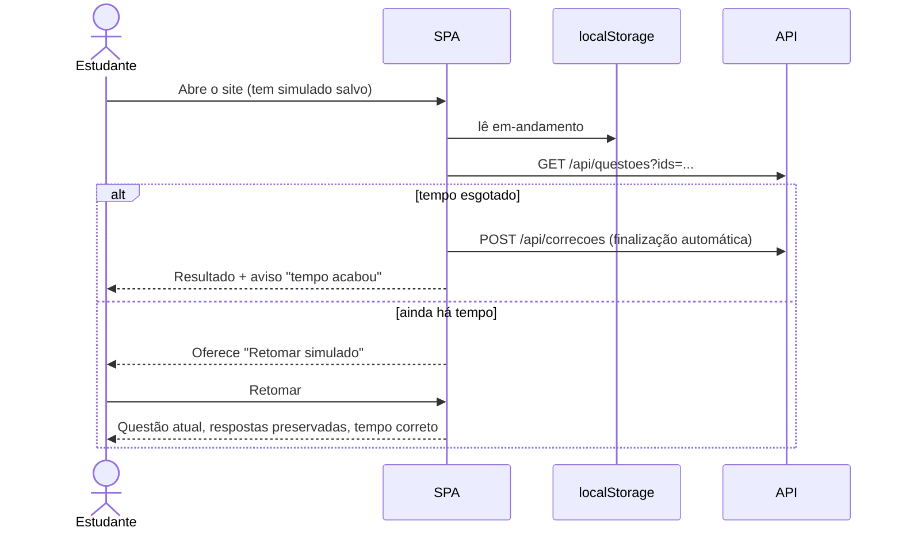

# Especificação Técnica — Início, Configuração e Resolução do Simulado (Frontend)

**Versão:** 1.0
**Data:** 2026-09-29
**PRD Ref:** 01-PRD v1.0 (RF-008 a RF-016, US-001 a US-005, RN-009 a RN-012)
**Arquitetura Ref:** 02-ARCHITECTURE v1.0 (ADR-004)
**CR Ref:** —

---

## 1. Resumo das Mudanças

SPA React: tela inicial com catálogo, configuração dos modos, tela de resolução (questão, grade, cronômetro), modo Treino e persistência do simulado em andamento no `localStorage`.

### Escopo desta Iteração
- Rotas e layout base (cabeçalho, rodapé com aviso de não afiliação)
- Home/catálogo, configuração do Personalizado e da Prova de um ano
- Estado do simulado (reducer + Context + storage) e cronômetro por timestamps
- Tela de resolução e modo Treino
- Componentes de exibição de questão (blocos, figuras com zoom, alternativas)

---

## 2. Detalhamento Técnico

### 2.1 Arquivos

| Ação | Caminho | Descrição |
|------|---------|-----------|
| Criar | `frontend/src/App.tsx` | Rotas + layout |
| Criar | `frontend/src/types.ts` | Tipos espelhando os schemas da API |
| Criar | `frontend/src/services/api.ts` | `getCatalogo`, `gerarSimulado`, `getQuestoes`, `corrigir`, `reportar`; erro tipado `ApiError {status, codigo?, dados?}` |
| Criar | `frontend/src/storage/storage.ts` | `lerJSON`/`gravarJSON`/`remover` com `try/catch`; `storageDisponivel()` |
| Criar | `frontend/src/storage/simuladoStorage.ts` | Chave `simulado-fuvest:v1:em-andamento` |
| Criar | `frontend/src/contexts/SimuladoContext.tsx` | Reducer + persistência a cada ação |
| Criar | `frontend/src/utils/tempo.ts` | `restanteMs`, `decorridoMs`, `formatarTempo` |
| Criar | `frontend/src/hooks/useCatalogo.ts`, `useQuestoes.ts`, `useCronometro.ts` | TanStack Query + relógio |
| Criar | `frontend/src/components/` | `Layout`, `Blocos`, `Figura`, `Alternativas`, `QuestaoView`, `GradeQuestoes`, `Cronometro`, `ConfirmDialog`, `AvisoStorage` |
| Criar | `frontend/src/pages/` | `HomePage`, `ConfigurarPersonalizadoPage`, `EscolherAnoPage`, `ResolucaoPage`, `TreinoPage` |
| Criar | `frontend/src/**/*.test.ts(x)` | Vitest |

### 2.2 Interfaces / Types

```typescript
type Modo = 'completa' | 'personalizado' | 'ano' | 'treino';
type Letra = 'A' | 'B' | 'C' | 'D' | 'E';

interface SimuladoEmAndamento {
  versao: 1;
  id: string;                     // crypto.randomUUID()
  modo: Exclude<Modo, 'treino'>;
  descricao: string;              // "Prova completa" | "Personalizado — Física, Química (20)" | "FUVEST 2023"
  questaoIds: string[];
  respostas: Record<string, Letra>;
  marcadas: string[];             // "marcar para revisar"
  indiceAtual: number;
  iniciadoEm: number;             // epoch ms
  tempoLimiteS: number | null;
  pausavel: boolean;
  pausadoEm: number | null;       // != null => pausado agora
  pausadoTotalMs: number;
}

type AcaoSimulado =
  | { tipo: 'INICIAR'; simulado: SimuladoEmAndamento }
  | { tipo: 'RESPONDER'; questaoId: string; letra: Letra }   // mesma letra de novo => desmarca
  | { tipo: 'ALTERNAR_MARCADA'; questaoId: string }
  | { tipo: 'IR_PARA'; indice: number }                      // limitado a [0, n-1]
  | { tipo: 'PAUSAR'; agora: number }                        // ignorado se !pausavel ou já pausado
  | { tipo: 'RETOMAR'; agora: number }
  | { tipo: 'DESCARTAR' };
```

O conteúdo das questões **não** vai para o storage: fica no cache do TanStack Query (chave `['questoes', ids]`), semeado pela resposta de `POST /api/simulados` e buscado por `GET /api/questoes?ids=` quando o simulado é retomado.

### 2.3 Lógica de Negócio

**Tempo (RN-009)** — `utils/tempo.ts`, sempre por timestamps:
```
pausaAtualMs = pausadoEm ? agora - pausadoEm : 0
decorridoMs  = agora - iniciadoEm - pausadoTotalMs - pausaAtualMs
restanteMs   = max(0, tempoLimiteS*1000 - decorridoMs)     // null se sem cronômetro
```
`useCronometro` só força re-render a cada 1 s (`setInterval`); o valor vem sempre da fórmula. Fechar a aba não pausa: ao reabrir, a fórmula já considera o tempo decorrido.

**Eventos do cronômetro:**
- `restanteMs ≤ 15 min` (primeira vez) → banner "Faltam 15 minutos" (RF-015)
- `restanteMs = 0` → finalização automática (RN-010), sem diálogo de confirmação
- Ao carregar com o tempo já esgotado → finaliza imediatamente e avisa "O tempo acabou enquanto você estava fora; o simulado foi finalizado com as respostas marcadas"

**Iniciar simulado (RN-011):**
1. Se existe simulado em andamento → `ConfirmDialog` "Descartar o simulado em andamento?"; cancelar mantém o atual.
2. `POST /api/simulados` → semear o cache de questões → `INICIAR` com `iniciadoEm = Date.now()` → navegar para `/simulado`.
3. 409 `questoes_insuficientes` (Personalizado) → mensagem "Só existem N questões para esses filtros" + botão "Gerar com N" (N > 0) ou "Nenhuma questão encontrada" (N = 0).

**Persistência:** o Context grava o estado no storage após cada ação; `DESCARTAR` remove a chave. Na carga do app, lê a chave; se `versao` for desconhecida ou o JSON estiver corrompido, descarta. Sem storage disponível (bloqueado/privado): funciona em memória e mostra `AvisoStorage` ("Seu navegador bloqueou o armazenamento local: o simulado não será salvo se você recarregar a página").

**Finalizar (RF-016):** botão "Finalizar" → `ConfirmDialog` com "Você deixou N questões em branco" → correção (fluxo em `specs/04-correcao-resultado.md`). Se a correção falhar, o simulado **continua** em andamento e aparece "Não foi possível corrigir agora. Tentar novamente" (nenhuma resposta se perde).

**Treino (RF-012):** estado só da página (não persiste). Filtros (disciplinas, anos) → `POST /api/simulados {modo:'treino', excluir: vistas}` busca lotes de 20; quando faltarem 3 questões no lote, busca o próximo. Ao escolher uma alternativa → `POST /api/correcoes` com 1 item → mostra certo/errado + a alternativa correta, e as alternativas ficam travadas. "Próxima" avança. Placar "acertos / respondidas". Lote vazio → "Você já viu todas as questões deste filtro" + "Recomeçar" (limpa `excluir`).

### 2.4 Rotas

| Rota | Página | Observação |
|------|--------|------------|
| `/` | `HomePage` | Catálogo + 4 modos + "Retomar simulado" se houver um em andamento |
| `/novo/personalizado` | `ConfigurarPersonalizadoPage` | Disciplinas (checkbox, mín. 1), anos (dois selects com os anos do catálogo), quantidade (1–90, default 20), cronômetro (default ligado; mostra o tempo calculado) |
| `/novo/ano` | `EscolherAnoPage` | Lista de anos publicados; cada item com o link do PDF oficial (RN-013) |
| `/simulado` | `ResolucaoPage` | Sem simulado em andamento → redireciona para `/` |
| `/treino` | `TreinoPage` | Filtros + sessão |
| `/resultado/:id`, `/historico` | ver `specs/04-correcao-resultado.md` | |
| `*` | 404 simples | Link para `/` |

"Prova completa" inicia direto da Home (sem configuração); fica desabilitada com a explicação "Disponível quando a base tiver 90 questões válidas" se `completa_disponivel=false`.

---

## 3. Componentes de UI

### Componente: Blocos

| Prop | Tipo | Obrigatório | Default | Descrição |
|------|------|-------------|---------|-----------|
| blocos | `Bloco[]` | Sim | — | Texto e figuras em ordem |
| altFigura | `string` | Sim | — | Base do texto alternativo |

Texto renderizado como texto React (escapado) com `whitespace-pre-line`; **nunca** `dangerouslySetInnerHTML`.

### Componente: Figura

| Prop | Tipo | Obrigatório | Default | Descrição |
|------|------|-------------|---------|-----------|
| src | `string` | Sim | — | URL `/figuras/...` |
| alt | `string` | Sim | — | "Figura da questão N — FUVEST AAAA" (RNF-003) |

**Comportamento:** `loading="lazy"`, largura máxima da coluna; clique/Enter abre um overlay em tela cheia com a imagem em tamanho natural e rolagem (zoom nativo do navegador no mobile); Esc ou clique fora fecha. Falha de carga → "Não foi possível carregar a figura" + link para o PDF oficial.

### Componente: Alternativas

| Prop | Tipo | Obrigatório | Default | Descrição |
|------|------|-------------|---------|-----------|
| alternativas | `Record<Letra, Alternativa>` | Sim | — | |
| selecionada | `Letra \| null` | Sim | — | |
| onSelecionar | `(l: Letra) => void` | Sim | — | |
| correcao | `{correta: Letra \| null; anulada: boolean} \| null` | Não | null | Treino/revisão: destaca a correta e a errada, desabilita |

**Comportamento:** `radiogroup` acessível; clicar na selecionada desmarca (quando sem `correcao`).

### Componente: QuestaoView

Monta: cabeçalho "Questão i de n · Disciplina · FUVEST AAAA, nº NN" (RN-013) → texto-base (se houver, em caixa destacada) → enunciado → alternativas. Mostra o botão "Reportar problema" (`specs/05-reportes.md`).

### Componente: GradeQuestoes

| Prop | Tipo | Obrigatório | Default | Descrição |
|------|------|-------------|---------|-----------|
| total | `number` | Sim | — | |
| estado | `(i) => 'respondida' \| 'branco' \| 'marcada'` | Sim | — | Marcada tem prioridade visual (com indicador de respondida) |
| atual | `number` | Sim | — | |
| onIr | `(i) => void` | Sim | — | |

Desktop (≥ 1024 px): painel lateral fixo. Mobile: botão "Questões (x/n)" abre uma gaveta. Legenda de cores + contagens.

### Componente: Cronometro

Mostra `hh:mm:ss` restante; botão "Ocultar/Mostrar" (continua contando); "Pausar/Retomar" só quando `pausavel`; estado de aviso (≤ 15 min) com cor de alerta + `aria-live="polite"`.

### Atalhos (ResolucaoPage e TreinoPage)

`A`–`E` marcam a alternativa; `←`/`→` navegam; `M` alterna "revisar". Ignorados quando o foco está em campo de texto ou há diálogo aberto.

**Estados comuns das páginas:** Loading (skeleton), Error ("Não foi possível carregar. Tentar novamente"), Empty (catálogo vazio: "Ainda não há provas publicadas").

---

## 4. Fluxos Críticos



---

## 5. Casos de Borda

| # | Cenário | Comportamento Esperado |
|---|---------|------------------------|
| 1 | Recarregar no meio da prova | Mesma questão, respostas e marcações; tempo continua descontado |
| 2 | Fechar a aba por 1 h na Prova completa | Ao voltar, o restante já desconta 1 h |
| 3 | Personalizado pausado e aba fechada | Ao voltar, continua pausado; a pausa não consome tempo |
| 4 | Storage bloqueado | Funciona em memória + aviso |
| 5 | JSON do storage corrompido ou de outra versão | Descartado sem quebrar o app |
| 6 | Questão do simulado salvo removida da base | `nao_encontradas` → aviso; a questão é tratada como em branco e mostrada como "removida da base" |
| 7 | Duas abas com o mesmo simulado | Não suportado; a última gravação vence (documentado) |
| 8 | Tempo zera com um diálogo aberto | Fecha o diálogo e finaliza |
| 9 | Correção falha na finalização automática | Mantém o simulado; banner de erro com "Tentar novamente" |

---

## 6. Plano de Testes

| ID | Cenário | Alvo | Esperado |
|----|---------|------|----------|
| UT-001 | `restanteMs` com e sem pausa, pausa em curso, esgotado | `utils/tempo` | Valores exatos; nunca negativo |
| UT-002 | Reducer: responder, desmarcar com a mesma letra, marcar revisar, ir para fora do intervalo | `SimuladoContext` | Estado esperado |
| UT-003 | PAUSAR em simulado não pausável | reducer | Ignorado |
| UT-004 | Persistência: ação grava; DESCARTAR remove | `simuladoStorage` | Chave correta |
| UT-005 | Storage lançando exceção | `storage` | Sem crash; `storageDisponivel()=false` |
| UT-006 | JSON corrompido/versão desconhecida | `simuladoStorage` | Retorna null e limpa |
| UT-007 | Alternativas: clique, desmarcar, modo correção desabilitado | componente | Callbacks e estados corretos |
| UT-008 | Blocos com texto contendo `<script>` | componente | Renderizado como texto literal |
| FT-001 | Home → Prova completa → responder 3 → recarregar | E2E (Playwright MCP) | Respostas e tempo preservados |
| FT-002 | Personalizado com filtros → grade → finalizar | E2E | Resultado exibido |
| FT-003 | Personalizado insuficiente | E2E | Mensagem + "Gerar com N" |
| FT-004 | Treino: responder → feedback → próxima | E2E | Correta destacada; placar atualiza |
| FT-005 | Mobile 360 px: grade em gaveta, figura com zoom | E2E | Sem rolagem horizontal |

---

## 7. Checklist de Implementação

- [ ] Rotas, layout e rodapé
- [ ] Cliente da API + tipos
- [ ] Storage + reducer + Context + aviso de storage
- [ ] Utilitários de tempo + `useCronometro`
- [ ] Componentes de questão (Blocos, Figura, Alternativas, QuestaoView)
- [ ] Home e páginas de configuração
- [ ] ResolucaoPage (grade, cronômetro, atalhos, finalizar)
- [ ] TreinoPage
- [ ] Testes UT-001 a UT-008 + validação FT-001 a FT-005
