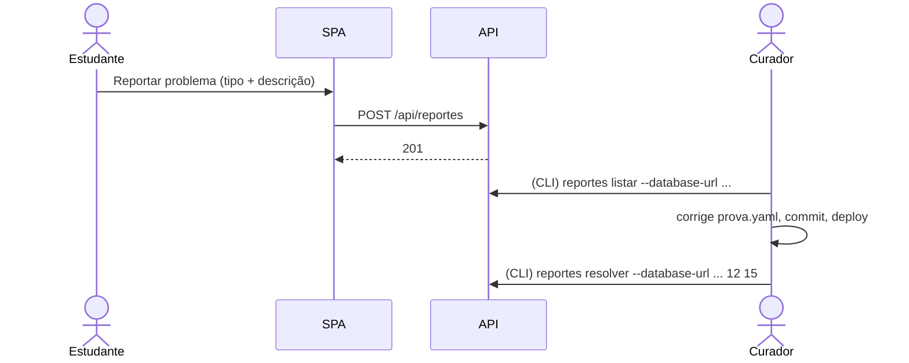

# Especificação Técnica — Reporte de Erro em Questões

**Versão:** 1.1
**Data:** 2026-10-01
**PRD Ref:** 01-PRD v4.0 (RF-007, RF-021, US-008, US-010, RN-017)
**Arquitetura Ref:** 02-ARCHITECTURE v1.0 (ADR-006, ADR-008)
**CR Ref:** CR-006 (o reporte exige sessão, mas continua sem gravar quem reportou), CR-013 (lista e resolução também na área de gestão — `specs/09-gestao.md`)

---

## 1. Resumo das Mudanças

O estudante reporta de forma anônima um problema em uma questão. O curador lista e resolve os reportes pela CLI, contra o banco de produção, informando a URL explicitamente. Desde o CR-013, também pela aba Qualidade da área de gestão (`GET /api/gestao/reportes`, `POST /api/gestao/reportes/resolver`), com o mesmo serviço (`resolver_reportes`).

### Escopo desta Iteração
- `POST /api/reportes` (rate limit)
- `ReportarModal` no frontend
- CLI `python -m ingestao reportes listar|resolver --database-url ...`

---

## 2. Detalhamento Técnico

### 2.1 Arquivos

| Ação | Caminho | Descrição |
|------|---------|-----------|
| Criar | `backend/app/routers/reportes.py` | Endpoint |
| Criar | `backend/app/services/reportes.py` | Criar, listar, resolver |
| Modificar | `backend/app/schemas.py` | Schemas abaixo |
| Modificar | `backend/ingestao/cli.py` | Subcomando `reportes` |
| Criar | `frontend/src/components/ReportarModal.tsx` | Modal |
| Criar | `backend/tests/test_api_reportes.py`, `test_cli_reportes.py` | Testes |

### 2.2 Interfaces / Types

```python
TipoReporte = Literal["enunciado", "figura", "gabarito", "outro"]

class ReporteCreate(BaseModel):
    questao_id: str                 # ^\d{4}-\d{3}$
    tipo: TipoReporte
    descricao: str | None = None    # trim; vazio -> None; máx. 500

class ReporteCriado(BaseModel):
    id: int
```

Rótulos na UI: `enunciado` → "Enunciado ou alternativa com erro"; `figura` → "Figura faltando ou ilegível"; `gabarito` → "Gabarito incorreto"; `outro` → "Outro".

### 2.3 Lógica de Negócio

**Criar reporte:**
1. Validar o body (422).
2. `questao_id` inexistente em `questoes` → 404 `questao_nao_encontrada`.
3. Inserir com `status='pendente'`, `criado_em=now()`. Nenhum dado do cliente além do body é gravado (nem IP; o IP só é usado em memória pelo rate limit).
4. Retornar 201 `{id}`.

**CLI (ADR-008):**
- `reportes listar --database-url URL [--status pendente|resolvido|todos]` (default `pendente`): imprime primeiro `Banco: <host>/<db>` (sem a senha), depois a tabela `id | questao_id | tipo | criado_em | descricao`, ordenada por `criado_em`.
- `reportes resolver --database-url URL ID [ID ...]`: imprime o host; marca cada id `pendente` como `resolvido` com `resolvido_em=now()`; informa os ids inexistentes ou já resolvidos; exit 1 se algum id não existir.
- `--database-url` é **obrigatório** e nunca lido do `.env`/`DATABASE_URL`.

### 2.4 API Endpoints

**POST /api/reportes**
```
Auth: sessão (CR-006, `specs/07` §8; 401 sem sessão, 503 em produção sem login configurado) | Rate limit: 10/hora por IP
Body: ReporteCreate
Response 201: {"id": 123}
Erros:
- 404: {"detail": {"codigo": "questao_nao_encontrada", "mensagem": "..."}}
- 422: validação
- 429: limite excedido
```

### 2.5 Validações

| Campo | Regra | Mensagem de Erro |
|-------|-------|------------------|
| questao_id | formato `AAAA-NNN` e existente | "Questão inválida" / 404 |
| tipo | um dos 4 valores | (422 padrão) |
| descricao | ≤ 500 caracteres após trim | "Descrição deve ter até 500 caracteres" |

---

## 3. Componentes de UI

### Componente: ReportarModal

| Prop | Tipo | Obrigatório | Default | Descrição |
|------|------|-------------|---------|-----------|
| questaoId | `string` | Sim | — | |
| aberto | `boolean` | Sim | — | |
| onFechar | `() => void` | Sim | — | |

**Estados:** formulário (radios de tipo + textarea com contador `n/500`); enviando (botão desabilitado); sucesso ("Obrigado! Vamos revisar esta questão." e fecha em 2 s); erro 429 ("Muitos envios em pouco tempo. Tente mais tarde."); outro erro ("Não foi possível enviar. Tente novamente.").

**Comportamento:** aberto a partir do botão "Reportar problema" em `QuestaoView` (resolução, treino e revisão do resultado); Esc fecha; foco preso no modal enquanto aberto; o cronômetro continua contando.

---

## 4. Fluxos Críticos



---

## 5. Casos de Borda

| # | Cenário | Comportamento Esperado |
|---|---------|------------------------|
| 1 | Descrição só com espaços | Gravada como null |
| 2 | 11º reporte na mesma hora, mesmo IP | 429 |
| 3 | Reporte de questão removida depois | Continua listado (sem FK); o curador resolve normalmente |
| 4 | Descrição com HTML/script | Gravada como texto; a CLI imprime texto puro |
| 5 | `resolver` com id já resolvido | Informa e não altera `resolvido_em` |

---

## 6. Plano de Testes

| ID | Cenário | Método/Rota | Esperado |
|----|---------|-------------|----------|
| BT-030 | Reporte válido | POST /api/reportes | 201 + linha `pendente` |
| BT-031 | Questão inexistente | POST /api/reportes | 404 |
| BT-032 | Descrição de 501 caracteres / tipo inválido | POST /api/reportes | 422 |
| BT-033 | Rate limit | 11 POSTs | 429 no 11º |
| BT-034 | CLI listar/resolver com SQLite de teste via `--database-url` | CLI | Saída e status corretos |
| BT-035 | CLI sem `--database-url` | CLI | Erro de argumento obrigatório |
| FT-020 | Reportar na tela de resolução | E2E (Playwright MCP) | Mensagem de sucesso; cronômetro segue |

---

## 7. Checklist de Implementação

- [ ] Schemas + serviço + router com rate limit
- [ ] CLI `reportes`
- [ ] ReportarModal integrado ao QuestaoView
- [ ] Testes BT-030 a BT-035 + validação FT-020
