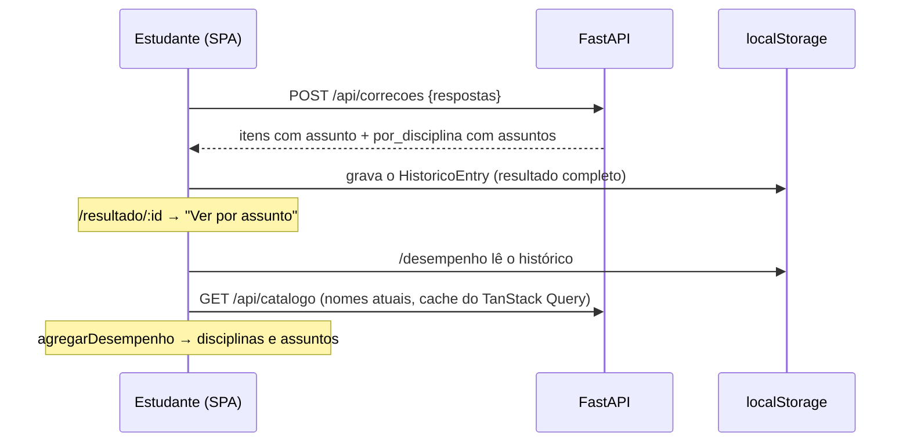

# Especificação Técnica — Assuntos e Desempenho

**Versão:** 1.0
**Data:** 2026-09-30
**PRD Ref:** 01-PRD v2.0 (RF-005, RF-018, RF-022, RF-023, US-011, US-012, RN-007, RN-014, RN-015)
**Arquitetura Ref:** 02-ARCHITECTURE v1.4 (ADR-002, ADR-004, ADR-009)
**CR Ref:** CR-004 (Fase 3A do roadmap)

---

## 1. Resumo das Mudanças

Cada questão ganha um **assunto**, tirado de uma taxonomia fixa por disciplina (`data/provas/assuntos.yaml`). A taxonomia é validada com os pacotes; o assunto passa a ser obrigatório para publicar (V11); a correção devolve o desempenho por assunto dentro de cada disciplina; o resultado mostra esse detalhe e um painel novo, "Meu desempenho", soma os simulados do histórico local.

### Escopo desta Iteração
- Taxonomia: arquivo, schema e carga (`app/pacote/assuntos.py`)
- Pacote e validação: `Questao.assunto`, V11 (contratos em `specs/01-ingestao.md`)
- Banco: `questoes.assunto` (migration `002_assunto_questoes`)
- API: assuntos no catálogo (`specs/02`) e na correção (`specs/04`)
- CLI do curador: `python -m ingestao assuntos`
- Frontend: "Ver por assunto" no resultado (`specs/04`) e página `/desempenho`

Fora desta iteração: filtro por assunto na geração, estatísticas do Treino e histórico no servidor (Fase 3B).

---

## 2. Detalhamento Técnico

### 2.1 Arquivos

| Ação | Caminho | Descrição |
|------|---------|-----------|
| Criar | `data/provas/assuntos.yaml` | Taxonomia (conteúdo, revisado pelo usuário) |
| Criar | `backend/app/pacote/assuntos.py` | `Assunto`, `Taxonomia`, `TaxonomiaInvalida`, `carregar_taxonomia`, `taxonomia_em_uso` |
| Modificar | `backend/app/pacote/schema.py`, `validacao.py`, `sincronizar.py` | Ver `specs/01-ingestao.md` |
| Modificar | `backend/app/models.py` + criar `alembic/versions/002_assunto_questoes.py` | Coluna `questoes.assunto` |
| Modificar | `backend/app/schemas.py`, `services/catalogo.py`, `services/correcao.py`, `routers/catalogo.py`, `routers/correcoes.py`, `dependencias.py` | Assuntos na API |
| Modificar | `backend/ingestao/cli.py` | `validar` com taxonomia; comando `assuntos` |
| Modificar | `backend/tests/fixtures/gerar_pacotes.py` | Taxonomia sintética (3 assuntos por disciplina) e assunto em cada questão |
| Criar | `backend/tests/test_pacote_assuntos.py`, `test_cli_assuntos.py` | Testes |
| Modificar | `frontend/src/types.ts` | `AssuntoCatalogo`, `DesempenhoAssunto`, campos opcionais |
| Modificar | `frontend/src/components/resultado/DesempenhoDisciplinas.tsx` | "Ver por assunto" |
| Criar | `frontend/src/utils/desempenho.ts` (+ `desempenho.test.ts`) | Agregação do painel |
| Criar | `frontend/src/pages/DesempenhoPage.tsx` (+ `desempenho.test.tsx`) | Painel |
| Modificar | `frontend/src/App.tsx`, `components/Layout.tsx`, `pages/HistoricoPage.tsx`, `test/apiFalsa.ts` | Rota, links e catálogo falso com assuntos |

### 2.2 Interfaces / Types

**Taxonomia (`data/provas/assuntos.yaml`):**

```yaml
# Condensada do "Programa das disciplinas" do Guia de Provas FUVEST (CR-004).
biologia:
  - slug: citologia
    nome: Citologia
  - slug: genetica
    nome: Genética
fisica:
  - ...
```

```python
ARQUIVO_TAXONOMIA = "assuntos.yaml"

class Assunto(BaseModel):                  # extra="forbid"
    slug: str                              # ^[a-z0-9-]+$, até 40 caracteres
    nome: str                              # 1..60 caracteres

class Taxonomia(RootModel[dict[Disciplina, list[Assunto]]]):
    # Validação: as 8 disciplinas presentes; 1..20 assuntos cada (a taxonomia aprovada tem de 11 a 14, e 5 em Inglês);
    # slugs e nomes únicos dentro da disciplina
    def assuntos(self, disciplina: Disciplina) -> list[Assunto]: ...
    def contem(self, disciplina: Disciplina, slug: str) -> bool: ...
    def nome(self, disciplina: Disciplina, slug: str) -> str | None: ...

class TaxonomiaInvalida(Exception):        # caminho + detalhe, como PacoteInvalido
    ...

def carregar_taxonomia(data_dir: Path) -> Taxonomia:
    """Estrita: arquivo ausente, YAML inválido ou fora do schema -> TaxonomiaInvalida.
    Usada pela validação (CLI), pela sincronização e pelo comando `assuntos`."""

def taxonomia_em_uso(data_dir: Path) -> Taxonomia | None:
    """Tolerante, para a API: cache por (caminho, mtime); None (com log de aviso) se o arquivo
    faltar ou for inválido. A sincronização já garante que a taxonomia de produção é válida."""
```

**API (contratos completos em `specs/02` e `specs/04`):**

```python
class AssuntoCatalogo(BaseModel):
    slug: str
    nome: str
    total_questoes: int            # não anuladas, como DisciplinaCatalogo.total_questoes

class DisciplinaCatalogo(BaseModel):
    ...                            # campos existentes
    assuntos: list[AssuntoCatalogo]  # na ordem da taxonomia, inclusive os com 0 questões; [] sem taxonomia

class ItemCorrigido(BaseModel):
    ...                            # campos existentes
    assunto: str | None            # slug; None só se a questão não tiver assunto no banco

class DesempenhoAssunto(BaseModel):
    assunto: str                   # slug
    nome: str                      # da taxonomia; o próprio slug se não estiver nela
    total: int
    acertos: int
    percentual: float              # 1 casa decimal

class DesempenhoDisciplina(BaseModel):
    ...                            # campos existentes
    assuntos: list[DesempenhoAssunto]  # do pior para o melhor; empate -> slug; itens sem assunto ficam fora
```

**Frontend (`types.ts`):** espelho dos schemas. Os campos novos da correção são **opcionais** (`assunto?: string | null`, `assuntos?: DesempenhoAssunto[]`): resultados gravados no histórico antes do CR-004 não os têm, e `HistoricoEntry` continua `versao: 1`.

**Painel (`utils/desempenho.ts`):**

```typescript
export const MINIMO_QUESTOES_ASSUNTO = 5

export interface LinhaAssunto {
  assunto: string | null            // null = "Sem assunto" (resultado anterior ao CR-004)
  nome: string
  total: number
  acertos: number
  percentual: number
  poucas: boolean                   // total < MINIMO_QUESTOES_ASSUNTO
}

export interface LinhaDisciplina {
  disciplina: Disciplina
  total: number
  acertos: number
  percentual: number
  assuntos: LinhaAssunto[]
}

export interface PainelDesempenho {
  simulados: number                 // entradas com ao menos uma questão contada
  total: number
  acertos: number
  percentual: number
  disciplinas: LinhaDisciplina[]
}

/** chave `${disciplina}/${slug}` -> nome */
export function nomesDosAssuntos(entradas: HistoricoEntry[], catalogo?: Catalogo): Map<string, string>
export function agregarDesempenho(entradas: HistoricoEntry[], nomes: Map<string, string>): PainelDesempenho
```

### 2.3 Lógica de Negócio

**Correção (`services/correcao.py`, complementa `specs/04` §2.3):**
1. `ItemCorrigido.assunto = questao.assunto`.
2. Para cada disciplina de `por_disciplina`, agrupar os itens dela por `assunto` (itens com `None` ficam fora dos assuntos, mas continuam na disciplina).
3. `nome = taxonomia.nome(disciplina, slug)`; sem taxonomia ou slug desconhecido → o próprio slug.
4. Ordenar os assuntos por percentual crescente, empate pelo slug (a mesma regra das disciplinas). Anuladas contam como acerto, como na nota (RN-002).

**Catálogo (`services/catalogo.py`, complementa `specs/02` §2.3):** contar as questões não anuladas por `(disciplina, assunto)` numa consulta; para cada disciplina, listar os assuntos da taxonomia na ordem do arquivo com essa contagem (0 quando não houver). Assunto do banco fora da taxonomia não aparece na lista.

**Agregação do painel (`agregarDesempenho`, RN-015):**
1. Percorrer os `resultado.itens` de todas as entradas do histórico. Pular os itens `anulada` (não medem conhecimento). `acertou` já vem da correção: em branco é erro (RN-008).
2. Somar por disciplina e, dentro dela, por `assunto` (`undefined`/`null` → grupo "Sem assunto").
3. `percentual = round(1000 × acertos / total) / 10` (1 casa, como o servidor); `total = 0` → 0.
4. Disciplinas ordenadas por percentual crescente, empate pelo slug.
5. Assuntos de cada disciplina: primeiro os com `total ≥ 5` por percentual crescente (empate pelo nome); depois os com `total < 5` (`poucas`), pela mesma regra; "Sem assunto" sempre por último.
6. Nome do assunto: `nomes.get('disciplina/slug')`; senão o slug. `nomesDosAssuntos` junta os nomes gravados nos resultados (`por_disciplina[].assuntos[].nome`) e os do catálogo, e o catálogo prevalece: ele traz o nome atual.
7. O painel usa o assunto **gravado no resultado**: reclassificar uma questão depois não muda simulados antigos (o mesmo vale para o gabarito).

**Sincronização e validação:** ver `specs/01-ingestao.md` (V11, taxonomia inválida aborta a sincronização).

### 2.4 API Endpoints

Sem endpoint novo. Mudam as respostas de `GET /api/catalogo` (`specs/02`) e `POST /api/correcoes` (`specs/04`). Os erros e os limites continuam os mesmos.

### 2.5 CLI do curador — `assuntos`

```
python -m ingestao assuntos [--ano AAAA] [--data-dir DIR]
```

- Sem `--ano`: todos os pacotes do diretório (inclusive rascunhos). Com `--ano`: só aquele (inexistente → exit 1).
- Carrega a taxonomia com `carregar_taxonomia` (inválida → mensagem + exit 1) e cada pacote (YAML inválido → mensagem + exit 1).
- Saída por pacote, para revisão da classificação:

```
== 2025 (publicada) — 90 questões, 0 sem assunto
Biologia — 11 questões
  Genética e hereditariedade (2)
    Q014 Na série ficcional Wandinha, o poder da visão é transmiti…
    Q083 O heredograma a seguir mostra o aparecimento de AME (atro…
  Ecologia (3)
    …
  Sem questões: Botânica, Zoologia
Sem assunto (0)
```

- Disciplinas em ordem alfabética do nome; assuntos na ordem da taxonomia; uma questão por linha. O início do enunciado é o primeiro bloco de texto, com espaços normalizados, cortado em 60 caracteres. Questões com assunto fora da taxonomia da disciplina aparecem num grupo "Assunto inválido" com o slug entre colchetes. Questões sem disciplina aparecem em "Sem disciplina", e as sem assunto são listadas no fim.
- Não toca o banco. Exit 0 sempre que conseguir ler tudo (é um relatório; quem bloqueia é o `validar`).

---

## 3. Componentes de UI

### Componente: DesempenhoDisciplinas (resultado, complementa `specs/04` §3)

Cada disciplina com `assuntos` não vazio ganha, abaixo da barra, um `<details>` recolhido com o `summary` "Ver por assunto". Dentro: lista com uma linha por assunto (nome à esquerda; "a de t (p%)" à direita, `tabular-nums`), na ordem da API. Sem `assuntos` (resultado antigo) → só a barra, como antes.

### Página: DesempenhoPage (`/desempenho`)

| Elemento | Conteúdo |
|----------|----------|
| Título | `h1` "Meu desempenho"; `useTituloPagina('Meu desempenho')` |
| Aviso | "Estes números somam os simulados concluídos neste navegador. Trocar de dispositivo ou limpar os dados do navegador apaga o histórico." |
| Vazio | Sem nenhuma questão contada: `Vazio` com "Nenhum simulado concluído ainda." + link "Começar um simulado" (`/`) |
| Resumo | "N simulado(s) · T questões · P% de acerto" + nota "Questões anuladas não entram na conta. Assuntos com menos de 5 questões aparecem como “poucas questões”." |
| Disciplinas | Uma `section` por disciplina (da pior para a melhor): `h2` com o nome, "a de t (p%)" e a barra (igual à do resultado); abaixo, a lista dos assuntos (nome, "a de t (p%)", barra fina) e o selo "poucas questões" quando `poucas` |
| Ações | Link "Ver histórico" |

- O catálogo (`useCatalogo`) só fornece os nomes atuais; enquanto carrega ou se falhar, a página usa os nomes gravados no histórico (nunca bloqueia).
- A lista vem de `listarHistorico()` na montagem (o painel não muda enquanto está aberto).

### Navegação
- `Layout`: link "Desempenho" (`/desempenho`) antes de "Histórico" no cabeçalho, com o mesmo estilo de `NavLink` ativo. Abaixo de 640 px os dois links ficam empilhados, alinhados à direita (lado a lado estouravam 320 px).
- `HistoricoPage`: link "Ver meu desempenho" acima da lista quando ela não está vazia.

---

## 4. Fluxos Críticos



---

## 5. Casos de Borda

| # | Cenário | Comportamento Esperado |
|---|---------|------------------------|
| 1 | Resultado antigo (sem `assunto` nos itens) no resultado | Só as barras das disciplinas, sem "Ver por assunto" |
| 2 | Resultado antigo no painel | As questões entram na disciplina e no grupo "Sem assunto", sempre por último |
| 3 | Histórico vazio ou storage bloqueado | Estado vazio com link para começar |
| 4 | Catálogo falha ou ainda carrega | Painel com os nomes gravados nos resultados; slug se nem isso houver |
| 5 | Slug renomeado depois do simulado | O nome vem do histórico; o slug antigo aparece separado do novo (a classificação gravada vale) |
| 6 | Todas as questões de uma entrada anuladas | A entrada não conta em "N simulados" |
| 7 | Taxonomia ausente ou inválida em runtime | Catálogo com `assuntos: []`; correção com o slug no lugar do nome (a sincronização já teria barrado o deploy) |
| 8 | Questão sem assunto no banco (não deveria existir após a V11) | `assunto: null` no item; fora do detalhe por assunto; conta na disciplina |
| 9 | Pacote rascunho sem assunto (2022, 2020) | V11 vira aviso no `validar` (rascunho), como as demais pendências |

---

## 6. Plano de Testes

| ID | Cenário | Alvo | Esperado |
|----|---------|------|----------|
| IT-014 | Taxonomia válida; inválida por disciplina faltando/sobrando, slug repetido ou fora do padrão, nome vazio, chave extra, arquivo ausente, YAML quebrado | `pacote/assuntos` | Carrega / `TaxonomiaInvalida` com detalhe |
| IT-015 | V11: sem assunto; assunto de outra disciplina; válido; rascunho sem assunto | `validacao` | Pendência V11 bloqueante / nenhuma |
| IT-016 | `validar` com taxonomia inválida ou ausente | CLI | Exit 1 com mensagem |
| IT-017 | Pacotes sintéticos com assunto em todas as questões e taxonomia sintética | `gerar_pacotes` + `validacao` | Nenhuma pendência bloqueante; ida e volta do YAML preserva `assunto` |
| IT-018 | Sincronizar grava `assunto` | `sincronizar` | Coluna preenchida em todas as questões |
| IT-019 | Sincronizar com taxonomia inválida | `sincronizar` / `main` | `TaxonomiaInvalida` / exit 1; banco intacto |
| IT-020 | `assuntos --ano` e sem `--ano`; ano inexistente; taxonomia inválida | CLI | Relatório agrupado / exit 1 |
| BT-025 | Catálogo com assuntos | GET /api/catalogo | Ordem da taxonomia, totais sem anuladas, assuntos com 0; `[]` sem taxonomia |
| BT-026 | Correção por assunto | `correcao` (unit) + POST /api/correcoes | `assunto` por item; assuntos por disciplina do pior para o melhor, empate por slug, nome da taxonomia |
| BT-047 | Migrations `001` → `002` → `001` | alembic | Sem erro nos dois sentidos (SQLite local, Postgres no CI) |
| UT-024 | "Ver por assunto" no resultado; resultado sem assuntos | `DesempenhoDisciplinas` | Detalhe recolhido com as linhas; sem `details` no antigo |
| UT-025 | Agregação: anuladas fora, branco como erro, ordenação, `poucas`, "Sem assunto" por último, nomes do catálogo > histórico > slug, `simulados` | `utils/desempenho` | Valores esperados |
| UT-026 | Painel: vazio, resumo, disciplinas e assuntos, aviso local, título, link no cabeçalho | `DesempenhoPage` | Textos e estrutura esperados |
| FT-012 | Prova de um ano 2025 → responder algumas → finalizar → "Ver por assunto" → `/desempenho`; entrada antiga injetada; 360 px sem rolagem horizontal; console limpo | E2E (Playwright MCP) | Dados consistentes com o resultado |

---

## 7. Checklist de Implementação

- [x] Taxonomia: `app/pacote/assuntos.py` + `data/provas/assuntos.yaml` (Gate 1 aprovado em 30/09)
- [x] Pacote: `Questao.assunto`, V11, `validar` com taxonomia, pacotes sintéticos
- [x] Banco: migration `002`, model, sincronização
- [x] API: catálogo e correção
- [x] CLI `assuntos`
- [x] Resultado: "Ver por assunto"
- [x] Painel `/desempenho` + links (no celular, os links do cabeçalho ficam empilhados abaixo de 640 px: lado a lado, estouravam 320 px)
- [ ] Classificação de 2023–2025 (Gate 2: usuário revisa) — primeira passada feita
- [x] Testes IT-014 a IT-020, BT-025, BT-026, BT-047, UT-024 a UT-026 + FT-012
