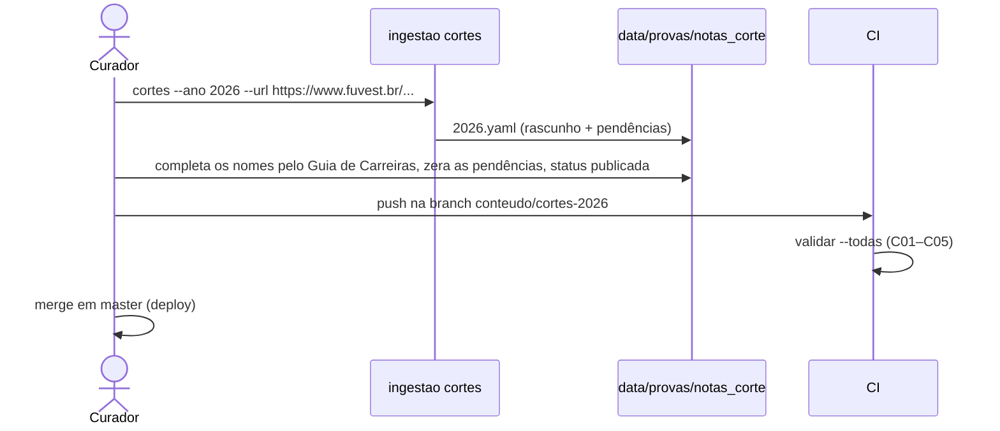
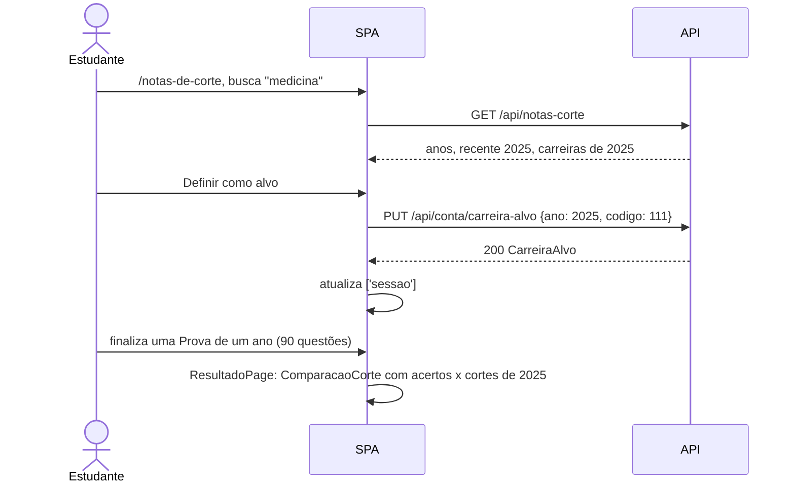

# Especificação Técnica — Notas de Corte e Carreira-alvo

**Versão:** 1.0
**Data:** 2026-10-02
**PRD Ref:** 01-PRD v5.0 (RF-027, RF-028, RF-029, US-018, US-019, US-020, RN-018, RN-019, RNF-005)
**Arquitetura Ref:** 02-ARCHITECTURE v1.10 (ADR-002, ADR-009, ADR-012, ADR-014)
**CR Ref:** CR-010 (Fase 4 do roadmap: referência de notas de corte por carreira)

---

## 1. Resumo das Mudanças

As notas de corte da 1ª fase publicadas pela FUVEST (a menor nota entre os convocados para a 2ª fase, por carreira e modalidade) entram no repositório como conteúdo versionado, um arquivo por ano, extraído do PDF oficial por um comando do curador e validado no CI. Uma página nova mostra os cortes de cada ano. O estudante escolhe uma carreira-alvo da lista mais recente, guardada na conta, e o resultado dos simulados de 90 questões e o início comparam a nota com os três cortes dessa carreira.

### Escopo desta Iteração
- Conteúdo `data/provas/notas_corte/AAAA.yaml` (2020, 2022–2025), schema, carga e validação (C01–C05)
- Extrator do PDF "Notas de Corte" e comando `python -m ingestao cortes`; `validar` com os cortes
- `GET /api/notas-corte`
- Carreira-alvo: migration `004_carreira_alvo`, `PUT`/`DELETE /api/conta/carreira-alvo`, `carreira_alvo` na sessão
- Página `/notas-de-corte`, links no cabeçalho e no menu do celular
- Comparação no resultado e no cartão "Seu último simulado"; textos de privacidade

Fora desta iteração (CR-010 §3, D1–D4): equivalência de carreiras entre anos, modalidade de concorrência, notas mínimas de aprovação por chamada (dependem da 2ª fase), simulação de aprovação, cortes na vitrine pública.

---

## 2. Detalhamento Técnico

### 2.1 Arquivos

| Ação | Caminho | Descrição |
|------|---------|-----------|
| Criar | `data/provas/notas_corte/{2020,2022,2023,2024,2025}.yaml` | Conteúdo (nomes revisados pelo usuário) |
| Criar | `backend/app/pacote/notas_corte.py` | Schema, `carregar_ano`, `validar_notas_corte`, `notas_corte_em_uso`, `BaseNotasCorte` |
| Criar | `backend/ingestao/notas_corte.py` | Extrator por posição de palavra e rascunho com pendências |
| Modificar | `backend/ingestao/cli.py` | Comando `cortes`; `validar` com os cortes |
| Modificar | `backend/app/models.py` + criar `backend/alembic/versions/004_carreira_alvo.py` | `usuarios.carreira_alvo_ano`, `usuarios.carreira_alvo_codigo` |
| Modificar | `backend/app/schemas.py` | `CortesModalidades`, `CarreiraCorteResposta`, `NotasCorteResponse`, `CarreiraAlvoRequest`, `CarreiraAlvo`; `UsuarioPublico.carreira_alvo` |
| Criar | `backend/app/services/notas_corte.py` | Resposta da API, resolução e gravação da carreira-alvo |
| Criar | `backend/app/routers/notas_corte.py` | `GET /api/notas-corte` |
| Modificar | `backend/app/routers/conta.py`, `backend/app/dependencias.py`, `backend/app/main.py` | `PUT`/`DELETE /api/conta/carreira-alvo`; `obter_notas_corte`; sessão com a carreira-alvo; registro do router |
| Modificar | `backend/tests/fixtures/gerar_pacotes.py` | `notas_corte/2099.yaml` sintético (dados de desenvolvimento) |
| Criar | `backend/tests/test_notas_corte_pacote.py`, `test_notas_corte_extrator.py`, `test_cli_cortes.py`, `test_api_notas_corte.py`, `test_carreira_alvo.py` | Testes |
| Modificar | `backend/tests/test_migrations.py` | Migration 004 |
| Modificar | `frontend/src/types.ts`, `services/api.ts`, `test/apiFalsa.ts` | Tipos, chamadas e API falsa |
| Criar | `frontend/src/utils/notasCorte.ts` (+ `notasCorte.test.ts`) | Modalidades, pontos comparáveis, situação, busca |
| Criar | `frontend/src/hooks/useNotasCorte.ts`, `hooks/useCarreiraAlvo.ts` | Consulta e mutações |
| Criar | `frontend/src/pages/NotasCortePage.tsx` (+ `notasCorte.test.tsx`) | Página |
| Criar | `frontend/src/components/notasCorte/ComparacaoCorte.tsx` | Bloco do resultado e linha do início |
| Modificar | `frontend/src/App.tsx`, `components/Layout.tsx`, `components/MenuCelular.tsx` | Rota e links |
| Modificar | `frontend/src/pages/ResultadoPage.tsx`, `components/inicio/UltimoSimulado.tsx` | Comparação |
| Modificar | `frontend/src/pages/ApresentacaoPage.tsx`, `ContaPage.tsx`, `PrivacidadePage.tsx` (+ testes) | Textos |

### 2.2 Conteúdo: `data/provas/notas_corte/AAAA.yaml`

Fica dentro do `DATA_DIR` (`data/provas`) e entra na imagem com os pacotes, sem mudar o Dockerfile. `listar_pacotes` só considera diretórios com `prova.yaml`, então `notas_corte/` não é tomado por um pacote.

```yaml
# Notas de corte da 1ª fase — FUVEST 2025 (CR-010, specs/08).
# Corte = menor nota entre os convocados para a 2ª fase. Nomes completados pelo Guia de Carreiras e Cursos.
ano: 2025
status: publicada            # rascunho | publicada
fonte: https://www.fuvest.br/wp-content/uploads/fuvest_2025_notas_de_corte.pdf
pendencias: []               # textos; a publicação exige a lista vazia (C05)
carreiras:                   # na ordem do PDF (por código)
  - codigo: 111
    nome: Medicina (São Paulo, Ribeirão Preto, Bauru)
    ac: {vagas: 147, convocados: 586, corte: 79, maximo: 88}
    ep: {vagas: 61, convocados: 298, corte: 71, maximo: 86}
    ppi: {vagas: 36, convocados: 163, corte: 60, maximo: 83}
```

Os quatro números de cada modalidade transcrevem a linha do PDF. A interface mostra só as vagas (somadas) e o corte; os convocados e o máximo servem para conferir a extração (C04).

### 2.3 Interfaces / Types

**Backend — conteúdo (`app/pacote/notas_corte.py`):**

```python
DIRETORIO_NOTAS_CORTE = "notas_corte"
MINIMO_FUVEST = 27      # menos de 30% da 1a fase elimina (Resolucao FUVEST 2025, art. 11 par. 3)
PONTOS_PROVA = 90

class Modalidade(BaseModel):              # extra="forbid"
    vagas: int                            # 1..2000
    convocados: int                       # 0..20000
    corte: int | None                     # MINIMO_FUVEST..90
    maximo: int | None                    # MINIMO_FUVEST..90
    # C04: convocados > 0 -> corte e maximo presentes e corte <= maximo; convocados == 0 -> os dois None

class CarreiraCorte(BaseModel):           # extra="forbid"
    codigo: int                           # 100..999
    nome: str                             # 1..160 caracteres, sem espaços nas pontas
    ac: Modalidade
    ep: Modalidade
    ppi: Modalidade

    @property
    def vagas(self) -> int: ...           # ac + ep + ppi

class NotasCorteAno(BaseModel):           # extra="forbid"
    ano: int                              # 2000..2100
    status: Literal["rascunho", "publicada"]
    fonte: str                            # ^https://www\.fuvest\.br/\S+\.pdf$
    pendencias: list[str]
    carreiras: list[CarreiraCorte]        # 1..300

class NotasCorteInvalidas(Exception):     # caminho + detalhe, como TaxonomiaInvalida
    ...

def carregar_ano(caminho: Path) -> NotasCorteAno:
    """Estrita: arquivo ilegível, YAML malformado, fora do schema (C01, C04) ou `ano` diferente
    do nome do arquivo -> NotasCorteInvalidas."""

def problemas_de_publicacao(notas: NotasCorteAno) -> list[str]:
    """C02, C03 e C05. Bloqueiam só o arquivo publicado; no rascunho são o relatório do curador."""

def arquivos_de_notas_corte(data_dir: Path) -> list[Path]:
    """`data_dir/notas_corte/AAAA.yaml`, em ordem; [] se o diretório não existir."""

class BaseNotasCorte:
    anos: list[int]                       # publicados e válidos, do mais recente para o mais antigo
    recente: int | None
    def ano(self, ano: int) -> NotasCorteAno | None: ...
    def carreira(self, ano: int, codigo: int) -> CarreiraCorte | None: ...

def notas_corte_em_uso(data_dir: Path) -> BaseNotasCorte:
    """Para a API: só os arquivos publicados e sem problema; os demais ficam fora com log de aviso
    (o CI barra antes). Cache pela tupla (nome, mtime) dos arquivos do diretório."""
```

**Backend — API (`app/schemas.py`):**

```python
class CortesModalidades(BaseModel):
    ac: int | None                        # None = modalidade sem convocados
    ep: int | None
    ppi: int | None

class CarreiraCorteResposta(BaseModel):
    codigo: int
    nome: str
    vagas: int                            # soma das três modalidades
    cortes: CortesModalidades

class NotasCorteResponse(BaseModel):
    anos: list[int]                       # publicados, do mais recente para o mais antigo
    recente: int | None
    ano: int | None                       # o ano devolvido: o pedido, se publicado; senão o recente
    fonte: str | None                     # PDF oficial do ano devolvido
    carreiras: list[CarreiraCorteResposta]   # ordem do arquivo (por código)

class CarreiraAlvoRequest(BaseModel):     # extra="forbid"
    ano: int                              # 2000..2100
    codigo: int                           # 100..999

class CarreiraAlvo(BaseModel):
    ano: int
    codigo: int
    carreira: CarreiraCorteResposta | None   # None: o par (ano, código) não está mais nos cortes publicados

class UsuarioPublico(BaseModel):
    ...                                   # id, email, nome
    carreira_alvo: CarreiraAlvo | None
```

**Frontend (`types.ts`):** espelho dos schemas (`CortesModalidades`, `CarreiraCorte`, `NotasCorte`, `CarreiraAlvo`; `Usuario.carreira_alvo: CarreiraAlvo | null`).

**Frontend (`utils/notasCorte.ts`):**

```typescript
export type ChaveModalidade = 'ac' | 'ep' | 'ppi'
export const MODALIDADES: { chave: ChaveModalidade; nome: string; sigla: string }[] = [
  { chave: 'ac', nome: 'Ampla concorrência', sigla: 'AC' },
  { chave: 'ep', nome: 'Escola pública', sigla: 'EP' },
  { chave: 'ppi', nome: 'Escola pública PPI', sigla: 'PPI' },
]

/** Pontos comparáveis ao corte: os acertos da Prova completa e da Prova de um ano com 90 questões; null nos demais (RN-018). */
export function pontosComparaveis(entrada: HistoricoEntry): number | null

/** Ano da Prova de um ano (do primeiro id, AAAA-NNN); null nos outros modos. */
export function anoDaProva(entrada: HistoricoEntry): number | null

export type Situacao =
  | { tipo: 'atingiu'; acima: number }    // pontos >= corte (acima = pontos - corte, pode ser 0)
  | { tipo: 'falta'; faltam: number }     // pontos < corte
  | { tipo: 'sem-corte' }                 // corte null

export function situacao(pontos: number, corte: number | null): Situacao

/** Minúsculas e sem acento (NFD sem diacríticos), para a busca. */
export function normalizarBusca(texto: string): string

/** Filtra por nome ou código e ordena por nome (localeCompare pt-BR). Busca vazia -> todas. */
export function filtrarCarreiras(carreiras: CarreiraCorte[], busca: string): CarreiraCorte[]
```

### 2.4 Lógica de Negócio

**Extrator (`ingestao/notas_corte.py`), família única 2020–2025:**
1. Por página, as palavras do `pdfplumber` (`extract_words`) agrupadas em linhas pelo `top` (tolerância 1,5 pt). Linhas a menos de 2,5 pt são fundidas (em 2024–2025 os números e o nome da carreira saem em alturas diferentes), exceto a linha que só tem o ponto mínimo.
2. Colunas pela posição x, conferidas no cabeçalho de cada página ("CÓDIGO E NOME DA CARREIRA", "VAGAS", "CONVOC", "MÍNIMO", "MÁXIMO"): nome à esquerda de "VAGAS"; vagas, inscritos, ausentes, convocados e convocados por vaga na faixa numérica; ponto mínimo na coluna de "MÍNIMO" e máximo na de "MÁXIMO". Cabeçalho ausente ou fora das posições de 2020–2025 → erro "layout desconhecido" com a página.
3. Linha `NNN−Nome` (código ≥ 100) abre uma carreira; os números dessa linha (totais, de 2024 em diante) são ignorados.
4. Linha só com um inteiro na coluna do mínimo guarda o mínimo da próxima modalidade (de 2022 em diante ele sai cerca de 4 pt acima da linha).
5. Linha "− Ampla Concorrência", "− Candidatos de Escola Pública" ou "− Candidatos de Escola Pública − Grupo PPI" fecha a modalidade com vagas, convocados, o mínimo guardado (ou o da própria linha, em 2020) e o máximo. Célula sem número ("−−−") → `None`.
6. A linha "Total" encerra a tabela: o que vem depois (os totais e, em 2025, a segunda tabela, por código e sem modalidades) é ignorado.
7. Ficam fora as carreiras de treineiro (nome começando por "Treinamento"; códigos terminados em 99).
8. Pendências do rascunho: carreira sem as três modalidades; nome terminado em "..." ("nome cortado no PDF — completar pelo Guia de Carreiras"); nome repetido no ano, uma pendência por código ("nome repetido (Medicina) — completar o campus pelo Guia de Carreiras").
9. Saída: `NotasCorteAno` com `status: rascunho`, gravado em YAML (UTF-8, LF, nomes sem escape), com o comentário de cabeçalho da §2.2.

**Comando `cortes`:** `python -m ingestao cortes --ano AAAA --url URL [--forcar]`
- Baixa o PDF para `data/_cache/AAAA/notas_corte.pdf` (reaproveita se já existir), com as regras do `baixar` (só https) e a URL em `www.fuvest.br`. As URLs mudam de padrão entre anos (`fuvest_2020_nota_de_corte.pdf` × `fuvest2023_notas_de_corte.pdf`), por isso são informadas.
- Grava `data/provas/notas_corte/AAAA.yaml`. Se o arquivo já existir, recusa sem `--forcar` (exit 1): protege os nomes revisados.
- Imprime o resumo ("N carreiras, P pendências") e as pendências.

**`validar`:** `--todas` valida também todos os arquivos de `notas_corte/`; `--ano AAAA` valida o pacote e, se existir, o arquivo de cortes do ano. Para cada arquivo, imprime `== cortes AAAA — <status>` e os problemas. Falha (exit 1) com arquivo inválido (C01, C04) ou publicado com problema (C02, C03, C05), como os pacotes publicados com pendência bloqueante.

**Curadoria dos nomes (conteúdo, não código):** o curador completa o campus dos nomes repetidos e os nomes cortados pelo Guia de Carreiras e Cursos do ano (`fuvestAAAA_guia-carreiras.pdf`, que lista os cursos e o campus de cada código), zera `pendencias` e muda para `publicada`. Formato do nome: o da FUVEST, com o campus entre parênteses quando faltar (ex.: "Psicologia (Ribeirão Preto)"; carreira com vários campi: "Medicina (São Paulo, Ribeirão Preto, Bauru)"). As notas de corte de um ano novo seguem o fluxo de conteúdo: branch `conteudo/cortes-AAAA`, CI verde, sem CR.

**Carreira-alvo (RN-019):**
- `PUT` aceita só um par (ano, código) presente nos cortes publicados **e** com `ano == recente`; senão 422 `carreira_invalida`. Grava os dois campos juntos; uma por conta (substitui a anterior).
- `DELETE` apaga os dois campos (idempotente).
- A sessão resolve a carreira-alvo na hora: `carreira` com nome, vagas e cortes do ano dela; `None` se o par não estiver mais publicado.
- Quando sai a lista de um ano novo, nada é migrado (os códigos mudam): a carreira-alvo continua com o ano dela até o estudante escolher de novo.
- Excluir a conta apaga a linha de `usuarios` inteira, e com ela a carreira-alvo.

**Comparação (RN-018):**
- Só com `pontosComparaveis(entrada) !== null`: modo `completa` ou `ano` e `resultado.total === 90`. Os pontos são `resultado.acertos` (na Prova de um ano, a anulada já conta como acerto — RN-002).
- Sempre contra o corte do ano da carreira-alvo (D2), nas três modalidades (D4). `atingiu` quando pontos ≥ corte (o corte é a menor nota entre os convocados).
- Calculada na hora de mostrar, com a carreira-alvo atual; nada é gravado no histórico.

### 2.5 API Endpoints

```
GET /api/notas-corte?ano=AAAA
Auth: Acesso (specs/07 §8: 401 nao_autenticado sem sessão no modo conta; 503 site_indisponivel)
Query: ano opcional, inteiro 2000..2100 (fora disso -> 422)
200: NotasCorteResponse
     - sem `ano`, ou `ano` não publicado -> o ano mais recente (o cliente compara `ano` com o pedido)
     - nenhum ano publicado -> {"anos": [], "recente": null, "ano": null, "fonte": null, "carreiras": []}

PUT /api/conta/carreira-alvo
Auth: Acesso + sessão (401 nao_autenticado sem usuário, inclusive no modo livre) | Origin verificado | Rate limit: 30/min por IP | Cache-Control: no-store
Body: CarreiraAlvoRequest
200: CarreiraAlvo
403: origem_invalida | 422: corpo inválido, ou {"detail": {"codigo": "carreira_invalida", "mensagem": "Escolha uma carreira da lista mais recente de notas de corte."}}

DELETE /api/conta/carreira-alvo
Auth: Acesso + sessão | Origin verificado | Rate limit: 30/min por IP
204 | 401 | 403 | 503
```

Como nos demais endpoints de conteúdo, os erros de acesso vêm antes da validação do corpo (401/503 antes de 422). `GET /api/sessao` passa a trazer `usuario.carreira_alvo`.

### 2.6 Banco de Dados

| Tabela | Campo | Tipo | Restrições | Descrição |
|--------|-------|------|------------|-----------|
| `usuarios` | carreira_alvo_ano | smallint | NULL | Ano da lista de onde a carreira foi escolhida |
| | carreira_alvo_codigo | smallint | NULL | Código da carreira naquele ano |

Migration `004_carreira_alvo` (down_revision `003`), com `op.batch_alter_table` (SQLite). As notas de corte não vão para o banco (ADR-014).

### 2.7 Validações

| Regra | O quê | Quando bloqueia |
|-------|-------|-----------------|
| C01 | Arquivo `AAAA.yaml` legível, YAML válido, no schema (campos extras recusados) e `ano` igual ao nome do arquivo | Sempre (arquivo inválido) |
| C02 | Códigos únicos; nomes únicos no ano (sem diferenciar maiúsculas); nenhuma carreira de treineiro | Publicado |
| C03 | Nome sem "..." nem "…" (nome cortado) | Publicado |
| C04 | Por modalidade: com convocados, `27 ≤ corte ≤ maximo ≤ 90`; sem convocados, corte e máximo vazios | Sempre (schema) |
| C05 | `pendencias` vazia | Publicado |

| Campo (API) | Regra | Resultado |
|-------------|-------|-----------|
| `ano` (query) | inteiro 2000..2100 | 422 |
| `ano`, `codigo` (body) | 2000..2100 e 100..999; campos extras recusados | 422 |
| Par (ano, código) | publicado e `ano == recente` | 422 `carreira_invalida` |

---

## 3. Componentes de UI

### Página: NotasCortePage (`/notas-de-corte`)

Dentro do `RequerConta`. `useTituloPagina('Notas de corte')`. Lê e grava `?ano=` (com `replace`).

| Parte | Conteúdo |
|-------|----------|
| Cabeçalho | `h1` "Notas de corte"; "1ª fase da FUVEST: a menor nota entre os convocados para a 2ª fase, por carreira e modalidade." |
| Ano | `<select>` "Ano" com `anos` (padrão: o `?ano=` se publicado, senão o mais recente). `?ano=` não publicado → aviso "Não há notas de corte de AAAA na base. Mostrando FUVEST {recente}." |
| Carreira-alvo | Com alvo: "Sua carreira-alvo: **nome** · FUVEST {ano}", os três cortes com as siglas e o botão "Remover". Alvo de um ano anterior ao mais recente: "Sua carreira-alvo é da lista de {ano}. Escolha de novo na lista de {recente}: os códigos e os nomes das carreiras mudam de um ano para outro." Alvo fora da lista (`carreira: null`): "Sua carreira-alvo não está mais na lista. Escolha outra." Sem alvo: "Escolha uma carreira-alvo para comparar a nota dos seus simulados com o corte." |
| Busca | Campo "Buscar carreira" (nome ou código, sem diferenciar acento nem maiúscula); "N carreiras" (`aria-live="polite"`); sem resultado: "Nenhuma carreira encontrada." |
| Tabela | Colunas Carreira, Vagas, AC, EP, PPI e, só no ano mais recente e com usuário, a coluna de ação. Linhas ordenadas por nome. Corte `null` → "—" com `title` "sem convocados". A linha da carreira-alvo mostra "Sua carreira-alvo" (texto, não só cor); as outras, o botão "Definir como alvo" (`aria-label` "Definir {nome} como carreira-alvo") |
| Como ler | "Corte é a menor nota (de 0 a 90) entre os candidatos chamados para a 2ª fase naquela carreira e modalidade." · "Quem faz menos de 27 pontos (30% da prova) é eliminado; corte 27 quer dizer que todos os que atingiram o mínimo foram chamados." · "AC: ampla concorrência. EP: escola pública. PPI: escola pública, pretos, pardos e indígenas." · "É uma referência para a 1ª fase, não uma previsão de aprovação: a aprovação depende da 2ª fase." · "Fonte: FUVEST, Notas de Corte {ano}" (link para `fonte`, avisando que abre em outra aba, como os PDFs do início) |

**Estados:** carregando (`Carregando`); erro da consulta (estado de erro com "Tentar de novo"); nenhum ano publicado ("As notas de corte ainda não estão disponíveis."); salvando (botões da linha desabilitados); salvo (`role="status"`: "{nome} agora é a sua carreira-alvo." / "Carreira-alvo removida."); erro ao salvar (`role="alert"`: "Não foi possível salvar a carreira-alvo. Tente novamente.").

**Sem usuário** (só no modo `livre`, fora de produção): a tabela aparece, sem o bloco da carreira-alvo e sem a coluna de ação.

**Responsivo:** a partir de 640 px, tabela. Abaixo de 640 px, cada carreira num bloco: o nome numa linha e, na de baixo, "Vagas N · AC 79 · EP 71 · PPI 60" e o botão. A 360 px, sem rolagem horizontal.

**Depois de salvar:** a mutação atualiza a sessão em cache (`['sessao']`) com a `CarreiraAlvo` devolvida (ou `null` no `DELETE`), e o resultado e o início passam a usar a nova.

### Componente: ComparacaoCorte

| Prop | Tipo | Obrigatório | Descrição |
|------|------|-------------|-----------|
| pontos | `number` | Sim | `pontosComparaveis(entrada)` |
| alvo | `CarreiraAlvo \| null` | Sim | `sessao.usuario?.carreira_alvo ?? null` |
| variante | `'resultado' \| 'inicio'` | Sim | Bloco completo ou linha curta |
| anoDaProva | `number \| null` | Não | Na Prova de um ano, para o link dos cortes daquele ano |
| comUsuario | `boolean` | Sim | Sem usuário (modo livre), sem convite para escolher |

**Variante `resultado`** (no `ResultadoPage`, logo depois do `ResumoResultado`; só com `pontos` não nulo):
- `h2` "Notas de corte".
- Com `alvo.carreira`: "Sua carreira-alvo: **nome** · corte FUVEST {alvo.ano}" e uma linha por modalidade: "{nome da modalidade}: corte {c} — atingiu (+{acima})" / "— faltam {faltam}" / "— sem convocados". A situação é escrita, não só indicada por cor (tokens `acerto` e `erro` como reforço).
- Com alvo e `carreira: null`: "Sua carreira-alvo não está mais na lista." + link "Escolher de novo" (`/notas-de-corte`).
- Sem alvo, com usuário: "Compare sua nota com o corte da carreira que você quer." + link "Escolher carreira-alvo" (`/notas-de-corte`).
- Sempre: "Referência para ir à 2ª fase, não previsão de aprovação." e link "Ver todas as notas de corte" (`/notas-de-corte`). Na Prova de um ano, também "Ver as notas de corte de {anoDaProva}" (`/notas-de-corte?ano={anoDaProva}`).

**Variante `inicio`** (no cartão `UltimoSimulado`, abaixo do aproveitamento): só com `alvo.carreira` e `pontos` não nulo. Uma linha: "Corte {alvo.ano} · {nome}: AC 79 (faltam 18) · EP 71 (faltam 10) · PPI 60 (atingiu)", com `<abbr>` nas siglas.

### Cabeçalho e menu do celular (complementam `specs/03`)
Link "Notas de corte" (`/notas-de-corte`) depois de "Histórico", com as mesmas regras de visibilidade de "Desempenho" e "Histórico" (só com acesso ao conteúdo); o mesmo item no `MenuCelular`.

### Textos de privacidade (complementam `specs/07`)
- Apresentação: "É grátis. Guardamos só seu nome, seu e-mail, os resultados dos simulados concluídos e a carreira-alvo, se você escolher uma."
- Conta (sem login): "Guardamos só seu nome, seu e-mail, os resultados dos simulados concluídos e a carreira-alvo, se você escolher uma. O simulado em andamento continua só neste navegador."
- Privacidade, "Com conta Google": acrescenta ao que guardamos "a carreira-alvo que você escolher nas notas de corte (não guardamos a sua modalidade de concorrência)" e, ao para quê, "comparar a nota dos simulados com o corte dessa carreira em qualquer dispositivo".

---

## 4. Fluxos Críticos

### Fluxo: Publicar as notas de corte de um ano



### Fluxo: Escolher a carreira-alvo e comparar



---

## 5. Casos de Borda

| # | Cenário | Comportamento Esperado |
|---|---------|------------------------|
| 1 | Simulado Personalizado, ou Prova de um ano com questão removida da base (`total` ≠ 90) | Sem bloco no resultado e sem linha no início |
| 2 | Nota igual ao corte | "atingiu (+0)" |
| 3 | Modalidade sem convocados (corte `null`) | "—" na tabela; "sem convocados" no resultado |
| 4 | `?ano=2021` (não publicado) | Mostra o mais recente com o aviso |
| 5 | Saem os cortes de 2026 com a carreira-alvo de 2025 | A comparação continua com o corte de 2025; a página avisa e só aceita carreiras de 2026 |
| 6 | O arquivo do ano da carreira-alvo sai da base ou fica inválido | `carreira: null`: "Sua carreira-alvo não está mais na lista." |
| 7 | `PUT` com carreira de um ano anterior ou código inexistente | 422 `carreira_invalida` |
| 8 | Dois dispositivos: escolhe a carreira-alvo num deles | O outro vê a nova ao recarregar a sessão |
| 9 | Resultado antigo (antes do CR-010) | Mostra o bloco com a carreira-alvo atual: os acertos já estão no histórico |
| 10 | Modo `livre` (desenvolvimento, sem usuário) | Página e bloco sem carreira-alvo; `PUT`/`DELETE` → 401 |
| 11 | `cortes` com o arquivo já existente | Recusa sem `--forcar` (exit 1) |
| 12 | PDF com layout novo | Erro "layout desconhecido" com a página; nada é gravado |
| 13 | Nome de carreira com HTML | Gravado e mostrado como texto (React) |

---

## 6. Plano de Testes

### Backend isolado

| ID | Cenário | Método/Rota | Esperado |
|----|---------|-------------|----------|
| IT-021 | Arquivo válido carrega; campo extra, YAML malformado e `ano` diferente do nome do arquivo são recusados (C01) | `carregar_ano` | `NotasCorteAno` / `NotasCorteInvalidas` |
| IT-022 | Regras de publicação: código e nome repetidos, treineiro, nome cortado, pendência (C02, C03, C05) bloqueiam só o publicado; corte < 27, corte > máximo e corte sem convocados (C04) recusados em qualquer status | `problemas_de_publicacao`, `carregar_ano` | Problemas listados; rascunho aceito |
| IT-023 | Carga tolerante: só publicados e válidos, inválido fica fora com log, `anos` do mais recente para o mais antigo, troca do arquivo reflete (mtime) | `notas_corte_em_uso` | `BaseNotasCorte` correta |
| IT-024 | `validar --todas` e `--ano` com cortes válidos, inválidos e publicados com problema | CLI | Exit 0 / 1 e relatório `== cortes AAAA` |
| IT-025 | Extrator, variante 2020 (mínimo e máximo na linha da modalidade), com palavras sintéticas | `ingestao/notas_corte.py` | Carreiras e modalidades corretas |
| IT-026 | Extrator, variante 2022+ (mínimo acima da linha, totais na linha da carreira, "Total" encerra a tabela, treineiros fora, pendências de nome cortado e repetido, cabeçalho desconhecido → erro) | `ingestao/notas_corte.py` | Idem + pendências |
| IT-027 | Comando `cortes` (download falso): grava o rascunho em LF; recusa sobrescrever sem `--forcar`; URL fora de `www.fuvest.br` → erro | CLI | Exit e arquivo conforme |
| BT-079 | Sem `ano` → mais recente; com `ano` publicado; `ano` não publicado → mais recente; sem arquivos → listas vazias | GET /api/notas-corte | 200 com `anos`, `recente`, `ano`, `fonte`, `carreiras` |
| BT-080 | Acesso: sem sessão no modo `conta`; modo `indisponivel` | GET /api/notas-corte | 401 / 503 |
| BT-081 | `ano=abc`, `ano=1800` | GET /api/notas-corte | 422 |
| BT-082 | Carreira válida do ano mais recente | PUT /api/conta/carreira-alvo + GET /api/sessao | 200 `CarreiraAlvo`; sessão com a carreira resolvida |
| BT-083 | Ano anterior, código inexistente → `carreira_invalida`; corpo inválido ou com campo extra | PUT /api/conta/carreira-alvo | 422 |
| BT-084 | Sem sessão (modos `conta` e `livre`), Origin diferente, modo `indisponivel` | PUT e DELETE | 401 / 403 / 503 |
| BT-085 | Remover (duas vezes) | DELETE + GET /api/sessao | 204, 204; `carreira_alvo: null` |
| BT-086 | Carreira-alvo de um ano que saiu da base → `carreira: null`; excluir a conta apaga a linha | GET /api/sessao, DELETE /api/conta | Conforme |
| BT-047 | Migration upgrade/downgrade (inclui 004) | alembic | Sem erro nos dois sentidos |

### Fluxo completo (backend + frontend)

| ID | Cenário | Tipo | Esperado |
|----|---------|------|----------|
| UT-055 | `pontosComparaveis` (completa, ano, personalizado, total ≠ 90), `anoDaProva`, `situacao` (igual, acima, abaixo, sem corte) | Vitest | Conforme RN-018 |
| UT-056 | `normalizarBusca` e `filtrarCarreiras` (sem acento, por código, ordem por nome) | Vitest | Conforme |
| UT-057 | Página: ano padrão, troca de ano (`?ano=`), ano não publicado com aviso, busca e contagem, tabela, "—", "Como ler" e link da fonte | Vitest + Testing Library | Conforme §3 |
| UT-058 | Página com carreira-alvo: definir (só no ano mais recente), remover, alvo de ano anterior, alvo fora da lista, erro ao salvar; link "Notas de corte" no cabeçalho e no menu do celular | Vitest + Testing Library | Conforme §3 |
| UT-059 | Resultado: bloco com alvo (três cortes, "faltam"/"atingiu"), sem alvo (convite), alvo fora da lista, link do ano na Prova de um ano, sem bloco no Personalizado | Vitest + Testing Library | Conforme §3 |
| UT-060 | Início: linha dos cortes com 90 questões e alvo; sem linha no Personalizado ou sem alvo | Vitest + Testing Library | Conforme §3 |
| UT-061 | Textos da apresentação, Conta e Privacidade com a carreira-alvo | Vitest + Testing Library | Conforme §3 |
| FT-024 | Login com o provedor falso → `/notas-de-corte` → busca → "Definir como alvo" → Prova de um ano finalizada → bloco no resultado → linha no início; 360 px sem rolagem horizontal; console sem erros | E2E (Playwright MCP) | Conforme |

---

## 7. Checklist de Implementação

- [ ] Schema, carga e validação dos cortes + `validar` (IT-021 a IT-024)
- [ ] Extrator + comando `cortes` (IT-025 a IT-027)
- [ ] Conteúdo 2020, 2022–2025 com os nomes revisados (Gate 1 do CR-010)
- [ ] `GET /api/notas-corte` (BT-079 a BT-081)
- [ ] Migration 004 + carreira-alvo + sessão (BT-082 a BT-086, BT-047)
- [ ] Página, links (UT-055 a UT-058)
- [ ] Resultado, início e textos (UT-059 a UT-061)
- [ ] FT-024 exercitado
