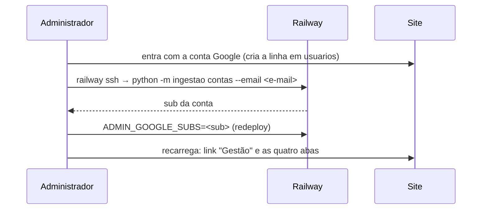

# Especificação Técnica — Área de Gestão

**Versão:** 1.0
**Data:** 2026-10-06
**PRD Ref:** 01-PRD v7.0 (RF-030 a RF-034, US-022 a US-024, RN-020 a RN-022, RNF-004, RNF-005)
**Arquitetura Ref:** 02-ARCHITECTURE v1.13 (ADR-006, ADR-010, ADR-012, ADR-016)
**CR Ref:** CR-013 (área de gestão: indicadores do site para o administrador)

---

## 1. Resumo das Mudanças

O administrador do site (o dono do produto) ganha a página `/gestao`, com quatro abas: **Uso**, **Aprendizado**, **Qualidade** e **Estudantes**. Para que os números existam, o servidor passa a contar por dia (horário de Brasília), sem identificar ninguém, os logins, os usuários ativos, as contas excluídas, os simulados concluídos (com acertos, tempo e "finalizado por tempo" por modo) e as marcações de cada questão. O administrador é reconhecido pelo `sub` da conta Google numa variável de ambiente; para qualquer outra pessoa a área não existe (404).

### Escopo desta Iteração
- `ADMIN_GOOGLE_SUBS`, `UsuarioPublico.admin`, dependência `exigir_admin` (RN-020)
- Migration `006_estatisticas_gestao`: `estatisticas_diarias` e `estatisticas_questoes`, com backfill do histórico guardado
- Contadores (RN-021) e o último acesso diário; o contador de gerados no dia de Brasília
- `GET /api/gestao/uso`, `/aprendizado`, `/qualidade`, `/reportes`, `/estudantes`; `POST /api/gestao/reportes/resolver`
- Comando `python -m ingestao contas --email X`
- Páginas `/gestao`, `/gestao/aprendizado`, `/gestao/qualidade`, `/gestao/estudantes`; link "Gestão" para o admin; `GraficoColunas`; texto da Privacidade

### Fora desta Iteração
- Exportar CSV (D1 do CR-013); retenção por coorte e qualquer registro da atividade de cada estudante (D2)
- Ações sobre contas (excluir, bloquear) e edição de questões pela web: a curadoria continua pela CLI (ADR-008)
- Métricas de desempenho técnico (p95 da geração, erros): ficam com os logs e as métricas da Railway

---

## 2. Detalhamento Técnico

### 2.1 Arquivos

| Ação | Caminho | Conteúdo |
|------|---------|----------|
| Modificar | `backend/app/config.py` | `admin_google_subs: frozenset[str]` (`ADMIN_GOOGLE_SUBS`, separada por vírgula, espaços ignorados) e `eh_admin(sub)`, a única regra do administrador |
| Criar | `backend/alembic/versions/006_estatisticas_gestao.py` | Tabelas + backfill (§2.6) |
| Modificar | `backend/app/models.py` | `EstatisticaDiaria`, `EstatisticaQuestao` |
| Modificar | `backend/app/services/estatisticas.py` | `FUSO_BRASILIA`, `dia_local`, `inicio_do_dia`, `incrementar`, `registrar_atividade`, `registrar_conclusoes`; `registrar_geracao` com `dia_local` |
| Modificar | `backend/app/services/contas.py`, `services/historico.py`, `dependencias.py` | Pontos de coleta (§2.4); `eh_admin`, `exigir_admin` |
| Criar | `backend/app/services/gestao.py`, `backend/app/routers/gestao.py` | Indicadores e rotas |
| Modificar | `backend/app/schemas.py`, `routers/conta.py`, `main.py` | Schemas (§2.3), `UsuarioPublico.admin`, router |
| Modificar | `backend/ingestao/cli.py` | Comando `contas` |
| Modificar | `frontend/src/types.ts`, `services/api.ts` | Tipos e chamadas |
| Criar | `frontend/src/hooks/useGestao.ts` | `useGestaoUso`, `useGestaoAprendizado`, `useGestaoQualidade`, `useGestaoReportes`, `useResolverReportes`, `useGestaoEstudantes` |
| Criar | `frontend/src/components/RequerAdmin.tsx`, `components/GraficoColunas.tsx` | Porteiro e gráfico |
| Criar | `frontend/src/pages/gestao/GestaoLayout.tsx`, `UsoPage.tsx`, `AprendizadoPage.tsx`, `QualidadePage.tsx`, `EstudantesPage.tsx`, `periodo.ts` (período na URL, rótulos), `componentes.tsx` (seletor, cartão, seção, tabela) | Telas (§3) |
| Modificar | `frontend/src/App.tsx`, `components/Layout.tsx`, `components/MenuCelular.tsx`, `components/questao/QuestaoView.tsx`, `pages/PrivacidadePage.tsx` | Rotas, links, questão sem "Reportar problema" na gestão, texto |

### 2.2 Variável `ADMIN_GOOGLE_SUBS`

Lista de `sub` (claim do Google, `usuarios.google_sub`) separados por vírgula. Ausente ou vazia: ninguém é administrador e todas as rotas de gestão respondem 404. O `sub` não é segredo, mas fica só na Railway, com as outras variáveis. Para descobrir o próprio: entrar no site uma vez com a conta e rodar `python -m ingestao contas --email <e-mail> --database-url "<DATABASE_PUBLIC_URL>"` (Deploy Guide).

### 2.3 Interfaces / Types

**Backend (`app/schemas.py`):**
```python
PeriodoGestao = Literal["7", "30", "90", "tudo"]
ModoConcluido = Literal["completa", "personalizado", "ano"]


class UsuarioPublico(BaseModel):  # + admin
    id: int
    email: str
    nome: str | None
    carreira_alvo: CarreiraAlvo | None = None
    admin: bool = False  # CR-013: só o servidor decide; o frontend só mostra o link


class PontoSerie(BaseModel):
    inicio: date  # primeiro dia do intervalo (o dia, ou a semana começando na segunda)
    total: int


class SeriesUso(BaseModel):
    cadastros: list[PontoSerie]
    logins: list[PontoSerie]
    ativos: list[PontoSerie]  # por semana: a média por dia, arredondada
    gerados: list[PontoSerie]
    concluidos: list[PontoSerie]


class CartoesUso(BaseModel):
    estudantes: int  # contas hoje
    novos: int  # contas criadas no período
    ativos_hoje: int
    ativos_media_dia: float  # soma de `ativo` no período ÷ dias, 1 casa
    ativos_7_dias: int
    ativos_30_dias: int
    logins: int
    gerados: int
    concluidos: int
    contas_excluidas: int


class ModoUso(BaseModel):
    modo: Literal["completa", "personalizado", "ano", "treino"]
    gerados: int
    concluidos: int | None  # None no Treino (não entra no histórico)
    taxa_conclusao: float | None  # concluídos ÷ gerados × 100, 1 casa; None sem gerados e no Treino


class FaixaUso(BaseModel):
    faixa: Literal["0", "1", "2–5", "6–20", "21–50"]
    estudantes: int


class ProvaFeita(BaseModel):
    codigo: str
    rotulo: str
    concluidos: int


class UsoResponse(BaseModel):
    periodo: PeriodoGestao
    inicio: date
    fim: date
    granularidade: Literal["dia", "semana"]
    cartoes: CartoesUso
    series: SeriesUso
    modos: list[ModoUso]  # completa, personalizado, ano, treino
    distribuicao: list[FaixaUso]  # sempre as 5 faixas, na ordem
    provas_ano: list[ProvaFeita]  # do mais feito para o menos


class ModoAprendizado(BaseModel):
    modo: ModoConcluido
    concluidos: int
    acerto_medio: float | None  # %, 1 casa
    por_tempo: float | None  # % dos concluídos, 1 casa
    tempo_medio_questao_s: int | None


class AssuntoAprendizado(BaseModel):
    assunto: str
    nome: str
    respostas: int
    acertos: int
    percentual: float


class DisciplinaAprendizado(BaseModel):
    disciplina: Disciplina
    respostas: int
    acertos: int
    percentual: float
    assuntos: list[AssuntoAprendizado]  # do pior para o melhor


class CarreiraEscolhida(BaseModel):
    ano: int
    codigo: int
    nome: str | None  # None: a carreira saiu dos cortes publicados
    pontos_prova: int
    cortes: CortesModalidades | None
    estudantes: int
    com_prova_completa: int
    atingiriam: CortesModalidades | None  # contagem por modalidade; None na modalidade sem corte


class AprendizadoResponse(BaseModel):
    periodo: PeriodoGestao
    inicio: date
    fim: date
    modos: list[ModoAprendizado]  # completa, personalizado, ano
    disciplinas: list[DisciplinaAprendizado]  # desde o início, do pior para o melhor
    carreiras: list[CarreiraEscolhida]  # até 10


class ProvaBase(BaseModel):
    codigo: str
    rotulo: str
    tipo: str
    total_questoes: int
    questoes: int  # na base
    anuladas: int
    sincronizado_em: datetime


class ResumoBase(BaseModel):
    provas: int
    questoes: int  # válidas (não anuladas)
    anuladas: int
    sem_assunto: int
    sincronizado_em: datetime | None


class DisciplinaBase(BaseModel):
    disciplina: Disciplina
    questoes: int


class ResumoReportes(BaseModel):
    pendentes: int
    resolvidos: int
    questoes_com_reporte_resolvido: int
    indice_resolvidos: float | None  # % das questões válidas, 1 casa (meta < 2% — PRD §2)


class Marcacoes(BaseModel):
    a: int
    b: int
    c: int
    d: int
    e: int
    em_branco: int


class QuestaoSuspeita(BaseModel):
    questao_id: str
    prova: str  # rótulo
    numero: int
    disciplina: Disciplina
    assunto: str | None  # nome
    gabarito: Letra
    respostas: int
    acertos: int
    percentual: float
    marcacoes: Marcacoes
    motivos: list[Literal["acerto_baixo", "alternativa_atrai"]]


class QualidadeResponse(BaseModel):
    base: ResumoBase
    provas: list[ProvaBase]
    disciplinas: list[DisciplinaBase]
    reportes: ResumoReportes
    suspeitas: list[QuestaoSuspeita]  # do menor acerto para o maior, até 50


class QuestaoReportada(BaseModel):
    prova: str  # rótulo
    numero: int
    disciplina: Disciplina
    gabarito: Letra | None
    anulada: bool


class ReporteGestao(BaseModel):
    id: int
    questao_id: str
    tipo: TipoReporte
    descricao: str | None
    status: Literal["pendente", "resolvido"]
    criado_em: datetime
    resolvido_em: datetime | None
    questao: QuestaoReportada | None  # None: a questão saiu da base


class ReportesGestaoResponse(BaseModel):
    reportes: list[ReporteGestao]


class ResolverReportesRequest(BaseModel):
    model_config = ConfigDict(extra="forbid")
    ids: list[int]  # 1..100 ids, cada um >= 1, sem repetição


class ResolverReportesResponse(BaseModel):
    resolvidos: list[int]
    ja_resolvidos: list[int]
    inexistentes: list[int]


class EstudanteGestao(BaseModel):
    id: int
    nome: str | None
    email: str
    criado_em: datetime
    ultimo_acesso_em: datetime
    simulados: int  # no histórico da conta (até 50)
    carreira_alvo: str | None  # nome; "2025 · código 111" se saiu da lista
    admin: bool


class EstudantesResponse(BaseModel):
    total: int
    pagina: int
    por_pagina: int  # 50
    estudantes: list[EstudanteGestao]
```

**Frontend (`types.ts`):** espelho dos schemas acima (`UsoGestao`, `AprendizadoGestao`, `QualidadeGestao`, `ReporteGestao`, `EstudantesGestao`, …), com `Usuario.admin?: boolean` e `PeriodoGestao = '7' | '30' | '90' | 'tudo'`. Datas chegam como string ISO.

### 2.4 Lógica de Negócio

**Dia e período (RN-021):**
- `FUSO_BRASILIA = timezone(timedelta(hours=-3))` (o Brasil não tem horário de verão desde 2019; sem `tzdata`). `dia_local(agora)` = data de `agora` em Brasília; `inicio_do_dia(dia)` = 00:00 de Brasília do dia, em UTC; `como_utc` normaliza o datetime sem fuso do SQLite.
- Período `7`, `30` ou `90`: de `hoje − (N − 1)` até hoje (dias de Brasília). `tudo`: do primeiro dia com dado (o menor entre `estatisticas_geracao.dia`, `estatisticas_diarias.dia` e o dia de cadastro da conta mais antiga) até hoje; sem dado, só hoje.
- Granularidade: `dia` quando o período tem até 31 dias; senão `semana`, com intervalos começando na segunda-feira (o primeiro pode começar no meio da semana, no `inicio`). As séries trazem todos os intervalos, com zero onde não houve nada.

**Contadores (`services/estatisticas.py`, RN-021):**
- `incrementar(sessao, dia, contagens: dict[str, int])`: `INSERT … ON CONFLICT (dia, metrica) DO UPDATE SET total = total + excluded.total`, por dialeto (como `historico.inserir_sem_conflito`), dentro de `sessao.begin_nested()`. Erro do banco → `log.exception` e a operação principal segue. Quem chama faz o commit.
- `registrar_atividade(sessao, usuario, agora)`: se `ultimo_acesso_em` já é de hoje, não faz nada (sem escrita). Senão, `UPDATE usuarios SET ultimo_acesso_em = agora WHERE id = :id AND ultimo_acesso_em < inicio_do_dia(hoje)`; se mudou uma linha, `ativo += 1`; commit. Duas abas no mesmo instante contam uma vez. Erro → rollback, log e o pedido segue.
- `registrar_conclusoes(sessao, entradas, agora)`: para cada entrada inserida, no dia da chegada: `concluido.<modo>` +1; `por_tempo.<modo>` +1 se `finalizado_por_tempo`; `tempo_ms.<modo>` + `tempo_gasto_ms` limitado a 0…24 h; `questoes.<modo>` + `resultado.total`; `acertos.<modo>` + `resultado.acertos`; no modo `ano`, `prova_ano.<codigo>` +1, com o código do prefixo de `questao_ids[0]`. Marcações: para cada item do resultado, a letra marcada (`marcadas_a` … `marcadas_e`) ou `em_branco`, somadas por questão e gravadas num upsert só (`estatisticas_questoes`). Anuladas também são contadas (a leitura as deixa de fora).
- `registrar_geracao` passa a usar `dia_local` (antes, o dia UTC). Os dias anteriores ficam como estão.

**Pontos de coleta:**
- `contas.entrar`: `login` +1; `ativo` +1 se a conta é nova ou o último acesso não era de hoje; `ultimo_acesso_em = agora` (como antes). `_usuario_do_google` passa a dizer se criou a conta.
- `dependencias.obter_usuario`: depois de resolver o usuário da sessão, `registrar_atividade` (vale para qualquer pedido com sessão, inclusive `GET /api/sessao`).
- `contas.excluir_conta`: `conta_excluida` + as linhas que o `DELETE` apagou, no mesmo commit (a segunda de duas exclusões simultâneas não conta).
- `historico.gravar`: o `INSERT … ON CONFLICT DO NOTHING` ganha `RETURNING id`; só as entradas devolvidas vão para `registrar_conclusoes`, antes do corte em 50 e no mesmo commit.

**Administrador (RN-020):** `Settings.eh_admin(sub)` = `sub in admin_google_subs` (a dependência e a lista de estudantes usam a mesma regra). `exigir_admin` (dependência do router de gestão) usa `obter_usuario`; sem usuário ou não admin → 404 `nao_encontrado`. Roda antes da validação de query e corpo, então quem não é admin nunca vê 422: o corpo do `POST` é lido numa dependência depois dela (um parâmetro de corpo seria decodificado antes das dependências, e JSON malformado daria 422). Não depende do modo de acesso: sem login configurado não há usuário, e a área responde 404.

**Uso (`GET /api/gestao/uso`):**
- Cartões: `estudantes` = contas hoje; `novos` = contas com cadastro no período; `ativos_hoje` = `ativo` de hoje; `ativos_media_dia` = soma de `ativo` no período ÷ dias do período (o cabeçalho do gráfico de ativos); `ativos_7_dias`/`ativos_30_dias` = contas com `ultimo_acesso_em ≥ inicio_do_dia(hoje − 6)` / `(hoje − 29)`; `logins`, `concluidos` (soma de `concluido.*`) e `contas_excluidas` no período; `gerados` = soma de `estatisticas_geracao` no período (todos os modos, inclusive Treino).
- Séries: `cadastros` pelo dia de Brasília de `usuarios.criado_em`; `logins`, `ativos` e `concluidos` de `estatisticas_diarias`; `gerados` de `estatisticas_geracao`. Por semana, `ativos` é a média por dia dos dias do intervalo, arredondada (somar ativos de dias diferentes contaria a mesma pessoa várias vezes).
- `modos`: Prova completa, Personalizado, Prova de um ano e Treino com os gerados no período; os três primeiros com os concluídos e a taxa (pode passar de 100%, porque o concluído é contado na chegada e o histórico de um navegador novo chega de uma vez).
- `distribuicao`: quantas contas têm 0, 1, 2–5, 6–20 e 21–50 simulados no histórico hoje (não depende do período).
- `provas_ano`: soma de `prova_ano.<codigo>` no período, com o rótulo da prova que está na base (`rotulo_da_prova`); prova que saiu da base, ou código desconhecido, mostra o código.

**Aprendizado (`GET /api/gestao/aprendizado`):**
- `modos` (no período): `acerto_medio` = Σ acertos ÷ Σ questões × 100; `por_tempo` = Σ por tempo ÷ Σ concluídos × 100; `tempo_medio_questao_s` = Σ tempo ÷ Σ questões, em segundos inteiros. Sem concluídos (ou sem questões), `None`.
- `disciplinas` (desde o início): `estatisticas_questoes` junto com `questoes` (só as colunas usadas, sem o conteúdo), sem anuladas e sem resposta nula. Por questão, `respostas` = soma das marcações e em branco; `acertos` = marcações da letra do gabarito **atual**. Agrupado pela disciplina principal e pelo assunto (nome da taxonomia; sem taxonomia, o slug); questão sem assunto entra só na disciplina. Ordem: pior percentual primeiro (empate pelo nome). Marcações de questões que saíram da base ficam de fora.
- `carreiras`: as 10 carreiras-alvo com mais contas (empate: ano mais recente, depois código). Para cada uma, os cortes do ano dela (como a sessão resolve — `resolver_carreira_alvo`); `com_prova_completa` = contas do grupo com alguma Prova completa no histórico; `atingiriam` = dessas, quantas têm, no simulado de Prova completa mais recente, a nota na escala da lista (direta se o total é igual aos pontos da lista; senão acertos ÷ total × pontos, 1 casa — RN-018) maior ou igual ao corte de cada modalidade.

**Qualidade (`GET /api/gestao/qualidade`):**
- `base`: provas, questões válidas, anuladas, questões sem assunto (deve ser 0 — V11) e a sincronização mais recente. `provas`: por prova, do ano mais recente para o mais antigo (vestibular antes dos simulados do mesmo ano, simulados por edição). `disciplinas`: questões válidas por disciplina principal.
- `reportes`: pendentes, resolvidos, questões distintas com reporte resolvido e o índice dessas sobre as questões válidas (o PRD §2 mede reportes **confirmados**; "resolvido" inclui os descartados, e a tela avisa).
- `suspeitas` (RN-022): questões não anuladas com pelo menos 20 respostas e acerto abaixo de 15% (`acerto_baixo`) ou alguma alternativa errada mais marcada que a correta (`alternativa_atrai`); até 50, do menor acerto para o maior.

**Reportes:** `GET /api/gestao/reportes?status=pendente` (padrão) lista todos os pendentes, do mais antigo para o mais novo; `status=resolvido`, os 100 resolvidos mais recentes. Cada um com a questão (rótulo da prova, número, disciplina, gabarito, anulada) ou `null` se ela saiu da base. `POST /api/gestao/reportes/resolver` usa `services/reportes.resolver_reportes` (o mesmo da CLI).

**Estudantes:** `busca` (até 100 caracteres, sem espaços nas pontas) filtra nome ou e-mail por "contém", sem diferenciar maiúsculas (`ilike`, com `%`, `_` e `\` escapados). `ordem=cadastro` (padrão) ordena pelo cadastro mais recente; `acesso`, pelo último acesso mais recente (empate: id decrescente). 50 por página; página além da última → lista vazia com o `total`.

**Comando `contas`:** `python -m ingestao contas --email X --database-url URL` (a URL é obrigatória e nunca lida do ambiente — ADR-008; imprime o banco alvo sem a senha) lista as contas com aquele e-mail (sem diferenciar maiúsculas): `sub`, nome, cadastro. Só leitura. Nenhuma conta → mensagem e exit 1.

### 2.5 API Endpoints

```
Todas: Auth admin (exigir_admin: 404 {"detail": {"codigo": "nao_encontrado", "mensagem": "Página não encontrada."}}
       para quem não entrou, não é admin ou sem ADMIN_GOOGLE_SUBS) | Cache-Control: no-store

GET  /api/gestao/uso?periodo=7|30|90|tudo          (padrão 30)   60/min por IP   200 UsoResponse
GET  /api/gestao/aprendizado?periodo=7|30|90|tudo  (padrão 30)   60/min por IP   200 AprendizadoResponse
GET  /api/gestao/qualidade                                       60/min por IP   200 QualidadeResponse
GET  /api/gestao/reportes?status=pendente|resolvido (padrão pendente)  60/min    200 ReportesGestaoResponse
POST /api/gestao/reportes/resolver   Origin verificado (403)     30/min por IP   200 ResolverReportesResponse
     Body: ResolverReportesRequest (lido depois do exigir_admin: JSON malformado de quem não é admin -> 404)
GET  /api/gestao/estudantes?busca=&ordem=cadastro|acesso&pagina=1..10000   60/min   200 EstudantesResponse

422: periodo, status, ordem ou pagina inválidos; corpo inválido (sem ids, mais de 100, repetidos, campo extra)
```

`GET /api/sessao` passa a trazer `usuario.admin`.

### 2.6 Banco de Dados

| Tabela | Campo | Tipo | Restrições | Descrição |
|--------|-------|------|------------|-----------|
| `estatisticas_diarias` | dia | date | PK (composta) | Dia de Brasília |
| | metrica | varchar(40) | PK (composta) | `login`, `ativo`, `conta_excluida`, `concluido.<modo>`, `por_tempo.<modo>`, `tempo_ms.<modo>`, `questoes.<modo>`, `acertos.<modo>`, `prova_ano.<codigo>` |
| | total | bigint | NOT NULL | Soma (o tempo em ms passa de 32 bits) |
| `estatisticas_questoes` | questao_id | varchar(12) | PK — **sem FK** | Sobrevive à ressincronização (ADR-006) |
| | marcadas_a … marcadas_e | int | NOT NULL, default 0 | Vezes que a letra foi marcada |
| | em_branco | int | NOT NULL, default 0 | Vezes que ficou em branco |

Migration `006_estatisticas_gestao` (down_revision `005`): cria as duas tabelas e faz o backfill em Python (portável SQLite/Postgres, sem importar o app), lendo `simulados_concluidos` (`dados`, `recebido_em`) com a mesma regra de `registrar_conclusoes`, no dia de Brasília de `recebido_em`. Downgrade: apaga as duas tabelas.

### 2.7 Validações

| Campo | Regra | Resultado |
|-------|-------|-----------|
| `periodo` | `7`, `30`, `90` ou `tudo` | 422 |
| `status` | `pendente` ou `resolvido` | 422 |
| `ordem` | `cadastro` ou `acesso` | 422 |
| `pagina` | inteiro 1..10000 | 422 |
| `busca` | até 100 caracteres | 422 |
| `ids` (body) | 1..100 inteiros ≥ 1, sem repetição; `extra="forbid"` | 422 |
| Quem pede | admin (RN-020) | 404 antes de qualquer validação |

---

## 3. Componentes de UI

### Porteiro: `RequerAdmin`
Dentro do `RequerConta` (sem login → apresentação). Com a sessão carregada e `usuario.admin` falso (ou sem usuário no modo `livre`) → `NaoEncontradaPage`. Erro de rede ao ler a sessão → `NaoEncontradaPage` também (a API protege de qualquer jeito, mas a área não aparece sem confirmação).

### `GestaoLayout` (`/gestao/*`)
- `h1` "Gestão" e o texto "Números do site, contados por dia sem identificar ninguém. Só o administrador vê esta área."
- Abas (`nav aria-label="Seções da gestão"`, `NavLink`): Uso (`/gestao`, `end`), Aprendizado, Qualidade, Estudantes; as quatro cabem em 360 px (fonte e espaçamento menores no celular), e o `?periodo=` segue ao trocar de aba. Título da aba do navegador: "Gestão · Uso" etc.
- Período (Uso e Aprendizado): `select` "Período" com "Últimos 7 dias", "Últimos 30 dias" (padrão), "Últimos 90 dias" e "Desde o início", guardado na URL (`?periodo=`); valor inválido vale 30. A troca mantém os dados anteriores esmaecidos (`aria-busy`) até chegar a resposta.

### `UsoPage` (`/gestao`)
- Cartões (`dl`): Estudantes (total, "+N no período"), Ativos hoje, Ativos em 7 dias, Ativos em 30 dias, Logins, Simulados gerados, Simulados concluídos, Contas excluídas.
- Gráficos (`GraficoColunas`): Cadastros, Usuários ativos (por dia ou "média por dia na semana"), Logins, Simulados gerados, Simulados concluídos.
- Tabela "Por modo": modo, gerados, concluídos, taxa de conclusão ("—" no Treino e sem gerados).
- "Simulados por estudante": as 5 faixas com o número de contas e a barra proporcional (`BarraPercentual`, valor em texto).
- "Provas mais feitas na Prova de um ano": lista ordenada; vazia → "Nenhuma Prova de um ano concluída no período."
- Nota: "Logins e usuários ativos passaram a ser contados em 06/10/2026; antes disso aparecem zerados. Os simulados concluídos antes dessa data vêm do histórico guardado nas contas."

### `AprendizadoPage` (`/gestao/aprendizado`)
- Tabela por modo: concluídos, acerto médio, % finalizados por tempo, tempo médio por questão ("2 min 15 s").
- "Acerto por disciplina e assunto": como o "Meu desempenho" (`BarraPercentual` + "acertos de respostas (p%)"), do pior para o melhor, com os assuntos de cada disciplina. Nota: "Desde o início, sem as anuladas, com o gabarito atual."
- "Carreiras-alvo mais escolhidas": carreira (ou "2025 · código 111 (fora da lista)"), estudantes, cortes AC/EP/PPI e "atingiriam" AC/EP/PPI "de N com Prova completa". Nota: referência para a 1ª fase (RN-018).

### `QualidadePage` (`/gestao/qualidade`)
- **Base:** cartões (provas, questões válidas, anuladas, sem assunto — em alerta se > 0), "Sincronizado em …", tabela por prova e lista por disciplina.
- **Reportes:** resumo (pendentes, resolvidos, índice com a meta de 2% e o aviso de que resolvido inclui descartados); alternância "Pendentes" / "Resolvidos recentemente". Cada pendente: caixa "Selecionar reporte N", tipo ("Enunciado ou alternativa", "Figura", "Gabarito", "Outro"), data, descrição, a questão ("FUVEST 2025, questão 37 · Física · gabarito B") e "Ver questão", que abre a questão (`QuestaoView` com o gabarito marcado, sem "Reportar problema", pelo `GET /api/questoes`). Botão "Marcar N como resolvidos" (desabilitado sem seleção); depois, "N reportes marcados como resolvidos." e a lista recarrega. Questão fora da base: "Questão fora da base". Sem pendentes: "Nenhum reporte pendente."
- **Questões suspeitas:** cada uma com a origem, o assunto, "Acerto de X% em N respostas · gabarito B", os motivos ("Acerto abaixo de 15%", "A alternativa C foi mais marcada que a correta"), a distribuição A–E e em branco (número e barra) e "Ver questão". Sem nenhuma: "Nenhuma questão suspeita (mínimo de 20 respostas por questão)."

### `EstudantesPage` (`/gestao/estudantes`)
- Busca (formulário com "Buscar"; `?busca=`), ordem ("Cadastro mais recente", "Último acesso mais recente"; `?ordem=`), página (`?pagina=`).
- Tabela num contêiner com rolagem horizontal própria (a página não rola de lado em 360 px): nome ("Sem nome"), e-mail, cadastro, último acesso, simulados, carreira-alvo ("—"); a conta de administrador leva a etiqueta "admin".
- "Página X de Y · N estudantes", "Anterior" e "Próxima". Nenhum resultado: "Nenhum estudante encontrado."

### `GraficoColunas`
- Props: `titulo`, `pontos: {inicio, total}[]`, `granularidade`, `unidade` (ex.: "cadastros"), opcionais `media` (a série é de médias por dia) e `mediaDoPeriodo`.
- `figure` nomeada pelo título (`aria-labelledby`), com o total do período ou a média por dia (nos ativos, `ativos_media_dia`, para as semanas parciais pesarem pelos dias). Colunas em HTML/CSS (sem biblioteca, regras da skill de dataviz): até 24 px de largura, 4 px arredondados no topo, 2 px de papel entre elas, cor `caneta`, mínimo de 2 px para valor maior que zero; coluna zero mostra só a linha de base. Acima, "máximo N" ou, sob o ponteiro, "06/10: 12 cadastros" (a coluna inteira é a área do ponteiro e muda de tom); abaixo, as datas do primeiro e do último intervalo. As colunas são `aria-hidden`: os números ficam na tabela de "Ver os números" (`details`), para todos. Sem pontos: "Sem dados no período."

### Cabeçalho, menu do celular e Privacidade
- Link "Gestão" no cabeçalho (depois de "Notas de corte") e no menu do celular, só com `usuario.admin`.
- Privacidade: "Com a conta Google" acrescenta a data de cadastro e a do último acesso e um parágrafo: o responsável pelo site vê a lista de contas (nome, e-mail, datas de cadastro e de último acesso, quantos simulados estão no histórico e a carreira-alvo), só para suporte. Seção nova "Números do site": contamos por dia, sem guardar quem, quantos simulados são gerados e concluídos, quantos logins e acessos houve e quantas vezes cada alternativa de cada questão foi marcada, para acompanhar o uso e achar questões com erro; esses números não identificam ninguém e ficam mesmo depois da exclusão de uma conta.

---

## 4. Fluxos Críticos

### Fluxo: Ligar a área em produção


### Fluxo: Contagem de um simulado concluído
```mermaid
sequenceDiagram
    participant N as Navegador
    participant H as POST /api/historico
    participant B as Banco
    N->>H: entradas (inclusive já enviadas)
    H->>B: INSERT … ON CONFLICT DO NOTHING RETURNING id
    B-->>H: ids inseridos
    H->>B: savepoint: upsert estatisticas_diarias (dia de Brasília) + estatisticas_questoes
    H->>B: corta em 50; COMMIT
    H-->>N: histórico (resposta igual à de antes)
```

---

## 5. Casos de Borda

| # | Cenário | Comportamento Esperado |
|---|---------|------------------------|
| 1 | Sem `ADMIN_GOOGLE_SUBS` | Todas as rotas 404; ninguém vê o link |
| 2 | Conta comum chama `/api/gestao/uso?periodo=x` | 404 (não 422) |
| 3 | Admin com a sessão vencida | 404 na API; a página leva à apresentação (sem sessão) |
| 4 | Mesmo simulado enviado por duas abas | Uma inserção, uma contagem |
| 5 | Navegador novo envia 30 simulados antigos ao entrar | Contam como concluídos no dia da chegada; a taxa de conclusão do dia pode passar de 100% |
| 6 | Entrada recusada pela validação | Não conta |
| 7 | `tempo_gasto_ms` negativo ou de dias | Limitado a 0…24 h |
| 8 | Questão removida da base com marcações | Fora do acerto por disciplina e das suspeitas; a linha fica (sem FK) |
| 9 | Gabarito corrigido depois | Acerto e suspeitas mudam na próxima consulta (T5) |
| 10 | Primeiro pedido do dia às 23h50 e outro às 00h10 (Brasília) | Dois dias ativos |
| 11 | Falha do banco ao contar | Log; login, sincronização ou pedido seguem |
| 12 | Busca com `%` ou `_` | Literal, não curinga |
| 13 | Página além da última | Lista vazia com o total |
| 14 | Reporte de questão que saiu da base | `questao: null`, "Questão fora da base"; ainda pode ser resolvido |
| 15 | Resolver ids já resolvidos ou inexistentes | 200 com as três listas |
| 16 | Carreira-alvo que saiu dos cortes | Nome `null` ("fora da lista"), sem cortes nem "atingiriam" |
| 17 | Período `tudo` sem nenhum dado | Só hoje, séries com um ponto zerado |
| 18 | Excluir a conta | Some da lista; os contadores ficam (+1 em contas excluídas) |

---

## 6. Plano de Testes

### Backend isolado

| ID | Cenário | Método/Rota | Esperado |
|----|---------|-------------|----------|
| BT-097 | `dia_local` e `inicio_do_dia` na virada (02:59 e 03:00 UTC) | `estatisticas` | Dia anterior / dia novo; início em 03:00 UTC |
| BT-098 | `incrementar` soma em linhas existentes e novas; erro do banco não propaga | `estatisticas` | Totais somados; log, sem exceção |
| BT-099 | Login conta `login`; conta nova e primeiro login do dia contam `ativo`; segundo login no mesmo dia não | `/api/auth/google/callback` | `login` 2, `ativo` 1 |
| BT-100 | Atividade: dois pedidos no mesmo dia → `ativo` 1; no dia seguinte → +1; `ultimo_acesso_em` atualizado | `obter_usuario` (`GET /api/sessao`) | Conforme RN-021 |
| BT-101 | Excluir a conta conta `conta_excluida`; duas exclusões da mesma conta contam uma | `DELETE /api/conta`, `excluir_conta` | +1 |
| BT-102 | Histórico: métricas por modo, `prova_ano`, marcações (letra e em branco); reenvio e entrada recusada não contam; tempo limitado | `POST /api/historico` | Conforme RN-021 |
| BT-103 | Geração no dia de Brasília | `registrar_geracao` | `dia_local` |
| BT-104 | Acesso: sem sessão, conta comum, sem a variável, query inválida e JSON malformado de não admin → 404 em todas as rotas; admin → 200 com `no-store` (JSON malformado → 422); `admin` na sessão; `POST` com Origin de fora → 403 | `/api/gestao/*`, `/api/sessao` | Conforme RN-020 |
| BT-105 | Uso: cartões, séries por dia (7, 30) e por semana (90, tudo), média semanal dos ativos, modos e taxa, distribuição, provas da Prova de um ano; `periodo` inválido → 422 | `GET /api/gestao/uso` | Conforme §2.4 |
| BT-106 | Aprendizado: modos no período; acerto por disciplina e assunto com o gabarito atual (trocar o gabarito muda), sem anuladas; carreiras com cortes e "atingiriam" (escala direta e convertida), carreira fora da lista | `GET /api/gestao/aprendizado` | Conforme §2.4 |
| BT-107 | Qualidade: base, provas, disciplinas, reportes e suspeitas pelos limiares (19 respostas fica de fora; acerto 14%; alternativa que atrai) | `GET /api/gestao/qualidade` | Conforme RN-022 |
| BT-108 | Reportes: listas por status com a questão (ou `null`); resolver; corpo inválido → 422 | `/api/gestao/reportes*` | Conforme §2.4 |
| BT-109 | Estudantes: busca (maiúsculas, `%` literal), ordem, paginação, simulados e carreira-alvo, `admin` | `GET /api/gestao/estudantes` | Conforme §2.4 |
| BT-110 | `contas --email` com uma conta, sem conta | CLI | `sub` impresso / exit 1 |
| BT-111 | `ADMIN_GOOGLE_SUBS` com espaços e vírgulas sobrando; ausente | `Settings.from_env` | `frozenset` limpo / vazio |
| BT-047 | Migration upgrade/downgrade (inclui 006: backfill dos concluídos e das marcações; downgrade sem perder contas) | alembic | Sem erro nos dois sentidos |

### Fluxo completo (backend + frontend)

| ID | Cenário | Tipo | Esperado |
|----|---------|------|----------|
| UT-069 | Link "Gestão" no cabeçalho e no menu do celular só com `usuario.admin` | Vitest + Testing Library | Conforme §3 |
| UT-070 | `/gestao` para conta comum → "Página não encontrada"; sem login → apresentação; admin → abas | Vitest + Testing Library | Conforme §3 |
| UT-071 | Uso: cartões, troca de período (pedido com `periodo`, URL), tabela por modo, distribuição, provas | Vitest + Testing Library | Conforme §3 |
| UT-072 | Aprendizado: modos (tempo formatado), disciplinas e assuntos, carreiras (fora da lista) | Vitest + Testing Library | Conforme §3 |
| UT-073 | Qualidade: base, reportes (selecionar, marcar como resolvidos com os ids, mensagem, ver questão, questão fora da base, resolvidos), suspeitas | Vitest + Testing Library | Conforme §3 |
| UT-074 | Estudantes: busca, ordem, paginação, vazio | Vitest + Testing Library | Conforme §3 |
| UT-075 | `GraficoColunas`: tabela acessível com os valores, total e média, sem dados | Vitest + Testing Library | Conforme §3 |
| UT-076 | Privacidade com a lista de contas e os números do site | Vitest + Testing Library | Conforme §3 |
| FT-026 | Login falso como admin → quatro abas com dados; troca de período; resolver um reporte; conta comum em `/gestao` → não encontrada e API 404; 360 px sem rolagem horizontal; console sem erros | E2E (Playwright MCP) | Conforme |

---

## 7. Checklist de Implementação

- [x] Variável, migration 006 + backfill, contadores e pontos de coleta (BT-047, BT-097 a BT-103, BT-111)
- [x] Acesso de admin, API `/api/gestao/*`, comando `contas` (BT-104 a BT-110)
- [x] Frontend: porteiro, rotas, links, gráfico, quatro abas, Privacidade (UT-069 a UT-076)
- [x] FT-026 exercitado
